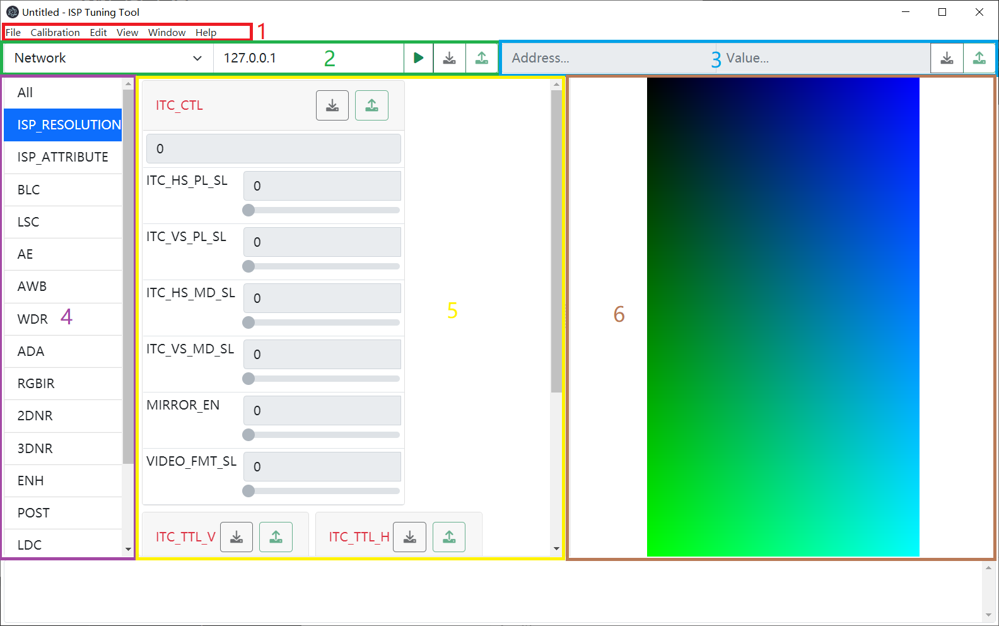
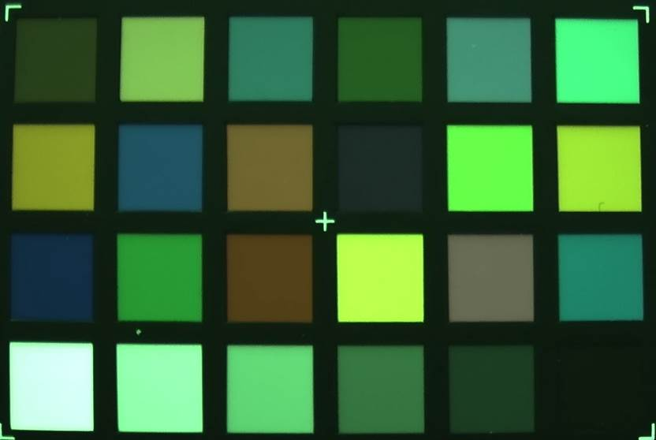
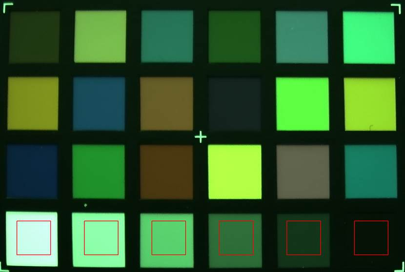
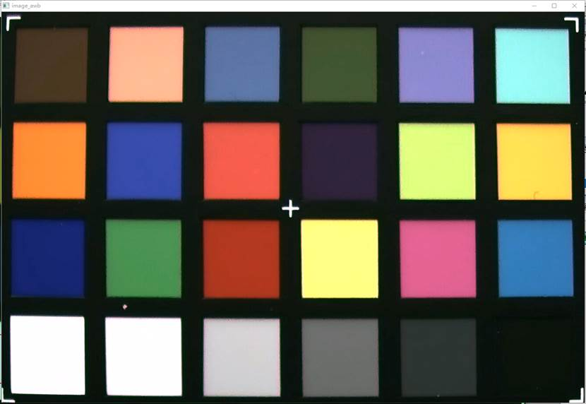
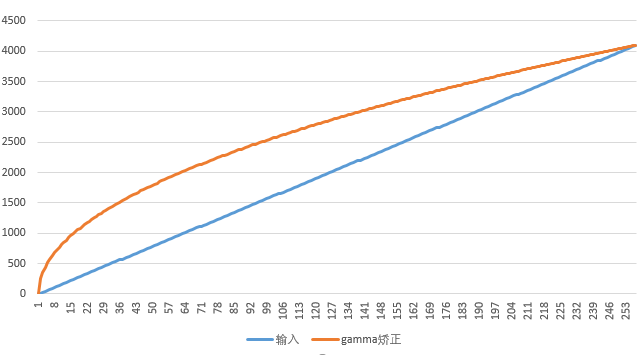

**<font face="黑体" size="6" style="float:right">K510 ISP Tuning Tool Guides</font>**

<font face="黑体"  size=3>Document version: V1.0.0</font>

<font face="黑体"  size=3>Published: 2022-03-31</font>

<div style="page-break-after:always"></div>

<font face="黑体" size=3>**Disclaimer**</font>
The products, services or features you purchase shall be subject to the commercial contracts and terms of Beijing Canaan Jiesi Information Technology Co., Ltd. ("the Company", the same hereinafter), and all or part of the products, services or features described in this document may not be within the scope of your purchase or use. Except as otherwise agreed in the contract, the Company disclaims all representations or warranties, express or implied, as to the accuracy, reliability, completeness, marketing, specific purpose and non-aggression of any representations, information, or content of this document. Unless otherwise agreed, this document is provided as a guide for use only.
Due to product version upgrades or other reasons, the contents of this document may be updated or modified from time to time without any notice.

**<font face="黑体"  size=3>Trademark Notices</font>**

"", "Canaan" icon, Canaan and other trademarks of Canaan and other trademarks of Canaan are trademarks of Beijing Canaan Jiesi Information Technology Co., Ltd. All other trademarks or registered trademarks that may be mentioned in this document are owned by their respective owners.

**<font face="黑体"  size=3>Copyright ©2022 Beijing Canaan Jiesi Information Technology Co., Ltd</font>**
This document is only applicable to the development and design of the K510 platform, without the written permission of the company, no unit or individual may disseminate part or all of the content of this document in any form.

**<font face="黑体"  size=3>Beijing Canaan Jiesi Information Technology Co., Ltd</font>**
URL: canaan-creative.com
Business Enquiries: salesAI@canaan-creative.com

<div style="page-break-after:always"></div>
# preface
**<font face="黑体"  size=5>Document purpose</font>**
This document is an ISP Tuning Tool documentation.

**<font face="黑体"  size=5>Reader Objects</font>**

The primary audience for this document is experienced software engineers, image algorithm engineers, system designers, and system integrators who want to implement proprietary applications and drivers.

**<font face="黑体"  size=5>Revision history</font>**
 <font face="宋体"  size=2>The revision history accumulates a description of each document update. The latest version of the document contains updates for all previous versions. </font>

| The version number   | Modified by     | Date of revision | Revision Notes |
|  :-----  |-------   |  ------  |  ------  |
| V1.0.0 | System software groups | 2022-03-31 | SDK V1.6 released |

<div style="page-break-after:always"></div>
**<font face="黑体"  size=6>Contents</font>**

[TOC]

<div style="page-break-after:always"></div>

# Introduction to the ISP Tuning Tool Framework

This section describes the ISP tuning tools and descriptions of the data streams that are provided to the upper-level processors to control the overall ISP image optimization.

```text
+----------------------------------------------------+
|                                                    |
|                      K510                          |
|                                                    |
|    +-------+        +--------------------------+   |
|    |       |        |                          |   |
|    |  ISP  +------> |   v4l2_drm_isptool.out   |   |
|    |       |        |                          |   |
|    +-------+        +-------------+------------+   |
|                                   |                |
|                                   |                |
|    +-----------------+            |                |
|    |                 |            |                |
|    |   isp-tuningd   | <----------+                |
|    |                 |                             |
|    +^-+--------------+                             |
|     | |                                            |
|     | |                                            |
+----------------------------------------------------+
      | |
      | |
+-------------------------------+
|     | |                       |
|     | |       PC              |
|     | |                       |
|    ++-v------------------+    |
|    |                     |    |
|    |  ISP Tuning Tool    |    |
|    |                     |    |
|    +---------------------+    |
|                               |
+-------------------------------+
```

## Tune the tool traffic

The communication protocol can be found in the documentation in the client code repository, and the tool consists of two parts, one is the client isp-tuningd running on the PC, the program is located in the /app/mediactl_lib/isp-tuningd, and the other part is the server running on the K510. By default, TCP's port 9982 is used for communication.

### client

The ISP Tuning Tool is an application that runs on a PC. In addition to being able to set registers, AWB calibration and CCM calibration are also supported.

### Server-side

isp-tuningd receives a yuv image (NV12) in size of 3133440 bytes from the standard input and broadcasts it to all clients, we can use v4l2_drm_isptool, he will automatically start isp-tuningd and send in the image data, the specific usage is consistent with the v4l2_drm. We can run it with the following command

```shell
cd /app/mediactl_lib
./v4l2_drm_isptool -f video_drm_1080x1920.conf
```

# ISP tuning options

Many registers and tables are provided in the K510 ISP for control and tuning. The setting of the ISP hardware registers is very important for image quality. At present, on the K510 platform, the image tuning process is only implemented through TCP Socket.

## Tuning tool main window

This section describes the features of these panels on the tuning window.

Figure 3-1 shows the entire operator panel on the tuning window

- Panel 1 is the**menu**that can optionally load the configured ISP file or perform calibration.
- Panel 2 is the **connection control panel**, fill in the IP address and port number of the development board (default port 9982) and click the green connect button to connect.
- Panel 3 is the**register panel**, if you need to set or read the register is not in this one, you can use this panel to set and read.
- Panel 4 is a tuning **parameter selection panel**, the user can select various parameters or groups of parameters according to the panel prompt text, the registers of these selections will be displayed on panel 5.
- Panel 5 is the **Tuning Parameter Settings panel**, which is used to set or obtain parameter values from the tuning server.
- Panel 6 is an **image display panel**, which displays the image output by the ISP and can click the pause button in the middle when it is not necessary to play all the time.



THE ISP Tuning Tool **does not**automatically acquire all register values after connecting, and if you need to get all register values, you can click the**Read button on the right side of the connection control panel** to pull all the current register values.

# Calibration & Calibration

This section describes instructions for calibration and calibration using ISP tuning tools, including Automatic White Balance (AWB), Color Correction Matrix (CCM), Gamma, and Lens Shadows (LSC).

## AWB

### Preparations

1. Standard light box with standard D65 light source
2. Standard 24 color card, currently only X-RITE color card is supported
3. A camera ready for calibration can output a sensor original image or a processed image
4. ISP also only open the black level correction and de-mosaic algorithm module, CSC and other format conversion modules must pay attention to symmetry (matrix is inverse matrix), in addition to noise reduction, sharpening and other modules have little impact, but also try to close, nonlinear modules and color processing modules (GAMMA, wide dynamic, AWB, CCM, saturation adjustment, etc.) must be turned off

### Gets the image

1. The camera is aimed at the 24 color card, make sure the 24 color card fills the entire picture, and then grab the image, which can be clicked to pause playback without guaranteeing accuracy, as shown in the following figure

    

2. The captured image should pay attention to moderate brightness and darkness, and too bright and too dark will affect the calibration

### demarcate

Click "Calibration" in the menu bar, select "AWB" to perform calibration, and the program will automatically select the color card



Press any key to continue, popping up the image after white balance is complete



If there is no problem, continue to press any key, the tool will pop up a dialog box asking whether the parameter is reasonable, yes will fill it into the main interface related registers, otherwise abandon the calibration result, if so, the tool will continue to ask whether to write to the device register.

## CC

Consistent with AWB calibration, it will not be repeated.

## Gamma

The formula for the standard gamma curve is
$$
Y=aX^b
$$
Where $b$ is the Gamma coefficient, which is generally less than 1 at the imaging end and greater than 1 at the display end. The value of $a$ can be calculated based on the value of $b$

$$
a=\frac{256}{256^b}
$$
The principle of the formula is that the input is 256, which is still 256 after Gamma correction.

When the gamma coefficient b is 0.5, the curve is shown in the following figure



## LSC

### Preparations

- A shot captures a photograph in RAW format

### principle

Because the center of the lens is inconsistent with the surrounding light transmission, the image brightness is uneven, so the curve fit generates a corrective surface to compensate for this problem.

The correction is shown in the figure below


After correction, it is shown in the following figure


**Translation Disclaimer**  
For the convenience of customers, Canaan uses an AI translator to translate text into multiple languages, which may contain errors. We do not guarantee the accuracy, reliability or timeliness of the translations provided. Canaan shall not be liable for any loss or damage caused by reliance on the accuracy or reliability of the translated information. If there is a content difference between the translations in different languages, the Chinese Simplified version shall prevail.

If you would like to report a translation error or inaccuracy, please feel free to contact us by mail.
