**<font face="黑体" size="6" style="float:right">Guía de compilación y grabación del SDK K510</font>**

<font face="黑体"  size=3>Versión del documento: V1.0.0</font>

<font face="黑体"  size=3>Publicado: 2022-03-07</font>

<div style="page-break-after:always"></div>

<font face="黑体" size=3>**Renuncia**</font>
Los productos, servicios o características que compre estarán sujetos a los contratos comerciales y términos de Beijing Canaan Jiesi Information Technology Co., Ltd. ("la Compañía", la misma en adelante), y todos o parte de los productos, servicios o características descritos en este documento pueden no estar dentro del alcance de su compra o uso. Salvo que se acuerde lo contrario en el contrato, la Compañía renuncia a todas las representaciones o garantías, expresas o implícitas, en cuanto a la precisión, confiabilidad, integridad, marketing, propósito específico y no agresión de cualquier representación, información o contenido de este documento. A menos que se acuerde lo contrario, este documento se proporciona como una guía para su uso solamente.
Debido a actualizaciones de la versión del producto u otras razones, el contenido de este documento puede actualizarse o modificarse de vez en cuando sin previo aviso. 

**<font face="黑体"  size=3>Avisos de marcas comerciales</font>**

"", el icono de "Canaan", Canaan y otras marcas comerciales de Canaan y otras marcas comerciales de Canaan son marcas comerciales de Beijing Canaan Jiesi Information Technology Co., Ltd. Todas las demás marcas comerciales o marcas registradas que puedan mencionarse en este documento son propiedad de sus respectivos propietarios. 

**<font face="黑体"  size=3>Derechos de autor ©2022 Beijing Canaan Jiesi Information Technology Co., Ltd</font>**
Este documento solo es aplicable al desarrollo y diseño de la plataforma K510, sin el permiso por escrito de la empresa, ninguna unidad o individuo puede difundir parte o la totalidad del contenido de este documento en ninguna forma. 

**<font face="黑体"  size=3>Beijing Canaan Jiesi Información Technology Co., Ltd</font>**
URL: canaan-creative.com
Consultas comerciales: salesAI@canaan-creative.com

<div style="page-break-after:always"></div>
# prefacio
**<font face="黑体"  size=5>Propósito del documento</font>**
Este documento es un documento complementario al sdk de K510 y está destinado a ayudar a los ingenieros a comprender la compilación y grabación del sdk de K510. 

**<font face="黑体"  size=5>Objetos reader</font>**

Las principales personas a las que se aplica este documento (esta guía):

- Desarrolladores de software
- Personal de soporte técnico

**<font face="黑体"  size=5>Historial 
 </font>**de revisiones <font face="宋体"  size=2>El historial de revisiones acumula una descripción de cada actualización del documento. La versión más reciente del documento contiene actualizaciones para todas las versiones anteriores. </font>

| El número de versión   | Modificado por     | Fecha de revisión | Notas de revisión |
|  :-----  |-------   |  ------  |  ------  |
| V1.0.0 | División de Productos de IA | 2022-03-07 |          |
|        |            |            |              |
|        |            |            |              |
|        |            |            |              |
|        |            |            |              |
|        |            |            |              |
|        |            |            |              |
|        |            |            |              |
|        |            |            |              |

<div style="page-break-after:always"></div>
**<font face="黑体"  size=6>Contenido</font>**

[TOC]

<div style="page-break-after:always"></div>

# 1 Introducción

Este documento describe el contenido de la sección de construcción del entorno de desarrollo, como la descarga, compilación y grabación del SDK de K510.

# SDK de 2 k510

## 2.1 k510 sdk descargar

Dirección del proyecto del SDK de k510: <https://github.com/kendryte/k510_buildroot>

Obtenga el SDK de k510:

```shell
git clone https://github.com/kendryte/k510_buildroot.git
```

## 2.2 Introducción al paquete k510 sdk

El SDK K510 es un entorno de desarrollo Linux integrado basado en buildroot como marco básico, basado en el kernel linux K510 (versión linux 4.17.0), u-boot (u-boot versión 2020.01), riscv-pk-k510 (BBL) paquete de código fuente, la estructura de directorios K510 SDK se muestra en la siguiente figura.

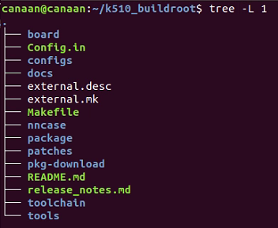

 Los archivos K510 SDK se describen de la siguiente manera:

| **archivo**        | **Descripción del contenido**                                                 |
| --------------- | ------------------------------------------------------------ |
| tabla           | Carpeta, que es K510 varios archivos de configuración y scripts, como el archivo de configuración para generar imágenes (genimage-xxx.cfg), scripts post-imagen buildroot, variables de entorno predeterminadas de U-Boot, etc. |
| Config.in       | Indica el paquete que requiere compilación buildroot. |
| configuraciones         | Carpeta, donde está el archivo de configuración de compilación predeterminado de la placa. Actualmente guarda los archivos de configuración de compilación predeterminados para las placas K510 CRB-V0.1, K510 CRB-V1.2 y K510 EVB:<br /> -`k510_crb_lp3_v1_2_defconfig`<br />-`k510_crb_lp3_v0_1_defconfig`<br />- `k510_evb_lp3_v1_1_defconfig` |
| external.desc   | Archivo de configuración del mecanismo externo de Buildroot. |
| external.mk     | |
| Makefile        | El Makefile principal del SDK k510. |
| paquete         | Las carpetas, que son principalmente aplicaciones K510, Config.in el contenido del archivo determinará qué aplicaciones se compilan bajo ese directorio. |
| Parches         | Carpeta, donde está el archivo de parche buildroot, Makefile descomprimirá el código fuente cuando el archivo de parche en este directorio al directorio de código fuente correspondiente. |
| pkg-descargar    | Carpeta, que es un paquete comprimido de la carpeta dl. |
| README.md       | Instrucciones relacionadas con el SDK. |
| release_note.md | |
| cadena de herramientas       | , donde es la cadena de herramientas de compilación cruzada. |
| Dl              | Carpeta, es el paquete dl extract en pkg-download, si hay otros paquetes agregados también se descargará a este directorio. |

## Versión del sdk de 2,3 k510

Al grabar la imagen generada por el sdk de k510 en la placa, se imprime la información de versión, como se muestra en la siguiente figura:

```text
#############SDK VERSION############################################
MX2_DEV_0106-02e87077-20220428-153936CST-xxxxx-server
####################################################################
```

Una vez completado el inicio, escriba lo siguiente en el terminal de shell para ver la información de la versión del SDK:

```shell
cat /etc/version/release_version
#############SDK VERSION############################################
MX2_REL_0106-02e87077-20220428-153936CST-xxxx-server
####################################################################
```

**Nota: La información anterior puede variar según la versión del sdk de k510**. 

# 3 entorno de compilación docker

Después de descargar el sdk de k510, ejecute el siguiente comando en el directorio principal del sdk para iniciar la ventana acoplable:

```shell
sh k510_buildroot/tools/docker/run_k510_docker.sh
```

Las operaciones de compilación posteriores se realizan en docker de forma predeterminada.
Si necesita configurar un entorno local, consulte[ Configuración del entorno local](#env_set)

# 4 Compilar

## 4.1 Preparación de la compilación

### 4.1.1 Descargue el paquete de código fuente (opcional, puede acelerar la compilación)

Ejecute el siguiente comando para descargar el paquete de origen:

```shell
make dl
```

## 4.2 Compilación

K510_buildroot/config tiene archivos de configuración de compilación para tres placas de desarrollo, a saber,`k510_crb_lp3_v0_1_defconfig` , `k510_crb_lp3_v1_2_defconfig`y `k510_evb_lp3_v1_1_defconfig`, este documento se ilustra seleccionando k510_crb_lp3_v1_2_defconfig como destino** de compilación**. 

En el entorno de docker k510, escriba el siguiente comando para comenzar a compilar:

```shell
make CONF=k510_crb_lp3_v1_2_defconfig
```


El siguiente mensaje indica que la compilación se completó correctamente.

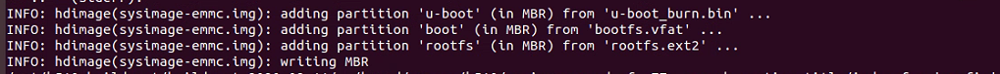

Una vez completada la compilación, se genera la carpeta`k510_crb_lp3_v1_2_defconfig`. 

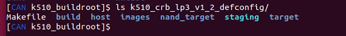

Cada uno de estos documentos se describe de la siguiente manera:

| **archivo**    | **Descripción del contenido**                                                 |
| ----------- | ------------------------------------------------------------ |
| Makefile    | Compile la imagen para usar Makefile.                                     |
| construir       | El directorio de compilación para todos los paquetes de origen. Por ejemplo, kernel de linux, u-boot, BBL, busybox, etc., el código fuente se extraerá al directorio de compilación y se compilará. |
| anfitrión        | Todas las rutas de instalación del paquete de host, la cadena de herramientas también se copiarán en este directorio para crear entornos de compilación cruzada. |
| Imágenes      | Compile el directorio de archivos de destino resultante (consulte las instrucciones a continuación para obtener más información)                     |
| nand_target | Directorio RAW del sistema de archivos raíz (utilizado para generar imágenes NandFlash)                  |
| blanco      | Directorio RAW del sistema de archivos raíz (para generar imágenes de tarjetas eMMC y SD para usar)                 |

K510_crb_lp3_v1_2_defconfig/images es una imagen grabada, en la que la descripción de cada archivo es la siguiente.

| **archivo**                   | **Descripción del contenido**                                                 |
| -------------------------- | ------------------------------------------------------------ |
| bootm-bbl.img              | Imagen del kernel de Linux+bbl (archivo de destino bpl del kernel empaquetado para uboot boot bbl) |
| k510.dtb                   | Árbol de dispositivos                                                       |
| sysimage-emmc.img          | archivos de grabación emmc: todo el paquete se ha empaquetado uboot_burn, kernel y bbl              |
| sysImage-sdcard.img        | Archivos de grabación de sdcard: todo el paquete se ha empaquetado uboot_burn, kernel y bbl            |
| sysImage-nand.img          | archivos de grabación de nand: todo el paquete se ha empaquetado uboot_burn, kernel y bbl              |
| u-boot.bin                 | Archivo binario UBoot                                             |
| u-boot_burn.bin            | UBoot graba archivos                                               |
| uboot-emmc.esv             | Variable de entorno uboot: se utiliza para el inicio de EMMC                                  |
| uboot-sd.esv               | Variable de entorno UBoot: se utiliza para el inicio de la tarjeta SDCard                                |
| uboot-nand.esv             | Variable de entorno UBOOT: se utiliza para el inicio de NAND                                  |
| vmlinux                    | Archivo de imagen del kernel de Linux (con información de depuración de elf)                           |
| rootfs.ext2                | Archivo de imagen buildroot format rootfs ext2                             |
| sysimage-sdcard-debian.img | archivos de grabación de tarjetas SDCARD: imágenes de tarjetas (rootfs en formato debian)                     |

K510_crb_lp3_v1_2_defconfig/build directory es el código fuente de todos los objetos compilados, varios de los cuales son documentos importantes que se describen a continuación.

| **archivo**         | **Descripción del contenido**                  |
| ---------------- | ----------------------------- |
| linux-xxx        | El directorio de origen del kernel de Linux compilado |
| uboot-xxx        | El directorio de origen de Uboot compilado       |
| riscv-hp-k510-xxx| El directorio de origen bbl donde se compila el código         |
| ...              |                               |

Nota: xxx es el número de versión. Cuando las referencias a las rutas de kernle, bbl y uboot en secciones posteriores, xxx representan números de versión.

**Necesita atención especial:**Al limpiar, se eliminará todo lo que se encuentre debajo de la carpeta k510_crb_lp3_v1_2_defconfig. Por lo tanto, si necesita modificar el código kernel, bbl o uboot, no lo modifique directamente en el directorio de compilación, puede consultar el Capítulo 5 para usar el método de origen de anulación.

## 4.1 Configurar buildroot

Introduzca el comando buildroot de configuración en el entorno de docker k510:

```shell
make CONF=k510_crb_lp3_v1_2_defconfig menuconfig
```

Los resultados de la ejecución son los siguientes:

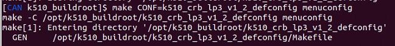

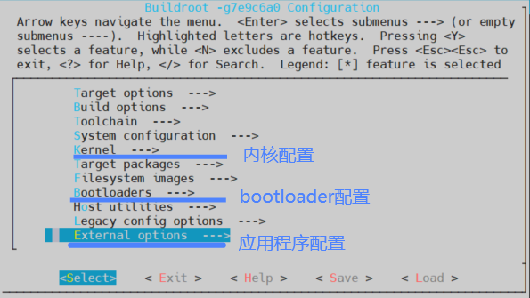

Después de completar la configuración, guardar y salir, también debe ejecutar el siguiente comando buildroot configuration save:

```shell
make CONF=k510_crb_lp3_v1_2_defconfig savedefconfig
```

Los resultados de la ejecución son los siguientes:

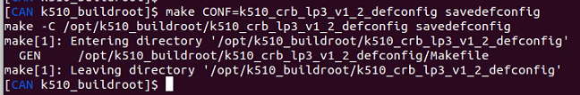

Una vez completada la operación anterior, el usuario puede introducir el siguiente comando para volver a compilar:

```shell
make CONF=k510_crb_lp3_v1_2_defconfig
```

## 4.2 Configurar U-Boot

Cuando necesite modificar la configuración de uboot, puede ingresar al directorio k510_crb_lp3_v1_2_defconfig e ingresar el siguiente comando para iniciar la configuración de U-Boot:

```shell
make uboot-menuconfig
```

Los resultados de la ejecución son los siguientes:


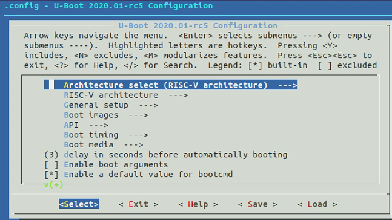

Cuando salga del menuuonfig después de completar la configuración, seleccione Guardar configuración y deberá ejecutar el siguiente comando de guardado de configuración:

```shell
make uboot-savedefconfig
```

Los resultados de la ejecución son los siguientes:


Por último, en el directorio k510_crb_lp3_v1_2_defconfig, escriba el siguiente comando para iniciar la compilación:

```shell
make uboot-rebuild
```

Consulte la descripción en la siguiente sección para obtener más información.

## 4.3 Compilar el U-Boot

El código fuente compilado de U-Boot se almacena en el directorio k510_crb_lp3_v1_2_defconfig/build/uboot-xxx, y el U-Boot debe volver a compilarse si el usuario modifica el código fuente de U-Boot o reconfigura el uboot.

Ingrese el directorio k510_crb_lp3_v1_2_defconfig e ingrese el siguiente comando para recompilar U-Boot:

```shell
make uboot-rebuild
```

Los resultados de la ejecución son los siguientes:

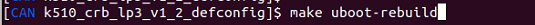

Una vez completada la compilación, se genera un nuevo archivo de .bin u-boot en el directorio k510_crb_lp3_v1_2_defconfig/images.

Si desea regenerar el archivo de imagen grabado con un nuevo u-boot,`k510_crb_lp3_v1_2_defconfig` ejecute :en el directorio

```shell
make
```

Los resultados de la ejecución son los siguientes:


Cuando se complete la compilación, verá la información generada por el siguiente archivo de imagen.


## 4.4 Configurar el kernel de Linux

Cuando necesite modificar la configuración del kernel, puede ingresar al directorio k510_crb_lp3_v1_2_defconfig e ingresar el siguiente comando para iniciar la configuración del kernel:

```shell
make linux-menuconfig
```

Los resultados de la ejecución son los siguientes:


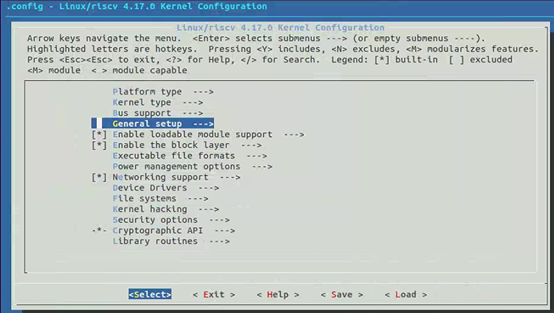

Cuando salga de menuufig después de modificar la configuración, seleccione Guardar configuración y, finalmente, ejecute el siguiente comando de guardado de configuración:

```shell
make linux-savedefconfig
```

Los resultados de la ejecución son los siguientes:


Por último, en el directorio k510_crb_lp3_v1_2_defconfig, escriba el siguiente comando para iniciar la compilación:

```shell
make linux-rebuild
```

Consulte la descripción en la siguiente sección para obtener más información.

## 4.5 Compilar el kernel de Linux

K510_crb_lp3_v1_2_defconfig/build/linux-xxx contiene el código fuente compilado de Linux, ya sea que el usuario modifique el código fuente de Linux o reconfigure Linux, debe volver a compilarse.

Ingrese al directorio k510_crb_lp3_v1_2_defconfig e ingrese el siguiente comando para recompilar linux:

```shell
make linux-rebuild
```

Los resultados de la ejecución son los siguientes:

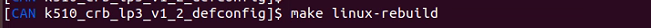

Después de compilar, se genera un nuevo vmlinux en el directorio k510_crb_lp3_v1_2_defconfig/images.

La imagen del kernel de Linux debe empaquetarse con bbl, después de reescribir el kernel de Linux, debe volver a compilar el bbl para generar una nueva imagen de bbl / kernel para el arranque de arranque, así que ingrese los siguientes dos comandos.

```shell
make riscv-pk-k510-dirclean
make riscv-pk-k510
```

Los resultados de la ejecución son los siguientes:

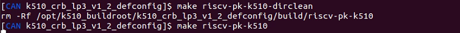

Cuando se completa la compilación, `k510_crb_lp3_v1_2_defconfig/images`se genera una nueva en el directorio`bootm-bbl.img`. 

Finalmente, ingrese make en el directorio k510_crb_lp3_v1_2_defconfig y use el nuevo paquete bootm-bbl.img para generar archivos de imagen emmc y de tarjeta SD.

```shell
make
```

Los resultados de la ejecución son los siguientes:


Cuando se complete la compilación, verá la información generada por el siguiente archivo de imagen.


## 4.6 Compilar dts

El archivo del árbol de dispositivos se encuentra en el directorio k510_buildroot/k510_crb_lp3_v1_2_defconfig/build/linux-4.17/arch/riscv/boot/dts/canaan, y cuando el usuario solo modifica el árbol de dispositivos, solo se puede compilar y descompilar el árbol de dispositivos.

Escriba un script mkdtb-local.sh que diga:

```shell
# !/bin/sh

set -Eeuo pipefail

export BUILDROOT="$(dirname "$(realpath "$0")")"
export VARIANT="${1:-k510_crb_lp3_v1_2}"

if [[ "$VARIANT" = *_defconfig ]]; then
        VARIANT="${VARIANT:0:-10}"
fi

export KERNEL_BUILD_DIR="$BUILDROOT/${VARIANT}_defconfig/build/linux-4.17"
export BINARIES_DIR="$BUILDROOT/${VARIANT}_defconfig/images"
export PATH+=":$BUILDROOT/toolchain/nds64le-linux-glibc-v5d/bin"

riscv64-linux-cpp -nostdinc -I "${KERNEL_BUILD_DIR}/include" -I "${KERNEL_BUILD_DIR}/arch" -undef -x assembler-with-cpp "${KERNEL_BUILD_DIR}/arch/riscv/boot/dts/canaan/${VARIANT}.dts" "${BINARIES_DIR}/${VARIANT}.dts.tmp"

"${KERNEL_BUILD_DIR}/scripts/dtc/dtc" -I dts -o "${BINARIES_DIR}/k510.dtb" "${BINARIES_DIR}/${VARIANT}.dts.tmp"
"${KERNEL_BUILD_DIR}/scripts/dtc/dtc" -I dtb -O dts "${BINARIES_DIR}/k510.dtb" -o "${BINARIES_DIR}/all.dts"

echo "DONE"
echo "${BINARIES_DIR}/k510.dtb"
echo "${BINARIES_DIR}/all.dts"
```

Coloque el mkdtb-local.sh en el directorio K510_buildroot y ejecute el siguiente comando para compilar el árbol de dispositivos de la placa de k510_crb_lp3_v1_2_defconfig:

```shell
./mkdtb-local.sh k510_crb_lp3_v1_2_defconfig
```

Los resultados de la ejecución son los siguientes:

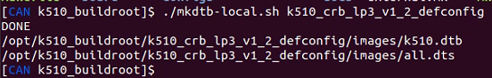

K510.dtb en el directorio k510_crb_lp3_v1_2_defconfig/images es el archivo de base de datos de árbol de dispositivos recién generado y all.dts es el archivo de árbol de dispositivos descompilado.

## 4.7 Compilar la aplicación

Los usuarios pueden hacer referencia a `package/hello_world` la Config.in y al archivo makefile que se escribe para crear sus propias aplicaciones, y las aplicaciones de usuario se colocan en el directorio k510_buildroot/package. 

El proceso de compilación de una aplicación se ilustra colocando hello_world proyectos en k510_buildroot / paquete como ejemplo.

Modifique los archivos Config.in en el directorio k510_buildroot en el entorno de hospedaje.


En el Config.in, agregue la ruta de acceso donde se encuentra package/hello_world/Config.in y guárdelo.

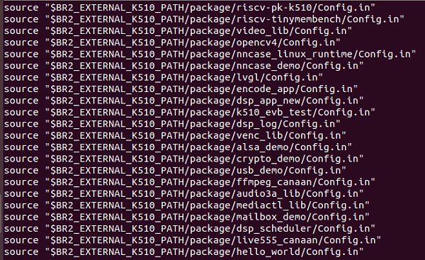

Introduzca el comando buildroot de configuración en el entorno de docker k510:

```shell
make CONF=k510_crb_lp3_v1_2_defconfig menuconfig
```

Los resultados de la ejecución son los siguientes:

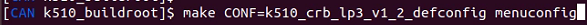

Aparece la página de configuración buildroot, seleccione la opción Extendido y, finalmente, seleccione la hello_world y luego guarde y salga.

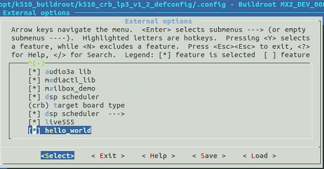

Escriba el comando Guardar configuración en el directorio k510_buildroot.

```shell
make CONF=k510_crb_lp3_v1_2_defconfig savedefconfig
```

Los resultados de la ejecución son los siguientes:

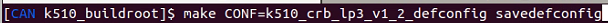

1) Si es la primera vez que se compila, los pasos son los siguientes:

En el directorio k510_buildroot, escriba el siguiente comando para compilar todo el programa del proyecto y empaquetar hello en archivos de imagen emmc y sd card.

```shell
make CONF=k510_crb_lp3_v1_2_defconfig
```

Los resultados de la ejecución son los siguientes:


En el directorio k510_buildroot/k510_crb_lp3_v1_2_defconfig/target, puede ver la aplicación hello resultante, que indica si la aplicación se compiló correctamente.

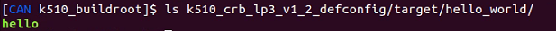

2) Si se ha compilado, simplemente compile la aplicación y empaquétela en la imagen grabada, siga estos pasos:

Introduzca el directorio k510_buildroot/k510_crb_lp3_v1_2_defconfig e introduzca el siguiente comando para compilar la aplicación hello.

```shell
make hello_world-rebuild
```

Los resultados de la ejecución son los siguientes:


Vaya al directorio k510_buildroot/k510_crb_lp3_v1_2_defconfig e ingrese el comando make para empaquetar hello en los archivos de imagen de la tarjeta emmc y sd.

```shell
make
```

Los resultados de la ejecución son los siguientes:

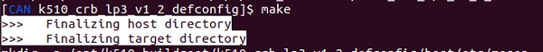

# 5 Desarrollar con el SDK K510

## 5.1 Kernel de Linux/BBL/uboot código fuente

La versión de uboot utilizada por este SDK es 2020.01, el directorio de revisión de uboot es package/patches/uboot y el directorio después de la revisión es k510_xxx_defconfig/build/uboot-2020.01.

El directorio de parches del kernel utilizado por este sdk es 4.17, el directorio de parches del kernel es package/patches/linux y el directorio parcheado es k510_xxx_defconfig/build/linux-4.17.

La BBL de este sdk se coloca como un paquete de destino en el paquete/riscv-pk-k510/directory, y el número de origen y versión del bbl se especifican en el riscv-pk-k510.mk:

```text
RISCV_PK_K510_VERSION = 1e666d6c5dbab220d2ca57fbd9bec49702599b75
RISCV_PK_K510_SITE = git@github.com:kendryte/k510_BBL.git
RISCV_PK_K510_SITE_METHOD = git
```

## 5.2 Desarrollar kernel linux/BBL/uboot

Cada pacificación compilada bajo Buildroot, incluyendo linux kernel/BBL/uboot, se implementa descargando tarball, descomprimiendo, configurando, compilando, instalando y otros pasos unificados de administración de paquetes, por lo que aunque todo el código fuente se puede ver en el directorio k510_buildroot/k510_crb_lp3_v1_2_defconfig/build, no hay información de control de versiones. Incluso si el código se descarga de un repositorio git.

Aunque el código fuente kernel/BBL/uboot que contiene los datos del repositorio git se puede ver en el dl/directorio, buildroot solo almacena en caché el código fuente en el directorio dl y no se recomienda desarrollar directamente en este directorio.

Para el modelo de desarrollo, buildroot proporciona una forma de OVERRIDE_SRCDIR.

En términos simples, puede agregar un archivo local.mk en el directorio k510_crb_lp3_v1_2_defconfig y agregarlo:

```text
<pkg1>_OVERRIDE_SRCDIR = /path/to/pkg1/sources
```

- LINUX es el nombre del paquete del kernel
- UBOOT es el nombre package de uboot
- RISCV_PK_K510 es el nombre del paquete del BBL

Tomemos el kernel de Linux como ejemplo para describir cómo usarlo.
Suponiendo que he clonado el código del kernel en el directorio /data/yourname/workspace/k510_linux_kernel y he realizado modificaciones, y quiero compilar bajo buildroot y probarlo en la placa crb v1.2, puede crear un local.mk en el directorio k510_crb_lp3_v1_2_defconfig y agregar lo siguiente:

```text
LINUX_OVERRIDE_SRCDIR = /data/yourname/workspace/k510_linux_kernel
```

Ejecutar en el directorio k510_crb_lp3_v1_2_defconfig

```shell
make linux-rebuild
```

Puede ver que el kernel se ha vuelto a compilar en el directorio build/linux-custom, utilizando el código modificado en /data/yourname/workspace/k510_linux_kernel.
UBOOT y BBL son similares. De esta manera, puede modificar directamente el código del kernel y reescribir el kernel bajo buildroot, y compilar incrementalmente la imagen para probar.
Nota: El código fuente de override se agregará al sufijo de custom en el nombre del directorio del directorio k510_crb_lp3_v1_2_defconfig/build para distinguir el origen de cada paquete en la configuración predeterminada de buildroot. Por ejemplo, en el ejemplo del kernel de Linux anterior, la compilación verá que el código especificado por el overrideide se compila en el directorio k510_crb_lp3_v1_2_defconfig/build/linux-custom, en lugar del directorio k510_crb_lp3_v1_2_defconfig/build/linux-xxx que vimos anteriormente.

Para otro código en el directorio de paquetes, o paquetes nativos buildroot, es posible desarrollar bajo el marco buildroot de esta manera.

# 6 Grabar la imagen

K510 admite sdcard y el modo de arranque eMMC, cada vez que la compilación en el directorio k510_buildroot / k510_crb_lp3_v1_2_defconfig / image generará archivos de imagen sysimage-sdcard.img y sysimg-emmc.img, los dos archivos se pueden grabar en sdcard y eMMC respectivamente.

El K510 determina el modo de arranque del chip por el estado de los pines de hardware boot0 y BOOT1, consulte la sección de instrucciones de arranque de la placa de desarrollo para obtener configuraciones específicas.

| ARRANQUE1   | BOOT0   | Modo de inicio      |
| ------- | ------- | ------------ |
| 0(ENCENDIDO)   | 0(ENCENDIDO)   | Arranque del puerto serie      |
| 0(ENCENDIDO)   | 1 (APAGADO)  | La tarjeta SD arranca      |
| 1 (APAGADO)  | 0(ENCENDIDO)   | Botas NANDFLASH |
| 1 (APAGADO)  | 1 (APAGADO)  | Botas EMMC      |


## 6.1 Grabar la imagen en la tarjeta SD

### 6.1.1 ubuntu quemado

Antes de insertar la tarjeta SD en el host, introduzca:

```shell
ls -l /dev/sd*
```

Ver el dispositivo de almacenamiento actual.

Después de insertar la tarjeta SD en el host, introdúzcala de nuevo:

```shell
ls -l /dev/sd*
```

Mirando el dispositivo de almacenamiento en este momento, la nueva adición es el nodo del dispositivo de la tarjeta SD.

Después de insertar la tarjeta sD en el host, el resultado de la ejecución del comando ls es el siguiente:

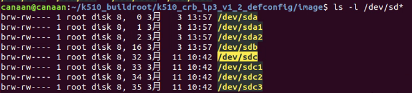

/dev/sdc es el nodo del dispositivo de la tarjeta SD. **Nota: Es posible que el nodo de dispositivo de la tarjeta SD generado en el entorno de usuario no sea /dev/sdc, y las operaciones posteriores deben modificarse de acuerdo con el nodo real. **

Ingrese el directorio k510_buildroot/k510_crb_lp3_v1_2_defconfig/image debajo del host e ingrese el comando dd para grabar sysimage-sdcard.img en el sdk:

```shell
sudo dd if=sysimage-sdcard.img of=/dev/sdc bs=1M oflag=sync
```

El resultado de la ejecución en el host es el siguiente:


### 6.1.2 Grabar en Windows

En Windows, la tarjeta SD puede ser grabada por la herramienta banana Etcher (dirección de descarga de la herramienta balena Etcher<https://www.balena.io/etcher/>). 

1) Inserte la tarjeta TF en la PC, luego inicie la herramienta ColumnEtcher, haga clic en el botón "Flash from file" de la interfaz de la herramienta, seleccione el firmware que se grabará, como se muestra en la siguiente figura.


2) Haga clic en el botón "Seleccionar destino" de la interfaz de la herramienta y seleccione la tarjeta sdcard de destino.


3) Haga clic en el botón "Flash" para comenzar a parpadear, el proceso de parpadeo tiene una pantalla de barra de progreso, flash Finish se le pedirá después del final del parpadeo.

|  |  |
| --------------------------------------- | --------------------------------------- |
|                                         |                                         |

4) Cuando se complete el parpadeo, inserte la tarjeta SD en la ranura de la placa de desarrollo, seleccione BOOT para comenzar desde SD y, finalmente, la placa de desarrollo se puede encender para comenzar desde la tarjeta SD.

## 6.2 Grabar la imagen en emmc

Para grabar el sysimage-emmc.img en el eMMC integrado, con la ayuda del sdk, en el entorno ubuntu, el sysimage-emmc.img se almacena en la partición de usuario del sdk y, a continuación, el sdk se inserta en la placa y se enciende.

Antes de grabar la imagen emmc, debe desmontar el sistema de archivos relacionado con emmc, consulte los siguientes pasos para desmontarlo.

```shell
mount | grep emmc
```

El resultado de la ejecución es el siguiente:

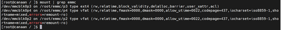

Introduzca el siguiente comando para desinstalar y comprobar.

```shell
umount /root/emmc/p2
umount /root/emmc/p3
umount /root/emmc/p4
mount | grep emmc
```

El resultado de la ejecución es el siguiente:

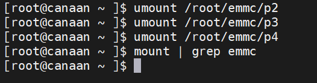

Finalmente, ingrese la ruta donde se encuentra la imagen, ingrese el siguiente comando para grabar eMMC.

```shell
dd if=sysimage-emmc.img of=/dev/mmcblk0 bs=1M
```

El resultado de la ejecución es el siguiente:

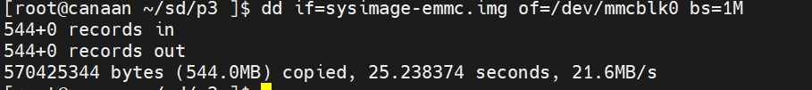

**Nota: El proceso de grabación es lento, toma unos 30 segundos, tenga paciencia.**

Cuando se complete el parpadeo, seleccione BOOT to Boot desde EMMC y, finalmente, encienda la placa para arrancar desde EMMC.

# 7 Entorno de compilación configurado por el usuario <a id="env_set"> </a>

Si no utiliza el entorno docker anterior, puede configurar su propio entorno de desarrollo consultando el siguiente comando en ubuntu18.04 / 20.04, si no tiene permiso,`sudo` úselo. 

```shell
apt-get update
apt-get upgrade
apt-get install libc6-i386 libc6-dev-i386

apt-get install mtools
apt-get install dosfstools
apt-get install python
apt-get install python-pip
python2 -m pip install pycrypto

apt-get install python3.7
apt-get install python3-pip
python3.7 -m pip install --upgrade pip
ln -sf /usr/bin/python3.7 /usr/bin/python3
python3 -m pip install onnx==1.9.0 onnx-simplifier==0.3.6 onnxoptimizer==0.2.6 onnxruntime==1.8.0 -i https://pypi.tuna.tsinghua.edu.cn/simple

#进行下一步，需进入k510_buildroot/nncase目录，将nncase_v1.4.0.tgz解压后进入k510_buildroot/nncase/nncase_v1.4.0目录，输入如下命令安装*.whl
python3 -m pip install x86_64/*.whl
#运行python3 -m pip show nncase，若看到nncase版本信息则表示AI应用程序环境部署成功。
python3 -m pip show nncase

python3 -m pip install xlrd==1.2.0
python3 -m  pip install pystache
dpkg --add-architecture i386
apt update
apt install libncurses5:i386
apt-get install wget
apt-get install cpio
apt-get install unzip
apt-get install rsync
apt-get install bc
apt-get install libssl-dev
pip3 install pycryptodome
```

**Descargo de responsabilidad de **traducción  
Para la comodidad de los clientes, Canaan utiliza un traductor de IA para traducir texto a varios idiomas, que pueden contener errores. No garantizamos la exactitud, fiabilidad o puntualidad de las traducciones proporcionadas. Canaan no será responsable de ninguna pérdida o daño causado por la confianza en la exactitud o fiabilidad de la información traducida. Si existe una diferencia de contenido entre las traducciones en diferentes idiomas, prevalecerá la versión en chino simplificado. 

Si desea informar de un error o inexactitud de traducción, no dude en ponerse en contacto con nosotros por correo.