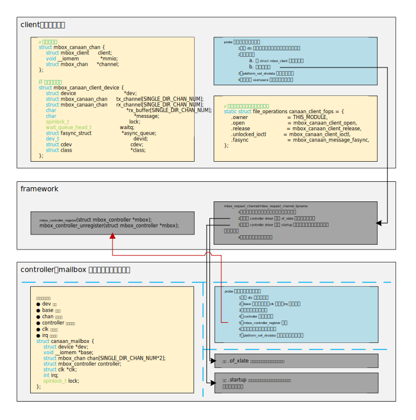
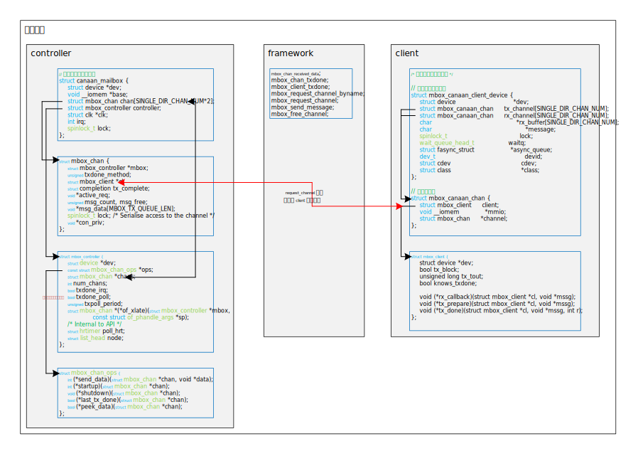
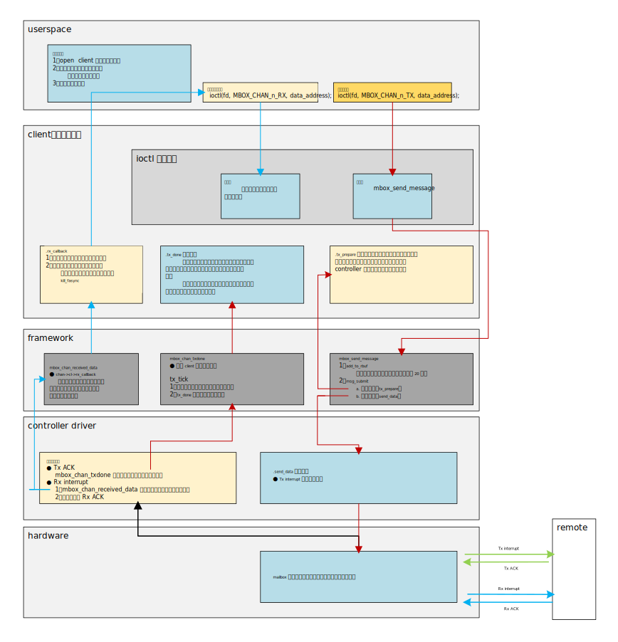
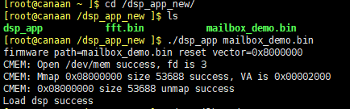
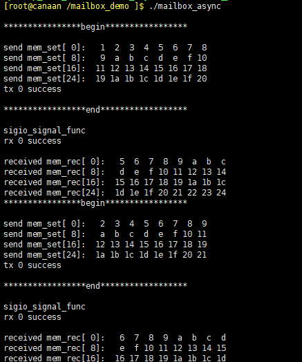
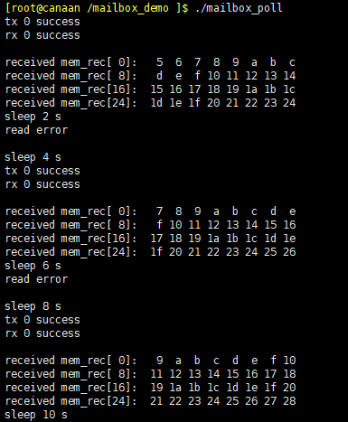

**<font face="黑体" size="6" style="float:right">K510 Mailbox Guida per lo sviluppatore</font>**

<font face="黑体"  size=3>Versione del documento: V1.0.0</font>

<font face="黑体"  size=3>Data di pubblicazione: 2022-03-09</font>

<div style="page-break-after:always"></div>

<font face="黑体" size=3>**Disconoscimento**</font>
I prodotti, i servizi o le funzionalità acquistati saranno soggetti ai contratti e ai termini commerciali di Beijing Canaan Jiesi Information Technology Co., Ltd. ("la Società", la stessa di seguito), e tutti o parte dei prodotti, servizi o funzionalità descritti in questo documento potrebbero non rientrare nell'ambito dell'acquisto o dell'utilizzo. Salvo quanto diversamente concordato nel contratto, la Società declina ogni dichiarazione o garanzia, espressa o implicita, in merito all'accuratezza, affidabilità, completezza, marketing, scopo specifico e non aggressione di qualsiasi dichiarazione, informazione o contenuto di questo documento. Salvo diverso accordo, questo documento è fornito solo come guida per l'uso.
A causa di aggiornamenti della versione del prodotto o altri motivi, il contenuto di questo documento può essere aggiornato o modificato di volta in volta senza alcun preavviso. 

**<font face="黑体"  size=3>Avvisi sui marchi</font>**

"", l'icona "Canaan", Canaan e altri marchi di Canaan e altri marchi di Canaan sono marchi di Beijing Canaan Jiesi Information Technology Co., Ltd. Tutti gli altri marchi o marchi registrati che possono essere menzionati in questo documento sono di proprietà dei rispettivi proprietari. 

**<font face="黑体"  size=3>Copyright ©2022 Pechino Canaan Jiesi Information Technology Co., Ltd</font>**
Questo documento è applicabile solo allo sviluppo e alla progettazione della piattaforma K510, senza il permesso scritto della società, nessuna unità o individuo può diffondere parte o tutto il contenuto di questo documento in qualsiasi forma. 

**<font face="黑体"  size=3>Pechino Canaan Jiesi Information Technology Co., Ltd</font>**
URL: canaan-creative.com
Richieste commerciali: salesAI@canaan-creative.com

<div style="page-break-after:always"></div>
# prefazione
**<font face="黑体"  size=5>Scopo </font>**del documento
Questo documento è un documento di sviluppo per il driver della cassetta postale K510. 

**<font face="黑体"  size=5>Oggetti lettore</font>**

Le principali persone a cui si applica questo documento (questa guida):

- Sviluppatori di software
- Personale di supporto tecnico

**<font face="黑体"  size=5>Cronologia delle revisioni</font>**
 <font face="宋体"  size=2>La cronologia delle revisioni accumula una descrizione di ogni aggiornamento del documento. La versione più recente del documento contiene gli aggiornamenti per tutte le versioni precedenti. </font>

| Il numero di versione   | Modificato da     | Data della revisione | Note di revisione |
|  :-----  |-------   |  ------  |  ------  |
| V1.0.0 · | Gruppi di software di sistema | 2022-03-09 | Rilasciato SDK V1.5 |
|        |        |            |                    |
|        |        |            |                    |
|        |        |            |                    |
|        |        |            |                    |
|        |        |            |                    |

<div style="page-break-after:always"></div>
**<font face="黑体"  size=6>Contenuto</font>**

[TOC]

<div style="page-break-after:always"></div>

# 1 Analisi del quadro

## 1.1 client、controller 与 framework

&emsp; &emsp; Il framework delle cassette postali viene utilizzato per gestire la comunicazione tra più processori. Il framework è diviso in controller e client.  
&emsp; &emsp; Controller è un driver che manipola direttamente la cassetta postale hardware. Gestisce i registri hardware direttamente verso il basso, completando la comunicazione con il telecomando inviando e ricevendo interrupt (se supportati dall'hardware); Fino all'interfaccia fornita dal framework per completare la comunicazione con il driver client.
&emsp; &emsp; Il cliente è il consumatore del controller, comunica con il controller verso il basso, completa le applicazioni del canale, la preparazione dei dati e altre funzioni; Fornisce interfacce per la manipolazione dello spazio utente.  
&emsp; &emsp; Il framework delle cassette postali è responsabile dell'interfaccia tra il controller e il client, la documentazione del kernel dice: "Il driver client e controller può essere molto dipendente dalla piattaforma specifica, quindi il driver client non può essere condiviso tra più piattaforme", quindi nella`/drivers/mailbox` directory, è possibile trovare solo il driver sul controller e non è possibile trovare il driver client, è possibile trovare un solo test Driver `mailbox-test.c`client del controller. Il modo in cui il driver client scambia i dati con lo spazio utente dipende anche dallo sviluppatore del driver stesso.  
&emsp; &emsp; Il diagramma seguente è il framework di base per due registrazioni di driver: 

<div align=center>

</div>  

## 1.2 Strutture dati

&emsp; &emsp; La struttura dei dati del controller e del cliente è illustrata nella figura seguente:<div align=center>

</div>

&emsp; &emsp; Il framework utilizza `struct mbox_controller`controller di cassette postali astratti, canali astratti`struct mbox_chan` e raccolte di funzioni `struct mbox_chan_ops`per modificare i canali. Le tre strutture di dati di cui sopra sono per i controllori. Il framework utilizza `struct mbox_client`client astratti, che sono specifici del cliente.  
&emsp; &emsp; Oltre a questo, dobbiamo definire la nostra struttura del dispositivo per i nostri dispositivi e unità, come mostrato nella figura sopra. La connessione tra il client e il controller viene`mbox_request_channel` eseguita nella funzione quando si richiede un canale nel client e un canale è associato a una`struct mbox_client` struttura. 

## 1.3 Flusso di chiamata di funzione

&emsp; &emsp; Il flusso di chiamata di funzione è illustrato nella figura seguente:<div align=center>

</div>  

&emsp; &emsp; Lo spazio utente e il recapito dei dati basato sul client utilizzano ioctl più notifiche asincrone, che è determinato dagli stessi sviluppatori del driver e non appartiene al framework.  
&emsp; &emsp; Abbiamo creato un nodo di dispositivo nel driver client`/dev/mailbox-client` attraverso il quale lo spazio utente legge e invia i dati. 8 canali di trasmissione, 8 canali di ricezione. 

### 1.3.1 Invio del flusso di dati

&emsp; &emsp; Come mostrato nella figura sopra:

1. Maniglie dei file di manipolazione dello spazio utente per inviare dati;
2. Immettere la funzione ioctl guidata dal client, che copia i dati dello spazio utente nello spazio del kernel e alla fine chiama la`mbox_send_message` funzione; 
3. Il processo di elaborazione specifico di questa funzione può essere visto nell'analisi del codice dei capitoli successivi, che chiama principalmente due funzioni di callback: implementazione guidata dal client`tx_prepare` e implementazione guidata dal controller`send_data`. Guarda i nomi per sapere cosa fanno queste due funzioni. Va notato che alcune cassette postali hardware hanno registri di trasmissione dati hardware, quindi in questo momento la trasmissione dei dati può essere`send_data` completata nel mezzo; Alcuni hardware non dispongono di registri di trasmissione dati hardware, quindi è possibile completare anche la trasmissione dati effettiva`tx_prepare` e `send_data`il ruolo diventa una semplice **notifica di interrupt trigger al processore remoto**; 
4. Quando il processore remoto riceve l'interrupt e riceve i dati, deve rispondere al controller con un interrupt che indica che Tx è stato completato;
5. Dopo aver ricevuto l'ACK Tx, è necessario chiamare il gestore di interrupt registrato dal controller `mbox_chan_txdone`per notificare al livello superiore che il trasferimento è stato ricevuto in remoto; 
6. `mbox_chan_txdone`Informare il cliente che il `tx_done`trasferimento è completato attraverso la registrazione del cliente. Il cliente decide per la successiva elaborazione e i`tx_done` parametri registrano lo stato del trasferimento dei dati. 

### 1.3.1 Processo di ricezione dei dati

&emsp; &emsp; Come mostrato nella figura sopra:

1. Interruzioni del responsabile del trattamento remoto che invia i dati al titolare del trattamento;
2. Dopo aver ricevuto l'interrupt, la chiamata del gestore di interrupt registrata dal controller `mbox_chan_received_data`informa il livello superiore di ricevere i dati provenienti dall'estremità più lontana e rispondere all'ACK Rx remoto. 
3. `mbox_chan_received_data`Invocare il cliente registrato`rx_callback`; 
4. `rx_callback`legge i dati dall'indirizzo specificato nell'albero del dispositivo e quindi invia una notifica allo spazio utente utilizzando notifiche asincrone;
5. Il gestore asincrono dello spazio utente che chiama ioctl legge i dati del canale di ricezione.

# 2 Analisi del codice framework

## 2.1 mailbox_controller.h

&emsp; &emsp; Definito `mbox_controller`(astrazione dell'hardware delle cassette postali)`mbox_chan` (astrazione del canale) `mbox_chan_ops`(raccolta di funzioni di callback che manipolano i canali). 

```c
struct mbox_controller {
    /* 此 controller 对应的设备，在 probe 时赋值，dev = &pdev->dev */
    struct device *dev;                  
    const struct mbox_chan_ops *ops;    // 对 channel 进行操作的函数集合
    struct mbox_chan *chans;            // channel 的指针数组，channel 的集合
    int num_chans;                      // 支持的 channel 的个数
    /* 是否支持通过中断来检查 remote 消费了一条消息。
        * 例如：硬件上有一些 TX ACK irq（传输完成后收到中断回复表明传输完成了） */
    bool txdone_irq;                  
    /* 是否支持通过 poll 机制来检查 remote 消费了一条消息。
        * 此标志用于硬件没有 TX ACK irq 机制，但是可以通过查询相关寄存器的某些位
        * 来检查是否完成传输。如果设置了 txdone_irq，此标志位会被忽略 */  
    bool txdone_poll;                   
    unsigned txpoll_period;             // POLL 周期，以 ms 计
    /* controller 驱动中通过此函数返回设备树参数中设定的通道 */
    struct mbox_chan *(*of_xlate)(struct mbox_controller *mbox,
                        const struct of_phandle_args *sp);
    /* Internal to API */
    struct hrtimer poll_hrt;
    struct list_head node;
};

struct mbox_chan {
    struct mbox_controller *mbox;           // 此通道所属的 controller
    unsigned txdone_method;                 // 传输完成的通知方式，在 mailbox.h中定义
    /* 指向占有此 channel 的 client 的指针，client 在 client driver 中声明 */
    struct mbox_client *cl;                 
    struct completion tx_complete;          
    void *active_req;                       // 如果不为 NULL，说明还有数据在传输
    unsigned msg_count, msg_free;           // 在代码中会详细分析
    void *msg_data[MBOX_TX_QUEUE_LEN];
    spinlock_t lock; /* Serialise access to the channel */
    void *con_priv;                         // controller 的私有数据，我用作了channel number
};

/**
 * struct mbox_chan_ops - 控制 mailbox channels 的函数
 * @send_data: 此 API 在 MBOX 驱动中使用, 在原子上下文中尝试在总线上
 *      发送消息. 如果发送的消息被远端接受，则返回0；如果远端还没有读取
 *      上一次的数据，会被拒绝并返回 -EBUSY（这个 -EBUSY 怎么使用还没
 *      看懂）。如果有 TX ACK irq 的话，实际的数据传输完成的通知是由 MBOX 
 *      controller 通过 mbox_chan_txdone 来完成的（在中断中）。此函数
 *      禁止睡眠。
 *      实际上，如果硬件没有发送数据的寄存器，那此函数只进行开始传输数据
 *      的通知。例如触发 remote 的中断，告诉远端开始发送数据了。
 * @startup: Called when a client requests the chan. The controller
 *      could ask clients for additional parameters of communication
 *      to be provided via client's chan_data. This call may
 *      block. After this call the Controller must forward any
 *      data received on the chan by calling mbox_chan_received_data.
 *      The controller may do stuff that need to sleep.
 * @shutdown:  Called when a client relinquishes control of a chan.
 *      This call may block too. The controller must not forward
 *      any received data anymore.
 *      The controller may do stuff that need to sleep.
 * @last_tx_done: If the controller sets 'txdone_poll', the API calls
 *        this to poll status of last TX. The controller must
 *        give priority to IRQ method over polling and never
 *        set both txdone_poll and txdone_irq. Only in polling
 *        mode 'send_data' is expected to return -EBUSY.
 *        The controller may do stuff that need to sleep/block.
 *        Used only if txdone_poll:=true && txdone_irq:=false
 * @peek_data: Atomic check for any received data. Return true if controller
 *        has some data to push to the client. False otherwise.
 */
struct mbox_chan_ops {
    int (*send_data)(struct mbox_chan *chan, void *data);
    int (*startup)(struct mbox_chan *chan);
    void (*shutdown)(struct mbox_chan *chan);
    bool (*last_tx_done)(struct mbox_chan *chan);
    bool (*peek_data)(struct mbox_chan *chan);
};

/* 
 * client 要送的消息的 buffer 队列，此队列是循环缓冲区。
 * 'msg_count' 记录缓冲消息的数量；
 * 'msg_free' 是下一条将被缓存的消息的 index。
 * 此缓冲区长度不需要太大，因为每次传输都会触发中断，如果有大量数据需要传输，
 * 终端延迟将会成为瓶颈，而不是缓冲区长度。
 * 此外，mbox_send_message 可以在原子上下文中调用，并且 client 可以在它的
 * 回调函数 tx_done 中发送下一条要发送的数据（tx_done 是传输完成的通知函数）。
 */
#define MBOX_TX_QUEUE_LEN   20
```

## 2.2 mailbox_client.h

```c
/**
 * struct mbox_client - User of a mailbox
 * @dev:            此 client 对应的设备
 * @tx_block:       如果 mbox_send_message 在数据传输完之前应该是阻塞的，那么
 *                  设置为 true。
 * @tx_tout:        最大阻塞时间，如果超过此时间，认为传输失败。
 * @knows_txdone:   在可以知道 TX 状态的机器上使用. 如果已经有了 TX_Done/RTR 
 *                  中断，那就不需要此位，置为 false 即可。
 * @rx_callback:    Atomic callback to provide client the data received
 * @tx_prepare:     原子回调函数，在初始化开始传输的寄存器之前，在此函数中准备
 *                  要传输的数据。
 *                  实际上：如果硬件只负责通知消息已经开始传输（例如触发远端中
 *                  断），而没有实际的数据传输寄存器，那么在此函数中完成实际的
 *                  数据传输（从源地址拷贝到目的地址）。
 * @tx_done:        原子回调函数，通知 client 传输已经完成，可以在此函数中准备
 *                  下一次要发送的数据，见 MBOX_TX_QUEUE_LEN 的注释。
 */
struct mbox_client {
    struct device *dev;
    bool tx_block;
    unsigned long tx_tout;
    bool knows_txdone;

    void (*rx_callback)(struct mbox_client *cl, void *mssg);
    void (*tx_prepare)(struct mbox_client *cl, void *mssg);
    void (*tx_done)(struct mbox_client *cl, void *mssg, int r);
};
```

## 2.3 Mailbox.c

### 2.3.1 add_to_rbuf

```c
/* 
 * 缓存通道传输的消息。
 * 'msg_count' 记录缓冲消息的数量；
 * 'msg_free' 是下一条将被缓存的消息的 index。
 */
static int add_to_rbuf(struct mbox_chan *chan, void *mssg)
```

&emsp; &emsp; La logica della funzione è la seguente:<div align=center>

</div>

### 2.3.2msg_submit

```c
/* 判断存在有效数据以后，调用准备数据和发送数据的回调函数。*/
static void msg_submit(struct mbox_chan *chan)
{
    ......
    /* 
    * index -= count 是为了取出还未传输的最早缓存的 data
    * 缓存区是环形的，当 index < count 时，需要 + MBOX_TX_QUEUE_LEN - count。
    */
    count = chan->msg_count;
    idx = chan->msg_free;
    if (idx >= count)
        idx -= count;
    else
        idx += MBOX_TX_QUEUE_LEN - count;

    data = chan->msg_data[idx];

    ......
}
```

&emsp; &emsp; La logica della funzione è la seguente:<div align=center>

</div>  

### 2.3.3 tx_tick

```c
/* 
 * 此函数的作用应该是更新状态，在 txdone 传输完成函数中调用，或者超时以后
 * 调用此函数。
 * 如果正确传输完成，complete(&chan->tx_complete) 结束此次传输。
 *
 * active_req 在此函数中清空。
 */
static void tx_tick(struct mbox_chan *chan, int r)
{
    ......

    /* 如果缓冲区还有消息，会继续发送下一条，如果没有，
        msg_submit 函数会直接返回 */
    msg_submit(chan);

    /* Notify the client */
    if (chan->cl->tx_done)
        chan->cl->tx_done(chan->cl, mssg, r);

    if (r != -ETIME && chan->cl->tx_block)
        complete(&chan->tx_complete);
}
```

### 2.3.4 mbox_chan_received_data

```c
/* 
 * 此函数的作用是在 controller 驱动接收到远端数据时，调用此函数来通知
 * 上层（client）接收到的数据。通知上层的方式是调用 client 中的回调函
 * 数 rx_callback。
 * @chan: RX chennel
 * @mssg: 数据指针，如果没有传输数据的寄存器，可以为空
 * 
 * 一般在 controller 驱动的中断处理函数中调用，在收到远端传输数据的中断
 * 后调用。
 */
void mbox_chan_received_data(struct mbox_chan *chan, void *mssg)
```

### 2.3.5 mbox_chan_txdone

```c
/* 
 * controller 驱动中通知框架数据传输完成的方式，在 controller 驱动的中
 * 断处理函数中调用，在接收到远端 ACK irq 以后调用。
 * 调用了 tx_tick 来完成状态更新。
 */
void mbox_chan_txdone(struct mbox_chan *chan, int r)
```

### 2.3.6 mbox_client_txdone

```c
/* 
 * 在 client 驱动中完成 tx 状态更新的方式
 * 此函数主要是为了不支持 ACK irq 的芯片服务的。例如，txdone_poll 的方式，
 * 芯片提供 tx 传输完成的标志位，此时，可以在 client 驱动中调用此函数完成
 * tx 状态更新。
 */
void mbox_client_txdone(struct mbox_chan *chan, int r)
```

### 2.3.7 mbox_send_message

```c
/* 
 * 为了 client 驱动准备的向 remote 传输数据的函数。
 * 如果在 client 中设置为 tx_block，此函数会在远端接收数据以后或者超时 
 * tx_out 以后返回。
 */
mbox_send_message(struct mbox_chan *chan, void *mssg)
```

&emsp; &emsp; La logica della funzione è la seguente:<div align=center>

</div>  

### 2.3.8 mbox_request_channel

```c
/* 
 * cl：请求通道的 client，在 client 驱动中调用，当客户端驱动声明了一个
 *     struct mbox_client 变量，并为其各个成员赋值以后，调用此函数来
 *     绑定 client 和 chan。
 * index：设备树中的通道的索引，下面会分析。
 * 返回值：如果 client 申请 channel 成功，返回对应 channel 的指针。
 */
struct mbox_chan *mbox_request_channel(struct mbox_client *cl, int index)
{
    ......

    if (of_parse_phandle_with_args(dev->of_node, "mboxes",
                        "#mbox-cells", index, &spec)) {
        dev_dbg(dev, "%s: can't parse \"mboxes\" property\n", __func__);
        mutex_unlock(&con_mutex);
        return ERR_PTR(-ENODEV);
    }

    chan = ERR_PTR(-EPROBE_DEFER);
    list_for_each_entry(mbox, &mbox_cons, node)
        if (mbox->dev->of_node == spec.np) {
            chan = mbox->of_xlate(mbox, &spec);
            break;
        }

    ......

    chan->msg_free = 0;
    chan->msg_count = 0;
    chan->active_req = NULL;
    chan->cl = cl;
    init_completion(&chan->tx_complete);

    ......
}
```

&emsp; &emsp; Questa funzione, tra l'altro, `of_parse_phandle_with_args`ottiene il canale dell'indice richiesto dall'albero del dispositivo. 

- `mboxes`Punta al nome della proprietà dell'elenco phandle nel nodo;
- `#mbox-cells`Indica il numero di celle contenute nel nodo a cui punta il phandle;
- `index`Rappresenta l'indice dell'elenco phandle, con 0 che rappresenta il primo phandle e 1 che rappresenta il secondo phandle;
- `out_args`Memorizza i parametri nel phandle.

&emsp; &emsp; Ad esempio, nel nostro albero dei dispositivi

```c
/* 
 * #mbox-cells 指明了 mboxes 属性只有一个 cell；
 * mboxes 是对应的通道的参数列表，我们将其用作了通道的索引
 * 此时，在 client 中调用上面申请通道的函数时，index = 1，就得到了
 * <&mailbox 1>，然后在 of_xlate 函数中进行处理并返回对应 channel 
 * 的指针。（of_xlate 函数是controller 驱动中注册的回调，可以参看
 * mbox_controller 结构体。）
 */
&mailbox {
    #mbox-cells = <1>;
};

&manage_subsys {
    mailbox_client: mailbox_client@0 {
        mboxes =    <&mailbox 0>, <&mailbox 1>, <&mailbox 2>, <&mailbox 3>,
                    ......
                    <&mailbox 12>, <&mailbox 13>, <&mailbox 14>, <&mailbox 15>;
        mbox-names = "tx_chan_0", "tx_chan_1", "tx_chan_2", "tx_chan_3", 
                    ......
                    "rx_chan_7";                    
};
```

&emsp; &emsp; Questo è seguito dall'inizializzazione delle informazioni sul canale, incluso l'azzeramento del conteggio della cache, il cl di chan e l'associazione client del client che richiede il canale, l'inizializzazione del tx_complete e così via.  
&emsp; &emsp; La logica della funzione è la seguente:<div align=center>

</div>

### 2.3.9 mbox_request_channel_byname

&emsp; &emsp; Questa funzione ottiene l'elenco mboxes corrispondente dall'albero dei dispositivi in base al nome (attributo mbox-names) e infine chiama la funzione mbox_request_channel per richiedere un canale.

### 2.3.10 mbox_free_channel

&emsp; &emsp; La funzione di rilascio del canale implementa una funzione di callback che svuoterà i membri del canale specificato e implementerà la funzione di callback se è necessario configurare il registro hardware corrispondente`shutdown`. 

### 2.3.11 mbox_controller_register e mbox_controller_unregister

&emsp; &emsp; Il nome implica.

# 3 Analisi dell'albero dei dispositivi

&emsp; &emsp; Esempio:

```c
/* controller */
mailbox: mailbox@970e0000 {
    ......
    compatible          = ;
    ......
    #mbox-cells = <1>;
};

/* client */
&manage_subsys {
    mailbox_client: mailbox_client@0 {
        compatible = "mailbox-client";
        mboxes =    <&mailbox 0>, <&mailbox 1>, <&mailbox 2>, <&mailbox 3>,
                    ......
                    <&mailbox 12>, <&mailbox 13>, <&mailbox 14>, <&mailbox 15>;
        mbox-names = "tx_chan_0", "tx_chan_1", "tx_chan_2", "tx_chan_3", 
                    ...... 
                    "rx_chan_4", "rx_chan_5", "rx_chan_6", "rx_chan_7";                    
        reg =   <0x1 0x087ffe00 0x0 0x20>, /* cpu2dsp channel 0 */
                <0x1 0x087ffe20 0x0 0x20>, /* cpu2dsp channel 1 */
                ......
                <0x1 0x087fffc0 0x0 0x20>, /* dsp2cpu channel 6 */
                <0x1 0x087fffe0 0x0 0x20>; /* dsp2cpu channel 7 */
    };
};
```

## 3.1 Controllore

&emsp; &emsp; Deve essere presente un attributo`#mbox-cells` con un valore di almeno 1. Indica il`mboxes` numero di celle per l'attributo client. 

## 3.2 cliente

&emsp; &emsp; Deve essere presente una proprietà `mboxes`che fornisce informazioni al canale dell'unità.  
&emsp; &emsp; Attributo facoltativo`mbox-names`, sì `mboxes`alias.  
&emsp; &emsp; Facoltativamente`reg`, il client della cassetta postale comunica con il telecomando mantenendo una parte di qualsiasi memoria.  

## 3.3 Come utilizzare la proprietà

&emsp; &emsp; `mbox-cells`Le`mboxes` `mbox-names`tre proprietà vengono utilizzate quando si richiede per i canali. 

```c

/* mailbox.c */
struct of_phandle_args spec;

if (of_parse_phandle_with_args(dev->of_node, "mboxes",
                    "#mbox-cells", index, &spec)) {
    dev_dbg(dev, "%s: can't parse \"mboxes\" property\n", __func__);
    mutex_unlock(&con_mutex);
    return ERR_PTR(-ENODEV);
}

chan = ERR_PTR(-EPROBE_DEFER);
list_for_each_entry(mbox, &mbox_cons, node)
    if (mbox->dev->of_node == spec.np) {
        chan = mbox->of_xlate(mbox, &spec);
        break;
    }

/* controller driver */
static struct mbox_chan *canaan_mailbox_xlate(struct mbox_controller *controller,
                        const struct of_phandle_args *spec)
{
    unsigned int ch = spec->args[0];
    ......
    return &mbox->chan[ch];
}
```

&emsp; &emsp; Qui lo usiamo come numero di canale, oppure possiamo aggiungere altre informazioni specifiche dell'hardware, la spiegazione specifica spetta allo sviluppatore del driver.

# 4 Implementazione del driver

- Configurazione DTS
&emsp; &emsp; Vedi l'esempio di albero dei dispositivi sopra.
- controllore
&emsp;&emsp;riferimento`/drivers/mailbox/canaan-mailbox.c`
- cliente
&emsp;&emsp;riferimento`/drivers/mailbox/canaan_mbox_client.c`
- Programmi per lo spazio utente
&emsp; &emsp; Riferimento`k510_buildroot/package/mailbox_demo/src/mailbox_async.c` e`k510_buildroot/package/mailbox_demo/src/mailbox_poll.c`

# 5 Come usare la demo

## 5.1 Utilizzo

1. Carica il programma bare metal dsp
Passare alla directory`/app/dsp_app_new` ed eseguire il comando `./dsp_app mailbox_demo.bin`per caricare il programma bare metal nel dsp, come illustrato nella figura seguente:  
  
2. Eseguire l'app di test dello spazio utente Linux
Immettete la directory`/app/mailbox_demo` ed eseguite il comando`./mailbox_async`, come illustrato nella figura riportata di seguito.  
mailbox_demo  
Questa demo utilizza notifiche asincrone per ricevere i dati inviati dal dsp. 
3. Nella directory`/app/mailbox_demo`, eseguire il comando`./mailbox_poll`, come illustrato nella figura riportata di seguito.  
mailbox_demo
Questa demo utilizza il blocco del polling per 500ms per ricevere i dati inviati dal dsp. Inviamo i dati ogni 4 secondi e leggiamo i dati ogni 2 secondi, in modo da poter vedere che ogni 2 secondi, il successo della lettura è scaglionato con l'errore di lettura e la lettura di blocco ha successo. 

## 5.2 Test del codice

&emsp; &emsp; Il programma bare metal dsp si trova `k510_buildroot/package/k510_evb_test/src/test/mailbox_demo/main.c`nel mezzo e il codice di test dello spazio utente si trova in`k510_buildroot/package/mailbox_demo/src/mailbox_async.c` e`k510_buildroot/package/mailbox_demo/src/mailbox_poll.c`. 

# 6 Problemi noti

&emsp; &emsp; Occasionalmente, il `./dsp_app mailbox_demo.bin`programma dsp non viene masterizzato nel dsp la prima volta che il comando viene eseguito. L'esecuzione della demo a questo punto comporterà un errore di invio. 

**Traduzione Disclaimer**  
Per la comodità dei clienti, Canaan utilizza un traduttore AI per tradurre il testo in più lingue, che possono contenere errori. Non garantiamo l'accuratezza, l'affidabilità o la tempestività delle traduzioni fornite. Canaan non sarà responsabile per eventuali perdite o danni causati dall'affidamento sull'accuratezza o sull'affidabilità delle informazioni tradotte. Se c'è una differenza di contenuto tra le traduzioni in lingue diverse, prevarrà la versione cinese semplificata. 

Se desideri segnalare un errore di traduzione o un'inesattezza, non esitare a contattarci via mail.