**<font face="黑体" size="6" style="float:right">K510 SDK アプリケーション ガイド</font>**

<font face="黑体"  size=3>ドキュメントのバージョン: V1.0.0</font>

<font face="黑体"  size=3>発売日:2022-03-09</font>

<div style="page-break-after:always"></div>

<font face="黑体" size=3>**免責事項**</font>
お客様が購入した製品、サービス、または機能は、北京Jiayuan Jetts情報技術有限公司(以下「当社」、以下同じ)の商業契約および条件の対象となり、本書に記載されている製品、サービス、または機能の全部または一部がお客様の購入または使用の範囲外となる場合があります。 契約に別段の定めがない限り、当社は、本書の記述、情報、内容の正確性、信頼性、完全性、マーケティング、特定目的、非攻撃性について、明示または黙示を問わず、いかなる表明または保証も行いません。 特に断りのない限り、このドキュメントは使用ガイダンスの参照としてのみ使用してください。
このドキュメントの内容は、製品バージョンのアップグレードまたはその他の理由により、予告なく随時更新または変更されることがあります。

**<font face="黑体"  size=3>商標表示</font>**

「」アイコン、カナン、その他の商標は、北京Jiayuan Jets情報技術有限公司の商標です。 本書で言及されるその他すべての商標または登録商標は、それぞれの所有者が所有しています。

**<font face="黑体"  size=3>©著作権2022北京Jiayuan Jetth情報技術有限公司</font>**
このドキュメントは、K510プラットフォーム開発設計にのみ適用され、当社の書面による許可なく、いかなるユニットまたは個人も、このドキュメントの一部または全部をいかなる形式でも配布することはできません。

**<font face="黑体"  size=3>北京Jiayuan Jetth情報技術有限公司</font>**
URL: canaan-creative.com
ビジネスお問い合わせ:salesAI@canaan-creative.com

<div style="page-break-after:always"></div>
# 序文
**<font face="黑体"  size=5>ドキュメントの目的</font>**
このドキュメントは、K510 SDK アプリ インスタンスの説明ドキュメントです。

**<font face="黑体"  size=5>リーダー オブジェクト</font>**

このドキュメント (このガイド) は、主に次の担当者に適用されます。

- ソフトウェア開発者
- テクニカル サポート スタッフ

**<font face="黑体"  size=5>レコードを改訂します</font>**
 <font face="宋体"  size=2>リビジョン レコードには、ドキュメントが更新されるたびに説明が蓄積されます。 ドキュメントの最新バージョンには、以前のすべてのバージョンの更新が含まれています。 </font>

| バージョン番号 | 変更者     | 改訂日   | 修正の説明     |
| :----- | ---------- | ---------- | ------------ |
| V1.0.0 | システム ソフトウェア グループ | 2022-03-09 | SDK V1.5 リリース |
|        |            |            |              |
|        |            |            |              |
|        |            |            |              |
|        |            |            |              |
|        |            |            |              |
|        |            |            |              |
|        |            |            |              |
|        |            |            |              |

<div style="page-break-after:always"></div>
**<font face="黑体"  size=6>目録</font>**

[目次]

<div style="page-break-after:always"></div>

# 1 Demo アプリ

## 1.1 ai demoプログラム

### 1.1.1 説明

nncase の demo プログラム ソースは、SDK ディレクトリの下のディレクトリにあり`package/ai`、ディレクトリ構造は次のとおりです

```shell
$ tree -L 2 ai
ai
├── ai.hash
├── ai.mk
├── code
│   ├── build.sh
│   ├── cmake
│   ├── CMakeLists.txt
│   ├── common
│   ├── face_alignment
│   ├── face_detect
│   ├── face_expression
│   ├── face_landmarks
│   ├── face_recog
│   ├── hand_image_classify
│   ├── head_pose_estimation
│   ├── imx219_0.conf
│   ├── imx219_1.conf
│   ├── license_plate_recog
│   ├── object_detect
│   ├── object_detect_demo
│   ├── openpose
│   ├── person_detect
│   ├── retinaface_mb_320
│   ├── self_learning
│   ├── shell
│   ├── simple_pose
│   ├── video_192x320.conf
│   ├── video_object_detect_320.conf
│   ├── video_object_detect_320x320.conf
│   ├── video_object_detect_432x368.conf
│   ├── video_object_detect_512.conf
│   ├── video_object_detect_640.conf
│   └── video_object_detect_640x480.conf
└── Config.in
```

retinaface_mb_320のソースコードを参照し、`CMakeLists.txt`新しいnncaseを追加するデモプログラムを追加することができます。

モデルのコンパイルについては、`nncase_demo.mk`内部で定義されている*POST_INSTALL_TARGET_HOOKS*を参照してください

```text
NNCASE_DEMO_DEPENDENCIES += mediactl_lib nncase_linux_runtime opencv4 libdrm
define NNCASE_DEMO_COMPILE_MODEL
    mkdir -p $(TARGET_DIR)/app/ai/kmodel/kmodel_compile/retinaface_mb_320
    cd $(@D) && /usr/bin/python3 retinaface_mb_320/rf_onnx.py --quant_type uint8 --model ai_kmodel_data/model_file/retinaface/retinaface_mobile0.25_320.onnx
    cp $(@D)/rf.kmodel $(TARGET_DIR)/app/ai/kmodel/kmodel_compile/retinaface_mb_320/rf_uint8.kmodel
    cd $(@D) && /usr/bin/python3 retinaface_mb_320/rf_onnx.py --quant_type bf16 --model ai_kmodel_data/model_file/retinaface/retinaface_mobile0.25_320.onnx
    cp $(@D)/rf.kmodel $(TARGET_DIR)/app/ai/kmodel/kmodel_compile/retinaface_mb_320/rf_bf16.kmodel

NNCASE_DEMO_POST_INSTALL_TARGET_HOOKS += NNCASE_DEMO_COMPILE_MODEL
```

モデルのコンパイルにはnncase環境が必要であり,nncase環境の構築についてはk510_nncase_Developer_Guides.mdを参照する. 以降nncaseに更新があり,buildroot sdkが同期的にnncaseに更新される.

### 1.1.2 網膜顔

機能:顔検出、顔特徴ポイント検出

プログラムパス:
`/app/ai/shell`
実行:
非定量的モデルを実行します`./retinaface_mb_320_bf16.sh`
uint8 量子化モデルを実行します`./retinaface_mb_320_uint8.sh`

スクリプトには QOS の設定があり、次の 2 つの demo も同様です。

```shell
#devmem phyaddr width value
devmem 0x970E00fc 32 0x0fffff00
devmem 0x970E0100 32 0x000000ff
devmem 0x970E00f4 32 0x00550000
```

demo を実行するときは、画面表示が正常であることを確認する優先順位、すなわち、表示に関連する QoS を高優先度に調整する必要があります。
QOS_CTRL0.ax25mp write QoS = 5
QOS_CTRL0.ax25mp read QoS = 5
QOS_CTRL2.ispf2k write QoS = 0xf
QOS_CTRL2.ispf2k read QoS = 0xf
QOS_CTRL2.ispr2k write QoS = 0xf
QOS_CTRL2.ispr2k read QoS = 0xf
QOS_CTRL2.isp3dtof write QoS = 0xf
QOS_CTRL3.display read QoS = 0xf
QOS_CTRL3.display write QoS = 0xf

QOS 制御レジスタ 0 (QOS_CTRL0) offset[0x00f4]
 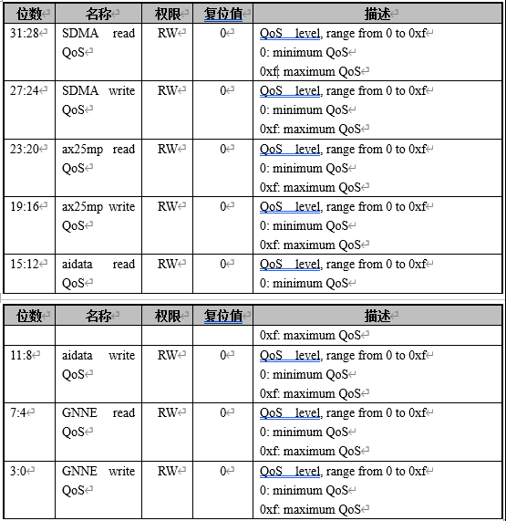

QOS 制御レジスタ 1 (QOS_CTRL1) offset[0x00f8]
 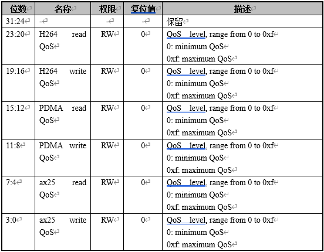

QOS 制御レジスタ 2 (QOS_CTRL2) offset[0x00fc]
 

QOS 制御レジスタ3(QOS_CTRL3) offset[0x0100]
 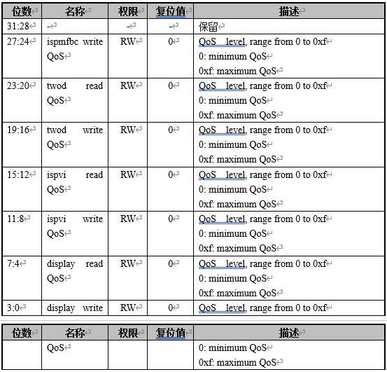

モデルのコンパイルインストールの詳細については、ファイル package/ai/ai.mk を参照してください。

スクリプト パスをコンパイルします。
package/ai/code/retinaface_mb_320/rf_onnx.py

### 1.1.3 object_detect

機能:オブジェクト分類検出、80分類

プログラムパス:`/app/ai/shell`

実行:
非定量的モデルを実行します`./object_detect_demo_bf16.sh`
uint8 量子化モデルを実行します`./object_detect_demo_uint8.sh`

モデルのコンパイルインストールの詳細については、ファイル package/ai/ai.mk を参照してください

スクリプト パスをコンパイルします。
package/ai/code/object_detect_demo/od_onnx.py

## 1.2 ffmpeg

`ffmpeg``ffmpeg-4.4`オープンソースコードに移植し、`0001-buildroot-ffmpeg-0.1.patch`パッチパッケージに追加しました

- `ff_k510_video_demuxer`: isp 入力を制御します`libvideo.so`
- `ff_libk510_h264_encoder`: h264 ハードウェア エンコーディングを制御します`libvenc.so`

設定可能なパラメータは、help ディレクティブを使用して表示できます

```shell
ffmpeg -h encoder=libk510_h264 #查看k510编码器的参数
ffmpeg -h demuxer=libk510_video #查看demuxer的配置参数
```

詳細な実行手順は[、K510_Multimedia_Developer_Guides.md を参照してください](./K510_Multimedia_Developer_Guides.md)

## 1.3 alsa_demo

alsa demoプログラムは`/app/alsa_demo`、ディレクトリの下に配置されます:

実行準備:
(1)ヘッドフォンを差し込みます

実行alsa demo:

```shell
cd /app/alsa_demo/
./alsa_demo c #录音到文件capture.pcm，demo程序仅作参考，可以参考package/alsa_demo的源码。
./alsa_demo p #播放capture.pcm
```

## 1.4 TWOD デモ

rotation メソッドを実行します。

```shell
cd /app/twod_app
./twod-rotation-app
```

ouput.yuvをyuvディスプレイに拷問し、サイズ1080 x 1920を設定し、nv12を表示し、結果は次のようになります
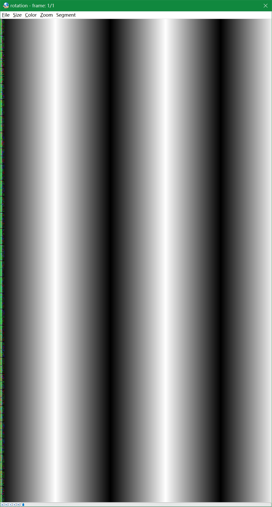

scaler 使用方法

```shell
cd /app/twod_app
./twod-scaler-app
```

ouput.yuvをyuvディスプレイに拷問してサイズ640x480を設定し、nv12を表示し、結果は次のようになります
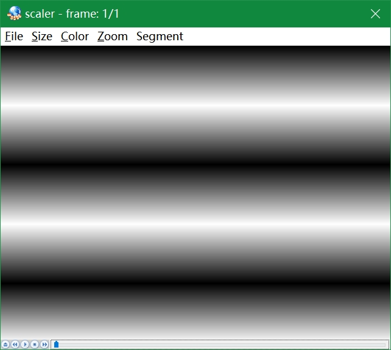

rgb2yuv メソッドを実行します。

```shell
cd /app/twod_app
./twod-osd2yuv-app
```

ouput.yuvをyuvディスプレイに拷問し、サイズ320x240を設定し、nv12を表示し、結果は次のようになります
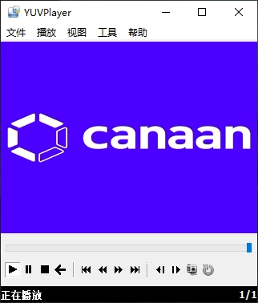

実行 yuv2rgb 使用方法:

```shell
cd /app/twod_app
./twod-scaler-output-rgb888-app
```

ouput.yuvをrgb888ディスプレイに拷問してサイズ640x480を設定し、rgb24を表示し、結果は以下の通りである


実行 出力 yuv オーバーレイ osd メソッドを実行します。

```shell
cd /app/twod_app
./twod-scaler-overlay-osd-app
```

ouput.yuvをモニターに拷問してサイズ640x480を設定し、nv12を表示し、結果は次のようになります
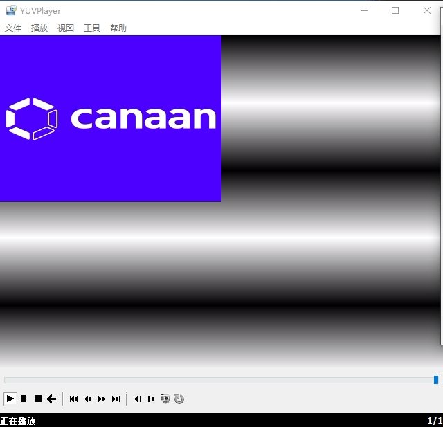

アパス:

```c
/* 创建内存 */
twod_create_fb()
/* 配置原图片参数 */   
twod_set_src_picture()
/* 配置输出图片参数 */ 
twod_set_des_picture()
/* 设置 scaler */     
twod_set_scaler()
/* 等待操作完成 */     
twod_wait_vsync()
/* Invali cache */   
twod_InvalidateCache()
/* flash cache */     
twod_flashdateCache()
/* 释放内存*/     
twod_free_mem()
/* 设置旋转 */  
twod_set_rot()
```

## 1.5 RTC デモ

RTC ドライバは、ビルド/dev/rtc0 デバイス ノードを登録します。

アプリケーション層は、Linux システムの標準 RTC プログラミングメソッド呼び出し駆動型に従い、参照ルーチンを実行する前にシェルコンソールからカーネル情報の印刷をオフにすることをお勧めします。

```shell
echo 0 > /proc/sys/kernel/printk
```

/app/rtc ディレクトリに移動し、次のようなコマンドを入力して rtc アプリケーションを起動します。

```shell
cd /app/rtc
./rtc 2021-11-3 21:10:59
```

プログラムの実行結果は次のとおりです。

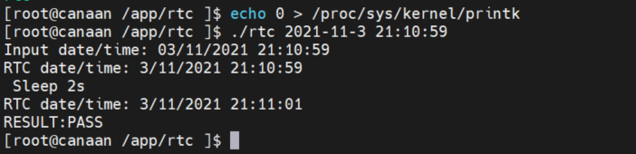

RTC demo プログラムの主なコード スニペットは次のとおりです。

```c
/*解析参数，获取当前年月日、时分秒*/
if(argc !=3) {
    fprintf(stdout, "useage:\t ./rtc year-month-day hour:minute:second\n");
    fprintf(stdout, "example: ./rtc 2021-10-11 19:54:30\n");
    return -1;
}

sscanf(argv[1], "%d-%d-%d",  &year, &month, &day);
sscanf(argv[2], "%d:%d:%d",  &hour, &minute, &second);

/*打开RTC设备，设备节点是：/dev/rtc0 */
fd = open("/dev/rtc0", O_RDONLY);
if (fd == -1) {
    perror("/dev/rtc0");
    exit(errno);
}

/* 设置RTC时间。*/
retval = ioctl(fd, RTC_SET_TIME, &rtc_tm);
if (retval == -1) {
    perror("ioctl");
    exit(errno);
}

/* 休眠 2秒。 */
sleep(2);

/* 读取RTC当前时间。*/
retval = ioctl(fd, RTC_RD_TIME, &rtc_tm);
if (retval == -1) {
    perror("ioctl");
    exit(errno);
}

/* 打印 RTC当前时间。*/
fprintf(stdout, "\nRTC date/time: %d/%d/%d %02d:%02d:%02d\n",
        rtc_tm.tm_mday, rtc_tm.tm_mon + 1, rtc_tm.tm_year + 1900,
        rtc_tm.tm_hour, rtc_tm.tm_min, rtc_tm.tm_sec);
```

## 1.6 WDT デモ

K510には3匹のウォッチドッグがあり、WDTドライバはビルド/dev/watchdog0、/dev/watchdog1、/dev/watchdog2デバイスノードを登録します。

アプリケーション層は、Linuxシステムの標準的なWDTプログラミングメソッド呼び出し駆動に従い、wathdogアプリケーションの最初のパラメータは0、1、それぞれwatchdog0、watchdog1を表し、2番目のパラメータは設定可能なタイムアウト時間(単位秒)を表し、例えば、次のコマンドはwatchdog0、watchdog0オーバーフロー時間40秒を開始することを意味します。

```shell
cd /app/watchdog
./watchdog 0 40
```

プログラム起動後、ウォッチドッグに1秒ごとに1秒ごとに餌を与え、シェル端末にstop文字を入力すると、アプリケーションが犬に餌を与えるのをやめ、ウォッチドッグはタイムアウトタイムアウトがオーバーフローした後にデバイスを再起動し、詳細はpackage/watchdogフォルダの下のコードを参照してください。

プログラムの実行結果は次のとおりです。

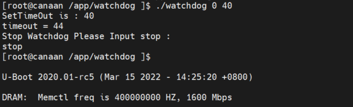

**注:**現在の k510 ウォッチドッグ モジュールの動作クロック周波数は 757575Hz で、タイムアウト時間を秒単位でウォッチドッグの実際の動作クロック周波数のタイムアウト時間に変換する必要があり、計算式は 2^n/757575であるため、実際のタイムアウト時間は入力タイムアウト時間以上になります。

実際のタイムアウト時間の計算プロセスは次のとおりです。

1)入力40,2^25/757575=44 > 40,2^24/757575=22 < 40なので、44秒に設定します。

2)155、2^27/757575=177>155と入力し、177秒に設定します。

3)入力2000、2^31/757575=2834 >2000なので、2834秒に設定します。

## 1.7 UART デモ

K510には4つのシリアルポートがあり,現在の駆動ではシリアルポート2,3にイネーブルがなく,シリアルポート0ドライバは生成/dev/ttyS0デバイスノードを登録する.

アプリケーション層は、Linux システムの標準 UART プログラミング メソッド呼び出しに従って駆動されます。 uart アプリケーションの最初のパラメーターは、それぞれ uart0、uart1 を表す 0、1 です。

開発ボードを有線ネットワークを使用してルータに接続し、開発ボードとデバッグ PC をネットワークに接続し、ボードの電源がオンになると自動的に IP を取得し、開発ボードのシェル シリアル ターミナルに ifconfig コマンドを入力して IP アドレスを取得し、デバッグ PC はこの IP を使用して telent 接続ボードを介して telent ウィンドウを開きます。 たとえば,デバッグPCがMobaXtermを介してtelentを用いて開発ボードを接続する動作を以下に示す.

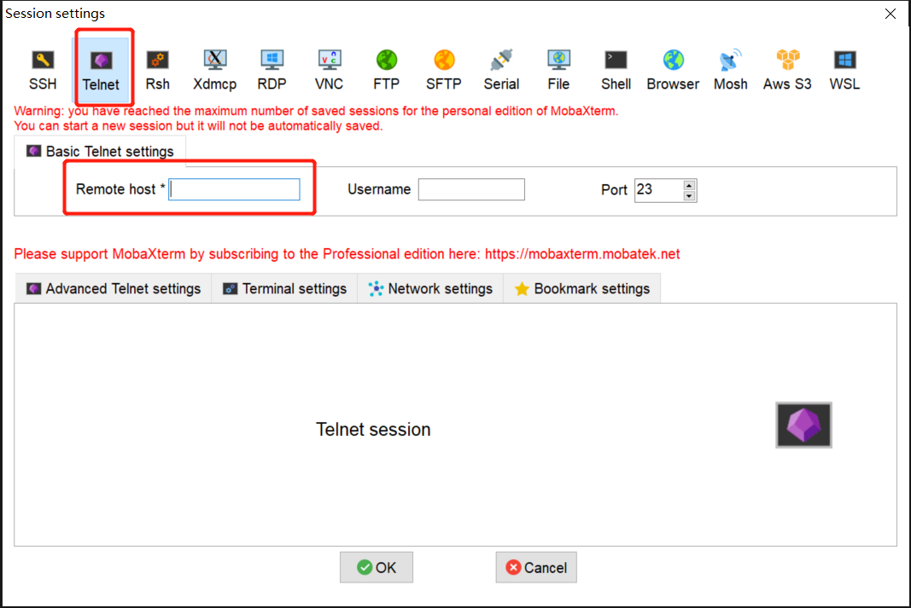

telentターミナルウィンドウに次のようなコマンドを入力してシリアルポート0の動作を開始します。

```shell
cd /app/uart
./uart 0
```

telent ウィンドウに送信する内容を入力すると、受信した crb_demoデータがシェル シリアル ターミナル ウィンドウに表示されます。
たとえば、telent ウィンドウの入力は次のようになります。

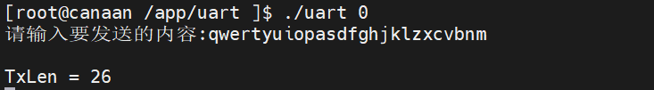

対応するシェルシリアルターミナルウィンドウは、次の方法で表示されます。

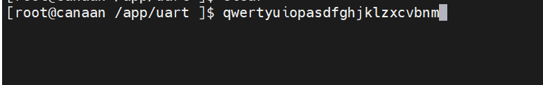

## 1.8 ETHデモ

アプリケーション層は、Linux システムの標準 ETH プログラミング メソッド呼び出しに従って駆動されます。

### 1.8.1 クライアント

デバイスはclient側として/app/clientディレクトリに入り,次のようなコマンドを入力してclientアプリケーションを起動し,ETHアプリケーションの最初のパラメータはTCPリンクを確立するサーバipアドレスを表し,たとえば次のようなコマンドを入力してETHプログラムを起動して10.20.1.13のserverと通信を確立することを示す.

```shell
cd /app/client
./client 10.20.1.13
```

tcpプロトコル接続serverを介して通信し,別のubuntuマシン上でserverプログラムを実行する,詳細コードはpackage/app/clientフォルダの下の内容を参照してください。

デバイス側にログが表示されます。

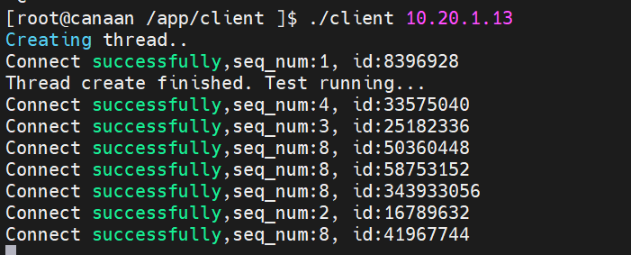

### 1.8.2 サーバ

デバイスはセルバー側として/app/server ディレクトリに入り、たとえば、次のようなコマンドを入力して、server プログラムを起動することを示します。

```shell
cd /app/server
./server
```

別のubuntuマシン上でclientプログラムを実行し、tcpプロトコルを介してserverに接続して通信し、詳細なコードはpackage/crb_demo/serverフォルダの下のコンテンツを参照してください。

デバイス側にログが表示されます。

 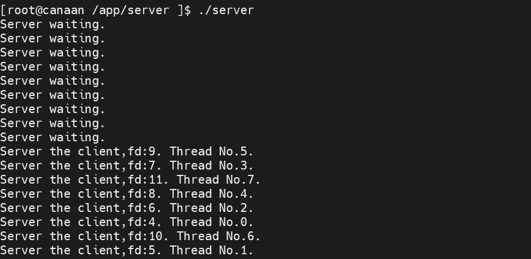

## 1.9 SDMMC デモ

K510には3つのSDMMCメインコントローラがあり、開発ボード上のSDMMC0はeMMC、SDMMC1はWIFIモジュール用、SDMMC2コントローラはsdcard用です。

SDMMC ドライバはビルド/dev/mmcblk0 を登録し、EMMC ドライバは/dev/mmcblk1 デバイス ノードとして登録します。

SDカードは、システム起動後に自動的に/root/dataにマウントされ、/app/write_read_fileディレクトリに入り、SDMMCアプリケーションの最初のパラメータは、SDカードマウント/ルート/dataなどの読み取り/書き込み操作を行うファイルを示し、/root/data/ディレクトリの下のファイルの読み取り/書き込み操作、最初の書き込み、読み取り、 SDMMCアプリケーションを起動してSDカードの読み書き操作を開始し、読み書き速度(単位m/s)を計算するには、次のコマンドを入力します。

```shell
cd /app/write_read_file
./write_read_file /root/data/test.txt
```

SDカードの1Gデータの読み書きを有効にし、コードはpackage/app/write_read_fileフォルダの下にあるものを参照してください。

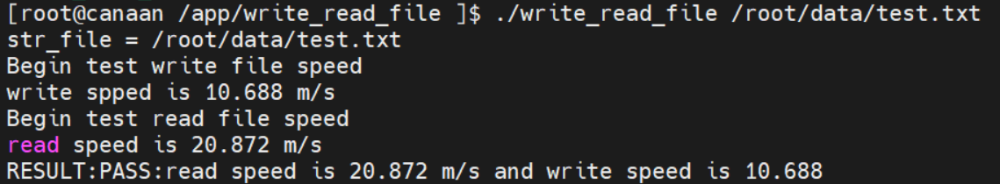

## 1.10 SHA/AES デモ

SHA/AES demo は Linux カーネルを使用して AF_ALG 型の Netlink インターフェイスをエクスポートし、ユーザー空間でカーネル暗号化 API を使用します。 詳細については、参照してください<https://www.kernel.org/doc/html/latest/crypto/userspace-if.html>。

パラメータ:
-h ヘルプ情報を印刷します
-t アルゴリズムの種類: hash、skcipher
-n アルゴリズム名: sha256, ecb(aes), cbc(aes)
-x 復号化操作
-k AES KEY (16 進数文字列)
-v AES IV (16 進数文字列)

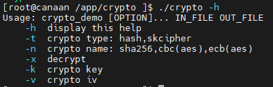

sha256テスト:

```shell
cd /app/crypto
echo -n "This is a test file, hello world" > plain.txt
./crypto -t hash -n "sha256" plain.txt sha256.txt
xxd -p -c 32 sha256.txt
sha256sum plain.txt
```

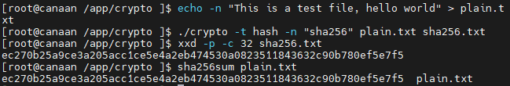

ecb(AES) 128 検定:

```shell
cd /app/crypto
echo -n "This is a test file, hello world" > plain.txt
./crypto -t skcipher -n "ecb(aes)" -k 00112233445566778899aabbccddeeff plain.txt ecb_aes_en.bin
./crypto -t skcipher -n "ecb(aes)" -k 00112233445566778899aabbccddeeff  -x ecb_aes_en.bin ecb_aes_de.bin
cmp ecb_aes_de.bin plain.txt
cat ecb_aes_de.bin
```

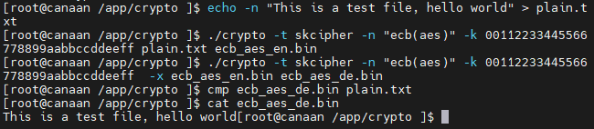

CBC(AES) 128 テスト

```shell
cd /app/crypto
echo -n "This is a test file, hello world" > plain.txt
./crypto -t skcipher -n "cbc(aes)" -k 00112233445566778899aabbccddeeff -v 00112233445566778899aabbccddeeff plain.txt cbc_aes_en.bin
./crypto -t skcipher -n "cbc(aes)" -k 00112233445566778899aabbccddeeff -v 00112233445566778899aabbccddeeff -x cbc_aes_en.bin cbc_aes_de.bin
cmp cbc_aes_de.bin plain.txt
cat cbc_aes_de.bin
```

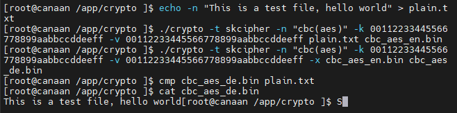

aes-ecb-128 および aes-cbc-128 は暗号化時にクリア テキストに 16 バイトのアラインメントを必要とし、0 を自動的に補うには不十分です。

## 1.11 TRNG デモ

TRNG demo は、/dev/hwrng 文字デバイスを読み取って、指定した長さの乱数を生成し、16 進数の文字列で出力します。

./trng の入力パラメータの意味:

-h ヘルプ情報を印刷します

-b 出力乱数の長さを byte 単位で指定します

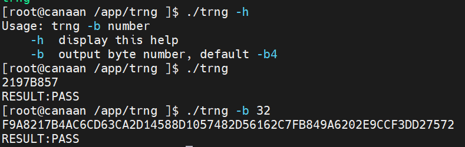

## 1.12 DRM デモ

drm demo は、VO ハードウェアのマルチレイヤー機能を示しています。

VOには8つのlayerがあります:

1)背景レイヤーは、背景色を設定することができます。

2)layer0はVIDEO層であり、YUV422およびYUV420をサポートし、NV12およびNV21フォーマットをサポートし、サイズ端は対応可能であり、ハードウェアscaling upおよびscaling downを支える。

3)layer1-layer3はVIDEo層であり、YUV422およびYUV420をサポートし、NV12およびNV21フォーマットをサポートし、サイズ端は合うことができる。

4)layer4-layer6はOSDレイヤーであり、複数のARGBフォーマットをサポートしています。

ボードの起動後に/app/drm_demoディレクトリに移動し、コマンドを入力します。

```shell
cd /app/drm_demo
./drm_demo
```

drm_demoアプリケーションを起動し、drm_demo効果を表示します。

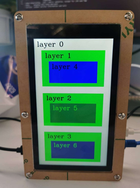

## 1.13 V4L2_DRMデモ

v4l2_drmデモは、カメラの入力と表示の機能を示しています。

ボードの起動後に/app/mediactl_libディレクトリに移動し、コマンドを入力します。

```shell
cd /app/mediactl_lib
./v4l2_drm.out -f video_drm_1080x1920.conf -e 1
或者
./v4l2_drm.out -f video_drm_1920x1080.conf
```

v4l2_drm.out アプリケーションを起動し、v4l2_drm.out 表示効果:

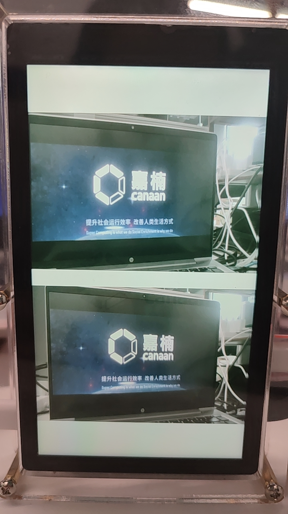

## 1.14 LVGL デモ

/app/lvgl に移動し、次のコマンドを実行します。

```shell
cd /app/lvgl
./lvgl
```

表示される効果は次のとおりです。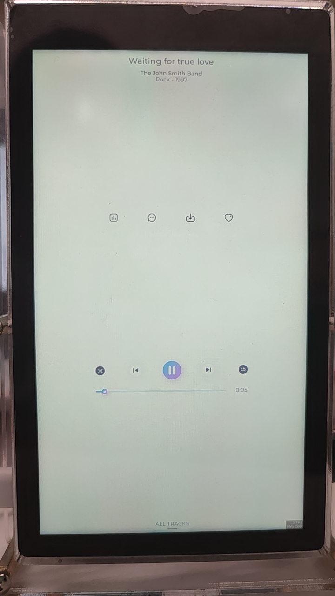

## 1.15 PWMデモ

PWM ドライバは、ビルド/sys/class/pwm/pwmchip0 および/sys/class/pwm/pwmchip3 デバイス ノードを登録します。

このルーチンは、pwm0とpwm1をそれぞれ構成およびイネーブルにすることができ、/app/pwmディレクトリに入り、pwmアプリケーションの最初のパラメータは、pwmを設定する期間を表し、単位はnsであり、2番目のパラメータはpwmの1周期で「ON」の時間を設定し、3番目のパラメータは0、1、pwm0とpwm1を表すことができ、例えば、イネーブルpwm0を示すコマンドを入力し、1sの周期、デューティ比10000000// 500000000*100% = 50%、詳細コードは package/app/pwm フォルダの下にある内容を参照してください。

```shell
cd /app/pwm
./pwm 1000000000 500000000 0
```

プログラムの実行結果は次のとおりです。

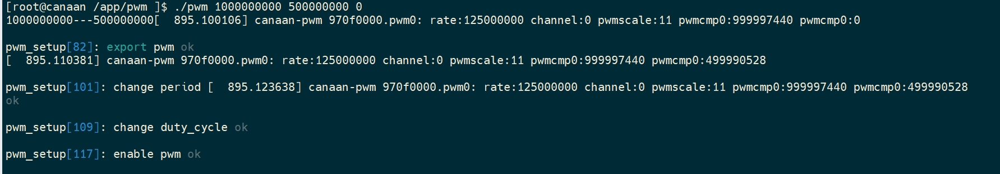

K510 CRB1.2開発ボードJ15の28番ピンをオシロスコープで接続すると、オシロスコープに1秒の周期と50%のデューティサイクルの波形プロットが観察されます。

## 1.16 無線LANデモ

WiFiモジュールドライバは、ロード後にワイヤレスネットワークカードwlan0を生成し、標準的なポートドライバに従い、TCP/IPソケットプログラミングを通常参照します。

1)ノートブックで「モバイルホットスポット」を開き、ホットスポットの名前とパスワードを設定します
2) ノートブックで NetAssist を起動し、プロトコルの種類、ローカル ホスト IP、ローカル ホスト ポート、受信設定、送信設定、および送信する必要があるデータを構成します。

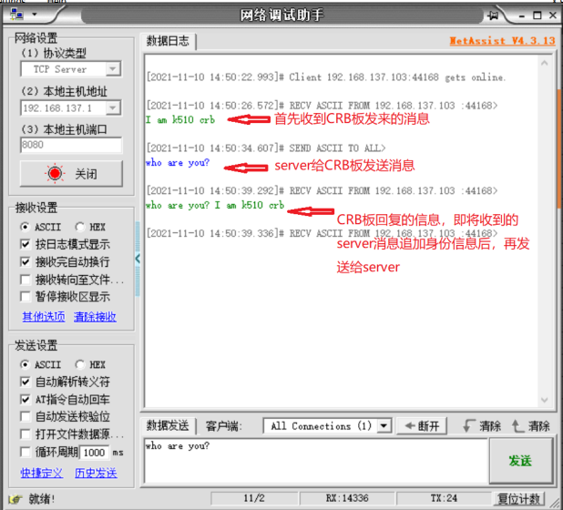

3)無線LANテスターのパラメータ形式は次のとおりです。

```shell
./wifi <AP name> <password> <local ip> <server ip>
```

たとえば、/app/wifi ディレクトリに移動し、無線LAN テスターを起動するコマンドを入力すると、プログラムの実行結果は次のようになります。

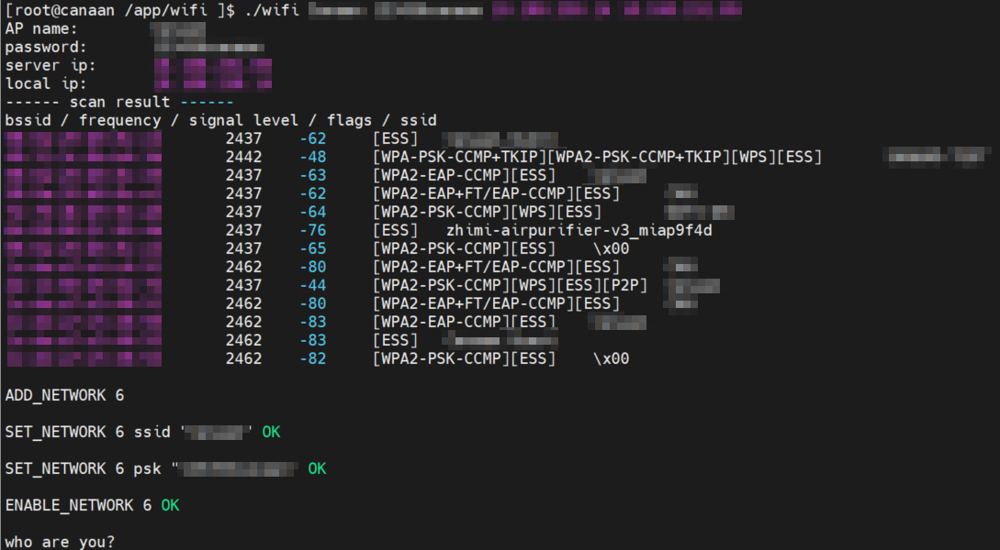

## 1.17 GPIO_KEYSデモ

キー駆動は,linux kernel自身が統合したinputサブシステムベースの汎用gpio−keysドライバを用いて,ドライバロード後に/dev/inputディレクトリでイベント監視ノードeventXを生成し,Xはイベントノード番号であり,cat /proc/bus/input/devicesで表示できる

gpio-keysルーチンは、キーアップイベントをブロックし、キーコードとキーストロークアクション、キーコード識別キーアイデンティティ、キーアクションをプレスとreleasedに分け、キーreleaseでキーが押された時間を計算するイベント情報を印刷します

プログラムの実行結果を次の図に示します。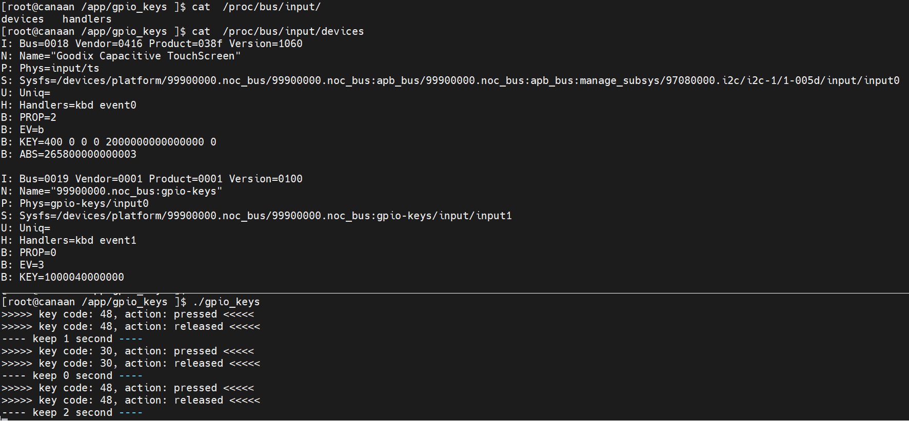

**免責事項を翻訳します**  
お客様の便宜のために、カナアンはAI翻訳プログラムを使用してテキストを複数の言語に翻訳し、エラーが含まれている可能性があります。 当社は、提供される翻訳の正確性、信頼性、または適時性を保証するものではありません。 カナアンは、翻訳された情報の正確性または信頼性への依存に起因するいかなる損失または損害についても責任を負いません。 異なる言語翻訳間でコンテンツの違いがある場合は、簡体字中国語版が優先されます。

翻訳エラーや不正確な問題を報告する場合は、メールでお問い合わせください。
