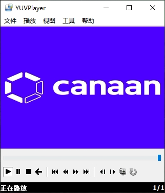

**<font face="黑体" size="6" style="float:right">K510 SDK 애플리케이션 가이드</font>**

<font face="黑体"  size=3>문서 버전: V1.0.0</font>

<font face="黑体"  size=3>게시 날짜: 2022-03-09</font>

<div style="page-break-after:always"></div>

<font face="黑体" size=3>**면책 조항**</font>
귀하가 구매한 제품, 서비스 또는 기능은 베이징 Jiananges 정보 기술 유한 회사(이하 "회사")의 상업 계약 및 약관의 적용을 받으며, 이 문서에 설명된 제품, 서비스 또는 기능의 전부 또는 일부는 구매 또는 사용의 범위를 벗어납니다. 계약에 달리 합의하지 않는 한, 회사는 본 문서의 진술, 정보, 내용의 정확성, 신뢰성, 완전성, 마케팅, 특정 목적 및 비침략성에 대해 명시적 또는 묵시적으로 어떠한 진술이나 보증도 하지 않습니다. 달리 합의하지 않는 한, 이 문서는 사용 지침의 참조로만 사용됩니다.
이 문서의 내용은 제품 버전 업그레이드 또는 기타 이유로 인해 예고 없이 수시로 업데이트되거나 수정될 수 있습니다.

**<font face="黑体"  size=3>상표 고지</font>**

베이징 Jianan Jets 정보 기술 유한 공사의 상표는 Jianan, Jianan 및 Jianan의 다른 상표입니다. 이 문서에 언급될 수 있는 기타 모든 상표 또는 등록 상표는 해당 소유자가 소유합니다.

**<font face="黑体"  size=3>저작권 ©2022 베이징 Jiananjets 정보 기술 유한 회사</font>**
이 문서는 K510 플랫폼 개발 및 설계에만 적용되며, 어떠한 단위나 개인도 회사의 서면 허가 없이 이 문서의 일부 또는 전부를 어떤 형태로든 배포할 수 없습니다.

**<font face="黑体"  size=3>베이징 Jiananjets 정보 기술 유한 회사</font>**
웹 사이트: canaan-creative.com
비즈니스 문의: salesAI@canaan-creative.com

<div style="page-break-after:always"></div>
# 서문
**<font face="黑体"  size=5>문서의 목적</font>**
이 문서는 K510 SDK 앱 인스턴스에 대한 설명서입니다.

**<font face="黑体"  size=5>독자 개체입니다</font>**

이 문서(이 가이드)가 주로 적용되는 사람:

- 소프트웨어 개발자
- 기술 지원 담당자

**<font face="黑体"  size=5>레코드를 수정합니다</font>**
 <font face="宋体"  size=2>개정 레코드에는 각 문서 업데이트에 대한 설명이 누적됩니다. 문서의 최신 버전에는 이전 버전의 모든 업데이트가 포함되어 있습니다. </font>

| 버전 번호입니다 | 수정자     | 개정일입니다   | 개정 지침     |
| :----- | ---------- | ---------- | ------------ |
| V1.0.0 | 시스템 소프트웨어 그룹입니다 | 2022-03-09 | SDK V1.5 릴리스 |
|        |            |            |              |
|        |            |            |              |
|        |            |            |              |
|        |            |            |              |
|        |            |            |              |
|        |            |            |              |
|        |            |            |              |
|        |            |            |              |

<div style="page-break-after:always"></div>
**<font face="黑体"  size=6>카탈로그</font>**

[목차]

<div style="page-break-after:always"></div>

# 1 데모 앱

## 1.1 ai demo 프로그램

### 1.1.1 설명

nncase의 데모 프로그램 소스 코드는 SDK 디렉토리의 디렉토리에 있으며`package/ai` 디렉토리 구조는 다음과 같습니다

```shell
$ tree -L 2 ai
ai
├── ai.hash
├── ai.mk
├── code
│   ├── build.sh
│   ├── cmake
│   ├── CMakeLists.txt
│   ├── common
│   ├── face_alignment
│   ├── face_detect
│   ├── face_expression
│   ├── face_landmarks
│   ├── face_recog
│   ├── hand_image_classify
│   ├── head_pose_estimation
│   ├── imx219_0.conf
│   ├── imx219_1.conf
│   ├── license_plate_recog
│   ├── object_detect
│   ├── object_detect_demo
│   ├── openpose
│   ├── person_detect
│   ├── retinaface_mb_320
│   ├── self_learning
│   ├── shell
│   ├── simple_pose
│   ├── video_192x320.conf
│   ├── video_object_detect_320.conf
│   ├── video_object_detect_320x320.conf
│   ├── video_object_detect_432x368.conf
│   ├── video_object_detect_512.conf
│   ├── video_object_detect_640.conf
│   └── video_object_detect_640x480.conf
└── Config.in
```

retinaface_mb_320 소스 코드를 참조하고 `CMakeLists.txt`새 nncase를 추가하는 데모 프로그램을 참조할 수 있습니다.

모델 컴파일은 `nncase_demo.mk`여기에 정의된*POST_INSTALL_TARGET_HOOKS*참조하십시오

```text
NNCASE_DEMO_DEPENDENCIES += mediactl_lib nncase_linux_runtime opencv4 libdrm
define NNCASE_DEMO_COMPILE_MODEL
    mkdir -p $(TARGET_DIR)/app/ai/kmodel/kmodel_compile/retinaface_mb_320
    cd $(@D) && /usr/bin/python3 retinaface_mb_320/rf_onnx.py --quant_type uint8 --model ai_kmodel_data/model_file/retinaface/retinaface_mobile0.25_320.onnx
    cp $(@D)/rf.kmodel $(TARGET_DIR)/app/ai/kmodel/kmodel_compile/retinaface_mb_320/rf_uint8.kmodel
    cd $(@D) && /usr/bin/python3 retinaface_mb_320/rf_onnx.py --quant_type bf16 --model ai_kmodel_data/model_file/retinaface/retinaface_mobile0.25_320.onnx
    cp $(@D)/rf.kmodel $(TARGET_DIR)/app/ai/kmodel/kmodel_compile/retinaface_mb_320/rf_bf16.kmodel

NNCASE_DEMO_POST_INSTALL_TARGET_HOOKS += NNCASE_DEMO_COMPILE_MODEL
```

모델을 컴파일하려면 nncase 환경, nncase 환경 빌드, 참조 k510_nncase_Developer_Guides.md가 필요합니다. 나중에 nncase에 대한 업데이트가 있으며 빌드 루트 sdk가 nncase로 동기화됩니다.

### 1.1.2 망막 얼굴

기능 : 얼굴 감지, 얼굴 특징 감지

프로그램 경로:
`/app/ai/shell`
실행:
정량화되지 않은 모델을 실행합니다`./retinaface_mb_320_bf16.sh`
uint8 양자화 모델을 수행합니다`./retinaface_mb_320_uint8.sh`

스크립트에는 QOS에 대한 설정이 있으며 다음 두 데모의 설정은 동일합니다.

```shell
#devmem phyaddr width value
devmem 0x970E00fc 32 0x0fffff00
devmem 0x970E0100 32 0x000000ff
devmem 0x970E00f4 32 0x00550000
```

데모를 실행할 때 화면이 제대로 표시되는지 확인하는 우선 순위가 필요합니다.
QOS_CTRL0.ax25mp write QoS = 5
QOS_CTRL0.ax25mp read QoS = 5
QOS_CTRL2.ispf2k write QoS = 0xf
QOS_CTRL2.ispf2k read QoS = 0xf
QOS_CTRL2.ispr2k write QoS = 0xf
QOS_CTRL2.ispr2k read QoS = 0xf
QOS_CTRL2.isp3dtof write QoS = 0xf
QOS_CTRL3.display read QoS = 0xf
QOS_CTRL3.display write QoS = 0xf

QOS 제어 레지스터 0(QOS_CTRL0) offset[0x00f4]
 

QOS 제어 레지스터 1(QOS_CTRL1) offset[0x00f8]
 

QOS 제어 레지스터 2(QOS_CTRL2) offset[0x00fc]
 

QOS 제어 레지스터 3(QOS_CTRL3) offset[0x0100]
 

모델의 컴파일 및 설치는 파일 패키지/ai/ai.mk에 자세히 설명되어 있습니다.

스크립트 경로 컴파일:
package/ai/code/retinaface_mb_320/rf_onnx.py

### 1.1.3 object_detect

기능 : 개체 분류 감지, 80 분류

프로그램 경로:`/app/ai/shell`

실행:
정량화되지 않은 모델을 실행합니다`./object_detect_demo_bf16.sh`
uint8 양자화 모델을 수행합니다`./object_detect_demo_uint8.sh`

모델의 컴파일 및 설치는 파일 패키지/ai/ai.mk에 자세히 설명되어 있습니다

스크립트 경로 컴파일:
package/ai/code/object_detect_demo/od_onnx.py

## 1.2 ffmpeg

`ffmpeg``ffmpeg-4.4`오픈 소스 코드에서 포팅, `0001-buildroot-ffmpeg-0.1.patch`패치 패키지에 대 한 추가

- `ff_k510_video_demuxer`: isp 입력을 제어하고 참조합니다`libvideo.so`
- `ff_libk510_h264_encoder`: h264 하드웨어 인코딩을 제어하고 참조합니다`libvenc.so`

구성 가능한 매개 변수는 도움말 지시문을 통해 볼 수 있습니다

```shell
ffmpeg -h encoder=libk510_h264 #查看k510编码器的参数
ffmpeg -h demuxer=libk510_video #查看demuxer的配置参数
```

자세한 실행 지침은 [K510_Multimedia_Developer_Guides.md를 참조하십시오](./K510_Multimedia_Developer_Guides.md)

## 1.3 alsa_demo

alsa demo 프로그램은 디렉토리에 배치됩니다`/app/alsa_demo`

실행 준비:
(1) 헤드폰을 연결합니다

alsa demo 실행:

```shell
cd /app/alsa_demo/
./alsa_demo c #录音到文件capture.pcm，demo程序仅作参考，可以参考package/alsa_demo的源码。
./alsa_demo p #播放capture.pcm
```

## 1.4 두 개의 데모

rotation 실행 방법:

```shell
cd /app/twod_app
./twod-rotation-app
```

ouput.yuv yuv 모니터에 1080 x 1920의 크기를 설정하고 nv12 형식을 표시한 결과 다음과 같습니다


스케일러 사용

```shell
cd /app/twod_app
./twod-scaler-app
```

ouput.yuv yuv 모니터에 640x480의 크기를 설정하고 nv12 형식을 표시한 결과 다음과 같습니다


rgb2yuv 사용 방법 실행:

```shell
cd /app/twod_app
./twod-osd2yuv-app
```

ouput.yuv yuv 모니터에 크기 320x240을 설정하고 nv12 형식을 표시한 결과 다음과 같습니다


yuv2rgb 사용 방법 실행:

```shell
cd /app/twod_app
./twod-scaler-output-rgb888-app
```

rgb888 모니터에 .yuv 640x480의 크기를 설정하고 rgb24 형식을 표시한 결과 다음과 같은 결과가 나타났습니다


출력 yuv에 오버레이 osd를 실행하려면 다음을 수행합니다.

```shell
cd /app/twod_app
./twod-scaler-overlay-osd-app
```

ouput.yuv 모니터에 640x480의 크기를 설정하고 nv12 형식을 표시한 결과 다음과 같습니다


API:

```c
/* 创建内存 */
twod_create_fb()
/* 配置原图片参数 */   
twod_set_src_picture()
/* 配置输出图片参数 */ 
twod_set_des_picture()
/* 设置 scaler */     
twod_set_scaler()
/* 等待操作完成 */     
twod_wait_vsync()
/* Invali cache */   
twod_InvalidateCache()
/* flash cache */     
twod_flashdateCache()
/* 释放内存*/     
twod_free_mem()
/* 设置旋转 */  
twod_set_rot()
```

## 1.5 RTC 데모

RTC 드라이버는 빌드/dev/rtc0 장치 노드를 등록합니다.

응용 프로그램 계층은 Linux 시스템의 표준 RTC 프로그래밍 메서드 호출 드라이버를 따르며 참조 루틴을 실행하기 전에 셸 콘솔을 통해 커널 정보 인쇄를 끄는 것이 좋습니다.

```shell
echo 0 > /proc/sys/kernel/printk
```

/app/rtc 디렉토리로 이동하여 다음 명령을 입력하여 rtc 응용 프로그램을 시작합니다.

```shell
cd /app/rtc
./rtc 2021-11-3 21:10:59
```

프로그램의 실행 결과는 다음과 같습니다.


RTC 데모 프로그램의 주요 코드 조각은 다음과 같습니다. 자세한 내용은 package/rtc 폴더 아래의 코드를 참조하십시오.

```c
/*解析参数，获取当前年月日、时分秒*/
if(argc !=3) {
    fprintf(stdout, "useage:\t ./rtc year-month-day hour:minute:second\n");
    fprintf(stdout, "example: ./rtc 2021-10-11 19:54:30\n");
    return -1;
}

sscanf(argv[1], "%d-%d-%d",  &year, &month, &day);
sscanf(argv[2], "%d:%d:%d",  &hour, &minute, &second);

/*打开RTC设备，设备节点是：/dev/rtc0 */
fd = open("/dev/rtc0", O_RDONLY);
if (fd == -1) {
    perror("/dev/rtc0");
    exit(errno);
}

/* 设置RTC时间。*/
retval = ioctl(fd, RTC_SET_TIME, &rtc_tm);
if (retval == -1) {
    perror("ioctl");
    exit(errno);
}

/* 休眠 2秒。 */
sleep(2);

/* 读取RTC当前时间。*/
retval = ioctl(fd, RTC_RD_TIME, &rtc_tm);
if (retval == -1) {
    perror("ioctl");
    exit(errno);
}

/* 打印 RTC当前时间。*/
fprintf(stdout, "\nRTC date/time: %d/%d/%d %02d:%02d:%02d\n",
        rtc_tm.tm_mday, rtc_tm.tm_mon + 1, rtc_tm.tm_year + 1900,
        rtc_tm.tm_hour, rtc_tm.tm_min, rtc_tm.tm_sec);
```

## 1.6 WDT 데모

K510에는 총 3개의 감시견이 있으며, WDT 드라이버는 빌드/dev/watchdog0, /dev/watchdog1, /dev/watchdog2 장치 노드를 등록합니다.

응용 프로그램 계층은 Linux 시스템의 표준 WDT 프로그래밍 메서드 호출 드라이버를 따르며, wathdog 응용 프로그램의 첫 번째 매개 변수는 각각 watchdog0, watchdog1을 나타내는 0, 1일 수 있으며, 두 번째 인수는 설정할 수 있는 시간 제한 시간(초)을 나타냅니다(예: 다음 명령은 watchdog0, watchdog0 오버플로 시간 40초)를 나타냅니다.

```shell
cd /app/watchdog
./watchdog 0 40
```

프로그램이 시작된 후 1초마다 감시견에게 먹이를 주고, 쉘 터미널에 스톱 문자를 입력하면 응용 프로그램이 개를 먹이지 않으며, 감시 타이머 오버플로 설정 후 장치를 재설정하고 다시 시작합니다.

프로그램의 실행 결과는 다음과 같습니다.


**참고**: 현재 k510 워치독 모듈의 작동 클럭 주파수는 757575Hz이며, 초 단위의 시간 제한은 워치독의 실제 작동 클럭 주파수의 시간 제한으로 변환되어야 하며, 계산 공식은 2^n/757575, 따라서 실제 시간 제한 시간은 입력된 시간 초과 시간과 같거나 같을 수 있습니다.

실제 시간 초과는 다음과 같이 계산됩니다.

1) 40,2^25/757575=44 > 40,2^24/757575=22 < 40을 입력하므로 44초로 설정됩니다.

2) 입력 155,2^27/757575=177 > 155, 따라서 177 초로 설정;

3) 2000, 2^31/757575=2834 > 2000을 입력하므로 2834초로 설정됩니다.

## 1.7 UART 데모

K510에는 총 4개의 직렬 포트가 있으며, 현재 드라이버의 직렬 포트 2, 3은 작동이 없으며 직렬 포트 0 드라이버는 생성/dev/ttyS0 장치 노드를 등록합니다.

응용 프로그램 계층은 Linux 시스템의 표준 UART 프로그래밍 메서드 호출 드라이버를 따릅니다. uart 응용 프로그램의 첫 번째 매개 변수는 각각 uart0, uart1을 나타내는 0, 1일 수 있습니다.

개발 보드는 유선 네트워크를 사용하여 라우터에 연결되므로 보드와 디버그 PC가 한 네트워크에서 작동하고 보드에 전원이 공급되면 자동으로 IP를 얻고 보드의 셸 직렬 터미널에 ifconfig 명령을 입력하여 IP 주소를 가져오고 디버그 PC는 이 IP를 사용하여 텔런트 연결 보드를 통해 텔런트 창을 엽니다. 예를 들어 MobaXterm을 통해 PC를 디버깅하고 텔런트를 사용하여 보드를 연결하는 작업은 다음과 같습니다.


telent 터미널 창에 다음 명령을 입력하여 직렬 포트 0 작업을 시작합니다.

```shell
cd /app/uart
./uart 0
```

telent 창에 보낼 항목을 입력하면 셸 직렬 터미널 창에서 수신된 데이터를 볼 수 있습니다. 자세한 내용은 패키지/crb_demo/uart 폴더 아래의 코드를 참조하십시오.
예를 들어 telent 창에 대한 입력은 다음과 같습니다.


해당 셸 직렬 터미널 창은 다음을 표시합니다.


## 1.8 ETH 데모

응용 프로그램 계층은 Linux 시스템의 표준 ETH 프로그래밍 메서드 호출 드라이버를 따릅니다.

### 1.8.1 클라이언트

장치는 client 측으로서/app/client 디렉토리에 들어가서 다음 명령을 입력하여 client 응용 프로그램을 시작하고, ETH 응용 프로그램의 첫 번째 매개 변수는 TCP 링크를 설정할 서버 IP 주소를 나타냅니다. 예를 들어, 다음 명령을 입력하면 ETH 프로그램이 10.20.1.13의 server와 통신합니다.

```shell
cd /app/client
./client 10.20.1.13
```

tcp 프로토콜을 통해 server를 연결하여 통신하고 다른 우분투 컴퓨터에서 server 프로그램을 실행합니다. 자세한 코드는 패키지/앱/client 폴더 아래를 참조하십시오.

장치 측 표시 로그:


### 1.8.2 서버

장치는 서버 측으로/app/server 디렉토리에 들어갑니다(예: Server 프로그램 시작을 나타내기 위해 다음 명령을 입력).

```shell
cd /app/server
./server
```

다른 우분투 컴퓨터에서 client 프로그램을 실행하고 tcp 프로토콜을 통해 server를 연결하여 통신합니다. 자세한 코드는 패키지/crb_demo/server 폴더 아래에 있습니다.

장치 측 표시 로그:

 

## 1.9 SDMMC 데모

K510에는 총 3개의 SDMMC 마스터 컨트롤러가 있으며, 개발 보드의 SDMMC0은 eMMC를 연결하고, SDMMC1은 WIFI 모듈용이고, SDMMC2 컨트롤러는 sdcard를 연결합니다.

SDMMC 드라이버는 빌드/dev/mmcblk0을 등록하고 EMMC 드라이버는 /dev/mmcblk1 장치 노드로 등록합니다.

SD 카드는 시스템 시작 후 /root/data에 자동으로 마운트되고,/app/write_read_file 디렉토리에 들어가고, SDMMC 응용 프로그램의 첫 번째 매개 변수는 SD 카드가 /root/data에 마운트되고/root/data/디렉토리의 파일을 읽고 쓸 수 있는 파일과 같이 읽기 및 쓰기 작업을 수행할 파일을 나타냅니다. 다음 명령을 입력하여 SD 카드를 읽고 쓰는 SDMMC 응용 프로그램을 시작하고 읽기 및 쓰기 속도(m/s)를 계산합니다.

```shell
cd /app/write_read_file
./write_read_file /root/data/test.txt
```

SD 카드에 대한 1G 데이터 읽기 및 쓰기를 켜려면 패키지 /앱 / write_read_file 폴더 아래의 내용을 참조하십시오.


## 1.10 SHA/AES 데모

SHA/AES demo는 Linux 커널을 사용하여 AF_ALG 유형의 Netlink 인터페이스를 내보내고 사용자 공간에서 커널 암호화 API를 사용합니다. 자세한 내용은 을 참조하십시오<https://www.kernel.org/doc/html/latest/crypto/userspace-if.html>.

매개 변수:
-h 도움말 정보를 인쇄합니다
-t 알고리즘 유형 : 해시, skcipher
-n 알고리즘 이름: sha256, ecb(aes), cbc(aes)
-x 암호 해독 작업
-k AES KEY(16진수 문자열)
-v AES IV(16진수 문자열)


sha256 테스트 :

```shell
cd /app/crypto
echo -n "This is a test file, hello world" > plain.txt
./crypto -t hash -n "sha256" plain.txt sha256.txt
xxd -p -c 32 sha256.txt
sha256sum plain.txt
```


ecb (aes) 128 테스트 :

```shell
cd /app/crypto
echo -n "This is a test file, hello world" > plain.txt
./crypto -t skcipher -n "ecb(aes)" -k 00112233445566778899aabbccddeeff plain.txt ecb_aes_en.bin
./crypto -t skcipher -n "ecb(aes)" -k 00112233445566778899aabbccddeeff  -x ecb_aes_en.bin ecb_aes_de.bin
cmp ecb_aes_de.bin plain.txt
cat ecb_aes_de.bin
```


cbc (aes) 128 테스트

```shell
cd /app/crypto
echo -n "This is a test file, hello world" > plain.txt
./crypto -t skcipher -n "cbc(aes)" -k 00112233445566778899aabbccddeeff -v 00112233445566778899aabbccddeeff plain.txt cbc_aes_en.bin
./crypto -t skcipher -n "cbc(aes)" -k 00112233445566778899aabbccddeeff -v 00112233445566778899aabbccddeeff -x cbc_aes_en.bin cbc_aes_de.bin
cmp cbc_aes_de.bin plain.txt
cat cbc_aes_de.bin
```


aes-ecb-128 및 aes-cbc-128 암호화는 16바이트 정렬이 필요하며, 부족하면 자동으로 0이 됩니다.

## 1.11 TRNG 데모

TRNG demo는 읽기/dev/hwrng 문자 장치를 통해 지정된 길이의 난수를 생성하여 16진수 문자열로 출력됩니다.

./trng의 입력 매개 변수 의미:

-h 도움말 정보를 인쇄합니다

-b 출력 난수 길이(byte 단위)를 지정합니다


## 1.12 DRM 데모

drm demo는 VO 하드웨어 멀티 레이어 기능을 보여줍니다.

VO에는 8개의 layer가 있습니다.

1) 배경 레이어, 배경 색상을 구성 할 수 있습니다.

2) layer0은 YUV422 및 YUV420을 지원하는 비디오 계층으로 NV12 및 NV21 형식을 지원하며 크기 측면에서 사용할 수 있으며 하드웨어 scaling up 및 scaling down을 지원합니다.

3) layer1-layer3은 YUV422 및 YUV420을 지원하는 비디오 레이어이며 NV12 및 NV21 형식을 지원합니다.

4) layer4-layer6은 OSD 계층으로 다양한 ARGB 형식을 지원합니다.

보드가 시작된 후 /app/drm_demo 디렉토리에 들어가 명령을 입력합니다.

```shell
cd /app/drm_demo
./drm_demo
```

drm_demo 응용 프로그램을 실행하면 다음과 같은 효과가 drm_demo.


## 1.13 V4L2_DRM 데모

v4l2_drm 데모는 카메라 입력 및 디스플레이 기능을 보여줍니다.

보드가 시작된 후 /app/mediactl_lib 디렉토리에 들어가 명령을 입력합니다.

```shell
cd /app/mediactl_lib
./v4l2_drm.out -f video_drm_1080x1920.conf -e 1
或者
./v4l2_drm.out -f video_drm_1920x1080.conf
```

v4l2_drm.out 응용 프로그램을 시작하고 v4l2_drm.out을 표시합니다.


## 1.14 LVGL 데모

/app/lvgl을 입력하고 다음 명령을 실행합니다.

```shell
cd /app/lvgl
./lvgl
```

다음과 같이 표시됩니다.

## 1.15 PWM 데모

PWM 드라이버는 빌드/sys/class/pwm/pwmchip0 및/sys/class/pwm/pwmchip3 디바이스 노드를 등록합니다.

이 루틴은 각각 pwm0 및 pwm1을 구성하고 가능하게 할 수 있으며, 입력/app/pwm 디렉토리, pwm 응용 프로그램의 첫 번째 매개 변수는 pwm을 설정하는 기간을 나타내며, 단위는 ns이고, 두 번째 매개 변수는 pwm의 기간 동안 "ON"의 시간을 설정하고, 단위는 ns이고, 세 번째 매개 변수는 각각 pwm0 및 pwm1을 나타낼 수 있으며, 예를 들어, 다음 명령을 입력하여 pwm0, 기간 1s, 듀티 사이클 100000000/을 나타냅니다. 50000000*100% = 50%, 자세한 코드는 패키지/앱/pwm 폴더 아래의 내용을 참조하십시오.

```shell
cd /app/pwm
./pwm 1000000000 500000000 0
```

프로그램의 실행 결과는 다음과 같습니다.


K510 CRB1.2 개발 보드 J15의 핀 28을 오실로스코프를 통해 오실로스코프에서 1초의 주기와 50%의 듀티 사이클을 관찰할 수 있습니다.

## 1.16 와이파이 데모

WiFi 모듈 드라이버가 로드되면 표준 네트워크 포트 드라이버, TCP/IP 소켓 프로그래밍을 참조하는 무선 네트워크 카드 wlan0이 생성됩니다.

1) 노트북에서 "핫스팟 이동"을 열고 핫스팟의 이름과 암호를 설정합니다
2) 노트북에서 NetAssist를 시작하고 프로토콜 유형, 로컬 호스트 IP, 로컬 호스트 포트, 수신 설정, 전송 설정 및 전송해야 하는 데이터를 구성합니다.

    

3) 와이파이 테스터의 매개 변수 형식은 다음과 같습니다.

    ```shell
    ./wifi <AP name> <password> <local ip> <server ip>
    ```

    예를 들어/app/Wi-Fi 디렉터리를 입력하고 Wi-Fi 테스터 시작 명령을 입력하면 프로그램 실행 결과는 다음과 같습니다.

    

## 1.17 GPIO_KEYS 데모

키 드라이버는 linux kernel 자체 통합 input 하위 시스템 기반 범용 gpio-keys 드라이버를 사용하여 로드 후 /dev/input 디렉토리에서 이벤트 모니터링 노드 eventX를 생성하며 X는 이벤트 노드 시퀀스 번호이며 cat /proc/bus/input/devices를 통해 볼 수 있습니다

gpio-keys 루틴은 키 입력을 읽고 이벤트를 보고하고 키 입력, 키 인코딩 및 키 입력, 키 입력 ID를 식별하는 키 인코딩, pressed 및 released로 나누어 키 누름 기간을 계산하는 키 누름을 포함한 이벤트 정보를 인쇄합니다

프로그램 실행 결과는 다음 그림과 같습니다.

**번역 면책 조항**  
고객의 편의를 위해 Canan은 AI 번역 프로그램을 사용하여 오류를 포함할 수 있는 여러 언어로 텍스트를 번역합니다. 당사는 제공된 번역의 정확성, 신뢰성 또는 적시성을 보장하지 않습니다. Canan은 번역된 정보의 정확성이나 신뢰성에 의존하여 발생하는 손실이나 손해에 대해 책임을 지지 않습니다. 언어 번역 간에 콘텐츠 차이가 있는 경우 중국어 간체 버전이 우선합니다.

번역 오류 또는 부정확한 문제를 신고하려면 이메일로 문의하시기 바랍니다.
