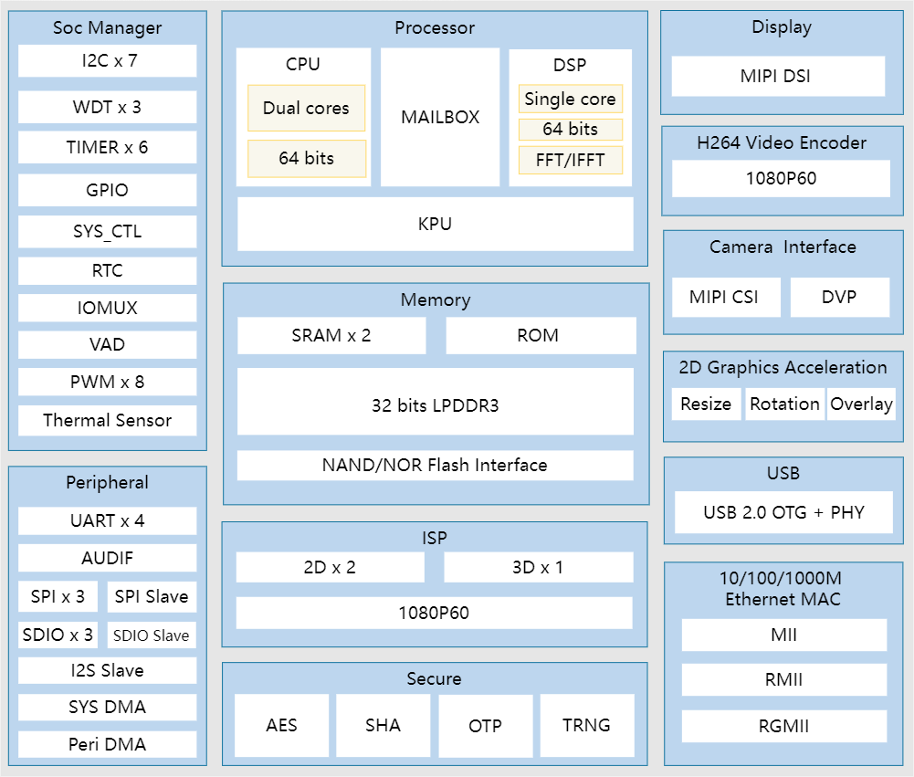
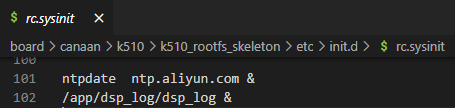
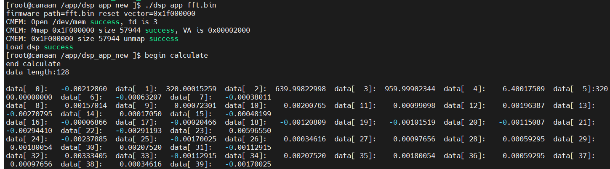

**<font face="黑体" size="6" style="float:right">K510 DSP CORE Gids</font>**

<font face="黑体"  size=3>Document versie: V1.0.0</font>

<font face="黑体"  size=3>Publicatiedatum: 2022-03-09</font>

<div style="page-break-after:always"></div>

<font face="黑体" size=3>**Disclaimer**</font>
De producten, diensten of functies die u koopt, zijn onderworpen aan de commerciële contracten en voorwaarden van Beijing Canaan Jiesi Information Technology Co., Ltd. ("het Bedrijf", hierna hetzelfde), en alle of een deel van de producten, diensten of functies die in dit document worden beschreven, vallen mogelijk niet binnen het bereik van uw aankoop of gebruik. Tenzij anders overeengekomen in het contract, wijst het bedrijf alle verklaringen of garanties af, expliciet of impliciet, met betrekking tot de nauwkeurigheid, betrouwbaarheid, volledigheid, marketing, specifiek doel en niet-agressie van verklaringen, informatie of inhoud van dit document. Tenzij anders overeengekomen, wordt dit document uitsluitend verstrekt als leidraad voor gebruik.
Vanwege upgrades van de productversie of andere redenen kan de inhoud van dit document van tijd tot tijd zonder enige kennisgeving worden bijgewerkt of gewijzigd.

**<font face="黑体"  size=3>Handelsmerkkennisgevingen</font>**

"", "Canaan" icoon, Kanaän en andere handelsmerken van Kanaän en andere handelsmerken van Kanaän zijn handelsmerken van Beijing Canaan Jiesi Information Technology Co., Ltd. Alle andere handelsmerken of geregistreerde handelsmerken die in dit document kunnen worden genoemd, zijn eigendom van hun respectieve eigenaars.

**<font face="黑体"  size=3>Copyright ©2022 Beijing Canaan Jiesi Information Technology Co, Ltd</font>**
Dit document is alleen van toepassing op de ontwikkeling en het ontwerp van het K510-platform, zonder de schriftelijke toestemming van het bedrijf mag geen enkele eenheid of persoon een deel of de inhoud van dit document in welke vorm dan ook verspreiden.

**<font face="黑体"  size=3>Beijing Canaan Jiesi Information Technology Co, Ltd</font>**
URL: canaan-creative.com
Zakelijke vragen: salesAI@canaan-creative.com

<div style="page-break-after:always"></div>
# inleiding
**<font face="黑体"  size=5>Doel van het document</font>**
Dit document is een handleiding voor het gebruik van de K510 DSP-kern.

**<font face="黑体"  size=5>Reader Objecten</font>**

De belangrijkste personen op wie dit document (deze gids) van toepassing is:

- Softwareontwikkelaars
- Technisch ondersteunend personeel

**<font face="黑体"  size=5>Revisiegeschiedenis</font>**
 <font face="宋体"  size=2>De revisiegeschiedenis bevat een beschrijving van elke documentupdate. De nieuwste versie van het document bevat updates voor alle voorgaande versies. </font>

| Het versienummer   | Gewijzigd door     | Datum van herziening | Opmerkingen bij herziening |
|  :-----  |-------   |  ------  |  ------  |
| V1.0.0 | Systeemsoftwaregroepen | 2022-03-09 |         |
|        |        |            |                    |
|        |        |            |                    |
|        |        |            |                    |
|        |        |            |                    |
|        |        |            |                    |

<div style="page-break-after:always"></div>
**<font face="黑体"  size=6>Inhoud</font>**

[INHOUDSOPGAVE]

<div style="page-break-after:always"></div>

# 1 Overzicht

Er zijn drie processors in de K510-chip, waarvan de CPU Dual Cores Linux draaien, en de DSP-kern is inactief voor gebruikers om te ontwikkelen en te gebruiken, en dit document biedt de DSP-kern als referentieroutine voor de coprocessor om bare metal-programma's uit te voeren.



<center> Figuur 1 k510 blokdiagram </center>

# 1 DSP-programma geladen

 k510_buildroot/package/dsp_app_new directory, is de code die de DSP laadt en uitvoert in Linux-gebruikersruimte. dsp_app_new code voornamelijk het laden van de DSP-firmware naar de opgegeven locatie en het starten van de DSP om de uitvoering te starten, is de hoofdcode als volgt:

```c
/*将DSP固件从pDspBinmPath路径下加载到DspRestVector位置。*/
if (kendryte_dsp_load_bin(DspRestVector, pDspBinmPath)) {
    printf("ERR: Load dsp bin file err\n");
    return -1;
} else {
    printf("Load dsp success\n");
}

/*启动DspRestVector位置处的DSP固件运行。*/
if (kendryte_dsp_boot(DspRestVector)) {
    printf("ERR: Boot dsp err\n");
    return -1;
}
```

dsp_app_new gecompileerde uitvoerbare programma wordt opgeslagen in de map root file system/app/dsp_app_new.

# 2 DSP informatie afdrukken

 k510_buildroot/package/dsp_log directory, is de code die vraagt of de DSP-kern Log-uitvoer heeft, die wordt uitgevoerd in Linux-gebruikersruimte. dsp_log Het gecompileerde uitvoerbare programma wordt opgeslagen in de map root file system/app/dsp_log.

Na het inschakelen wordt de dsp_log standaard op de achtergrond uitgevoerd en het configuratiebestand is: k510_buildroot/board/canaan/k510/k510_rootfs_skeleton/etc/init.d/rc.sysinit



# 3 DSP bare metal demo

## 3,1 fft

Het fft demo programma bevindt zich`/app/dsp_app_new/fft.bin`.
De broncode van het fft-demoprogramma wordt in`k510_buildroot/package/k510_evb_test/src/test/fft` de map geplaatst.

Ga naar de map /app/dsp_app_new':

- `dsp_app`: Programma's die de DSP laden en de dsp laten draaien (uitvoeren in Linux-gebruikersruimte)
- `fft.bin`: DSP bare metal programma

Start het fft-programma en voer uit:

```shell
cd /app/dsp_app_new
./dsp_app fft.bin
```

U kunt de volgende afdruk zien:



Nu is de firmware die op DSP draait een demoprogramma voor fct.

## 3,2 simd_umul8

Simd_umul8 demoprogramma bevindt zich`/app/dsp_app_new/simd_umul8_demo.bin`.
simd_umul8 de broncode van het demoprogramma `k510_buildroot/package/k510_evb_test/src/test/simd_umul8_demo`in de map wordt geplaatst, is het belangrijkste werk als volgt:

- Laat in de demo twee 32-bits gegevens "vermenigvuldigen", dat wil zeggen, verdeel elke 32-bits gegevens in 4 8-bits gegevens en vermenigvuldig ze vervolgens respectievelijk om 4 16-bits resultaten te krijgen en controleer of de berekeningsresultaten zijn zoals verwacht. Zo 0x05050505 vermenigvuldigd met 0x02020202 resulteert in 0x000a000a000a000a.
- Als het is zoals verwacht, drukt u `DSP SIMD UMUL8 TEST PASS`de informatie af, anders drukt u`DSP SIMD UMUL8 TEST FAIL` de informatie af

Methode om de demo uit te voeren:

```shell
cd /app/dsp_app_new
./dsp_app simd_umul8_demo.bin
```

Specifieke instructies zijn te vinden in [Productdocumentatie - Andes Technology](http://www.andestech.com/en/products-solutions/product-documentation/) om de AndeStar V5 DSP ISA Extension Specification .PDF (v1.0, 2019-03-25), zie Paragraaf 3.172.

## 3.3 DSP Scheduler API

Wanneer de CPU-prestaties niet kunnen voldoen aan sommige toepassingen, kunt u een deel van de functie splitsen om op de DSP te worden uitgevoerd om de CPU-belasting te verminderen. Er is geen besturingssysteem op de DSP, dus een taakplanningsmanager is geïmplementeerd en de code bevindt zich in de map k510_buildroot / pakket / dsp_scheduler. Taken die op de DSP worden uitgevoerd, worden gecompileerd in statische bibliotheken, vooraf gekoppeld aan de DSP-planner, en de runtime-CPU verzendt een bericht naar de dsp via het postvak om de bijbehorende taakuitvoering te starten.

Gebruikers kunnen prioriteiten definiëren bij het registreren van taken en de DSP-planner plant taken op basis van prioriteiten. De retourwaarde van de run-functie van de interface voor taakuitvoering bepaalt of deze RUN_ONCE of CONTINUE_RUN is, zodat de gebruiker zelf kan bepalen hoe vaak de taak wordt uitgevoerd.

Hoe berichten naar dsps te verzenden via het Linux mailbox framework, raadpleeg de bijbehorende inleiding in het document K510_Mailbox_Developer_Guides. De referentie-implementatie is in k510_buildroot/package/k510_evb_test/src/test/mailbox_demo/cpu2dsp_task_demo.c

### 3.3.1 Beschrijvingen van headerbestanden

1. k510_buildroot/pakket/dsp_scheduler/src/dsp_tasks.h

    Het programma dat op de cpu wordt uitgevoerd, moet dit headerbestand bevatten, dat het berichttype en de structuur tussen de CPU en de dsp definieert, en de communicatie met het systeembericht keurt een vraag-en-antwoordmethode goed, en de CPU moet wachten tot hetzelfde bericht door de dsp wordt verzonden na het verzenden van het bericht om aan te geven dat de dsp is verwerkt. Gebruikersberichten kunnen hun eigen mechanismen definiëren als dat nodig is. Het bericht betekent het volgende:

    - DSP_TASK_ENABLE

    Wanneer de bijbehorende taak wordt uitgevoerd, kan dit bericht worden gevolgd door een geheugenadres voor de foutopsporingsinformatie van de taakafdruk op de dsp

    - DSP_TASK_DISABLE

    De bijbehorende taak wordt niet meer uitgevoerd

    - DSP_TASK_PRINT_INFO

    Hiermee drukt u alle geregistreerde taakgegevens af

    - DSP_TASK_USER_MSG

    Door de gebruiker gedefinieerde taakberichten, die een geheugenadres volgen, stellen gebruikers in staat om hun eigen message queuing- en berichtcommunicatiemechanismen te ontwerpen als dat nodig is

    ```c
    typedef enum
    {
        DSP_TASK_ENABLE = 0x10000000,
        DSP_TASK_DISABLE,
        DSP_TASK_PRINT_INFO,
        DSP_TASK_USER_MSG,
        MAX_NUM_DSP_TASK_MSG
    } DspTaskMsg;

    typedef struct tDSP_MESSAGE
    {
        DspTaskMsg      msgId;         /**<Message ID*/
        unsigned int    msg_phyAddr;   /**<Message content, shared memory physical address
                                        when msgId is DSP_TASK_ENABLE, it is
                                        buffer address for print log
                                    */
        unsigned int    len;           /**<Length of message*/
    } DSP_MESSAGE;
    ```

2. k510_buildroot/pakket/dsp_scheduler/src/scheduler.h
    Programma's die op dsp worden uitgevoerd, vereisen dit headerbestand

### 3.3.2 API FunctieBeschrijving

#### 3.3.2.1 SCHE_TaskRegister

【Beschrijving】

Registreer een taak. Er kunnen maximaal 8 taken worden geregistreerd op de DSP, die elk communiceren via een postvakkanaal en CPU. Taak 0 komt overeen met het postvakkanaalnummer 0, DSP_TASK_0_CH komt overeen met de MBOX_CHAN_0_TX van het cpu-postvak, enzovoort.

Implementeer de volgende taakstructuur

```c
DSP_TASK dsp_sample_task = {
    .name             = "sample task",
    .priority         = 2,
    .init             = sample_task_init,
    .deinit           = sample_task_deinit,
    .run              = sample_task_run,
    .rev_callback     = sample_task_callback,
    .ack_callback     = sample_ack_callback,
};
```

Registreer in k510_buildroot/package/dsp_scheduler/alltasks.c de taak met de volgende code:

```c
{
    extern DSP_TASK dsp_sample_task;
    SCHE_TaskRegister(&dsp_sample_task, DSP_TASK_0_CH);
}
```

【Grammatica】

```c
ScheStatus SCHE_TaskRegister(DSP_TASK *task, DspTaskChannel ch)
```

【Parameters】

```c
typedef enum
{
    DSP_TASK_0_CH = 0,
    DSP_TASK_1_CH,
    DSP_TASK_2_CH,
    DSP_TASK_3_CH,
    DSP_TASK_4_CH,
    DSP_TASK_5_CH,
    DSP_TASK_6_CH,
    DSP_TASK_7_CH,
    MAX_NUM_DSP_TASKS
} DspTaskChannel;

typedef enum
{
    SCHE_RUN_ONCE = 0,
    SCHE_CONTINUE_RUN = 1,
}ScheRunType;

typedef struct DSP_TASK
{
    /**task name*/
    char *name;

    /**priority 0 to 255, 0 is the highest*/
    int priority;

    /**init function
       return task context pointer
    */
    void *(*init)();

    /**deinit function*/
    void (*deinit)(void *arg);

    /**task process function
       return 0 means run once
       return 1 means conitune run
    */
    ScheRunType (*run)(void *arg);

    /**ISR callback
       for receiving msg from cpu
    */
    void (*rev_callback)(void *arg);

    /**ISR callback
       for ack msg from cpu after dsp send msg to cpu
    */
    void (*ack_callback)(void *arg);
} DSP_TASK;
```

#### 3.2.2 SCHE_SendMessage

【Beschrijving】

Taken op de dsp verzenden berichten naar de CPU via deze interface

```c
ScheStatus SCHE_SendMessage(DSP_MESSAGE *pMsg, DspTaskChannel ch)
```

【Parameters】

Zie punt 3.3.1 voor instructies

#### 3.2.3 SCHE_GetMessage

【Beschrijving】

Taken op de dsp ontvangen berichten van de CPU via deze interface

```c
ScheStatus SCHE_GetMessage(DSP_MESSAGE *pMsg, DspTaskChannel ch)
```

【Parameters】

Zie punt 3.3.1 voor instructies

### 3.3.3 DSP Scheduler past echte kolommen toe

Voer de volgende opdracht uit om de bare metal programma dsp scheduler te laden:

```shell
cd /app/dsp_app_new
./dsp_app ../dsp_scheduler/scheduler.bin
```

In het shell-venster ziet u het volgende logboek, dat aangeeft dat de dsp-planner met succes is geladen.

```text
dsp schduler start
dsp schduler: register sample task successful, ch 0
dsp schduler: register audio3a task successful, ch 1
```

Voer de map /app/mailbox_demo in, voer de volgende opdracht in, de cpu stuurt een opdracht naar dsp om een taak te starten en stuurt een verzoek om de gegevens te verwerken, dsp processing stuurt een bericht om de cpu op de hoogte te stellen, zodat de lus.

```shell
cd /app/mailbox_demo
/app/mailbox_demo/cpu2dsp_task_demo
```

Zie het volgende logboek, waarin wordt aangegeven dat de taak die is opgegeven door de cpu die door dsp is opgegeven, is geslaagd.

```shell
[root@canaan ~/data ]$ ./cpu2dsp_task_demo
task 0 message buffer: vaddr 0x18000, phyAddr 0x1fdff000, size 4096
task 0 print buffer: vaddr 0x18000, phyAddr 0x1fdfd000, size 4096
task 0 src buffer: vaddr 0x14d000, phyAddr 0x1fdfb000, size 4096
task 0 dst buffer: vaddr 0x14e000, phyAddr 0x1fdf9000, size 4096
printc_init>log_id 0, cur_addr 0x1fdfd000, log_len 4096
dsp process_command>task 0: init done
task 0 is enabled
cpu send PROCESS_START
cpu receive PROCESS_END
cpu send PROCESS_START
cpu receive PROCESS_END
cpu send PROCESS_START
cpu receive PROCESS_END
cpu send PROCESS_START
cpu receive PROCESS_END
cpu send PROCESS_START
cpu receive PROCESS_END
cpu send PROCESS_START
cpu receive PROCESS_END
cpu send PROCESS_START
cpu receive PROCESS_END
^C //按下ctrl+c后
cpu send PROCESS_START
cpu receive PROCESS_END
dsp process_command>task 0: deinit done
task 0 is disabled
exit: task0 is disabled
cpu2dsp_task_demo: exit successful
```

**Vertaling Disclaimer**  
Voor het gemak van klanten gebruikt Canaan een AI-vertaler om tekst in meerdere talen te vertalen, wat fouten kan bevatten. Wij garanderen niet de nauwkeurigheid, betrouwbaarheid of tijdigheid van de geleverde vertalingen. Canaan is niet aansprakelijk voor enig verlies of schade veroorzaakt door het vertrouwen op de nauwkeurigheid of betrouwbaarheid van de vertaalde informatie. Als er een inhoudelijk verschil is tussen de vertalingen in verschillende talen, prevaleert de vereenvoudigd Chinese versie.

Als u een vertaalfout of onnauwkeurigheid wilt melden, neem dan gerust contact met ons op via e-mail.
