&nbsp;
&nbsp;
**Руководства по оборудованию K510 CRB V1.2**

&nbsp;
&nbsp;
&nbsp;

Версия документа: V1.0.0

Опубликовано: 2022-03-15

**Отказ**
Продукты, услуги или функции, которые вы покупаете, регулируются коммерческими контрактами и условиями Beijing Canaan Jiesi Information Technology Co., Ltd. («Компания», то же самое далее), и все или часть продуктов, услуг или функций, описанных в этом документе, могут не входить в сферу вашей покупки или использования. Если иное не оговорено в договоре, Компания отказывается от всех заявлений или гарантий, явных или подразумеваемых, в отношении точности, надежности, полноты, маркетинга, конкретной цели и ненападения любых заявлений, информации или содержания этого документа. Если не согласовано иное, настоящий документ предоставляется только в качестве руководства для использования.
В связи с обновлением версии продукта или по другим причинам содержимое этого документа может время от времени обновляться или изменяться без какого-либо уведомления. 

**Уведомления о товарных знаках**

"", значок "Canaan", Canaan и другие товарные знаки Canaan и другие товарные знаки Canaan являются товарными знаками Beijing Canaan Jiesi Information Technology Co., Ltd. Все другие товарные знаки или зарегистрированные товарные знаки, которые могут быть упомянуты в этом документе, принадлежат их соответствующим владельцам. 

**Copyright ©2022 Пекин Ханаан Цзеси Информационные технологии Co., Ltd**
Настоящий документ применим только к разработке и проектированию платформы K510, без письменного разрешения компании, ни одно подразделение или частное лицо не может распространять часть или все содержание этого документа в любой форме. 

**Пекин Ханаан Цзеси Информационные Технологии Co., Ltd**
URL: canaan-creative.com
Бизнес-запросы: salesAI@canaan-creative.com

# предисловие
**Назначение **документа
Этот документ является сопутствующим документом к пакету SDK K510 и предназначен для того, чтобы помочь инженерам понять компиляцию и запись пакета SDK K510. 

**Объекты чтения**

Основные люди, к которым относится этот документ (это руководство):

- Разработчики программного обеспечения
- Персонал технической поддержки

**История изменений**
 Журнал изменений накапливает описание каждого обновления документа. Последняя версия документа содержит обновления для всех предыдущих версий. 

| Номер версии | Изменено    | Дата пересмотра   | Примечания к пересмотру           |
| :----- | --------- | ---------- | ------------------ |
| Версия 1.0.0 | Отдел продуктов ИИ | 2022-03-15 | |
|        |           |            |                    |
|        |           |            |                    |
|        |           |            |                    |
|        |           |            |                    |
|        |           |            |                    |
|        |           |            |                    |
|        |           |            |                    |
|        |           |            |                    |

**Содержание**

[Оглавления]

# 1 Обзор

&emsp; &emsp; K510 CRB - это платформа для разработки аппаратного обеспечения для чипа Canaan Kendryte K510 AI, которая объединяет эталонный дизайн, отладку и тестирование чипов, а также проверку разработки пользовательского продукта, которая используется для демонстрации мощных вычислительных мощностей и функций чипа K510. В то же время он предоставляет клиентам аппаратные эталонные конструкции на основе чипов K510, так что клиентам не нужно модифицировать или просто модифицировать схему модуля эталонной конструкции, и они могут завершить работу по разработке аппаратного обеспечения продукта с чипами K510 в качестве ядра.

&emsp; &emsp; K510 CRB поддерживает разработку аппаратного обеспечения, проектирование прикладного программного обеспечения, отладку и работу чипа K510, поскольку, учитывая различные среды использования, чип является полнофункциональной проверкой, поэтому различные интерфейсы завершены, а дизайн относительно завершен. K510 CRB может быть подключен к ПК через USB-кабель, используемый в качестве базовой системы разработки, или к более полной системе разработки и демонстрационной среде, соединяющей следующие устройства и компоненты:

- электропитание

- Устройство хранения КАРТ TF

- MIPI DSI ЖК-дисплей

- Модуль камеры MIPI CSI

- Модуль DVP камеры

- Сетевой кабель Ethernet

- Дисплей HDMI

- Наушники или динамики

- Расширение запасных частей

    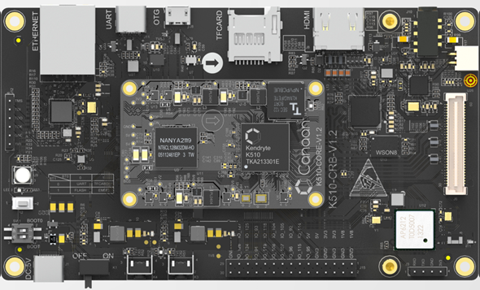

  
Рисунок 1-1 Рендеринг K510 CRB

    **禁止事项**

  1. Запрещено подключать и отключать основной модуль и периферийные модули в режиме реального времени!
  2. Запрещается эксплуатировать данное изделие напрямую без мер разряда статического электричества или без статической защиты.
  3. Запрещено использовать органические растворители или агрессивные жидкости для очистки этого продукта.
  4. Запрещается выполнять такие операции, как постукивание и скручивание, которые могут привести к физическому повреждению.

    **Профилактика**

  1. Обратите внимание, что после электростатического разряда человеческого организма, перед эксплуатацией данного изделия рекомендуется надеть электростатический браслет.
  2. Перед началом работы подтвердите напряжение питания и напряжение адаптера объединительной платы в пределах допустимого диапазона, описанного в этом документе.
  3. Обязательно прочитайте этот документ и соображения в инженерном файле перед проектированием.
  4. Обратите внимание, что использование продуктов в условиях высокой температуры, высокой влажности, высокой коррозии требует специальной обработки, такой как рассеивание тепла, дренаж и герметизация.
  5. Пожалуйста, не ремонтируйте и не разбирайте сами, иначе вы не сможете пользоваться бесплатным послепродажным обслуживанием.

## 1.1 Блок-схема системы

&emsp; &emsp; Блок-схема системы используется для описания принципов проектирования K510 CRB и взаимосвязи между компонентами, так что при использовании K510 CRB разработчики могут иметь интуитивное понимание архитектуры и принципов всей системы.

&emsp; &emsp; Для получения дополнительной информации о функциях K510, пожалуйста, обратитесь к K510 Полное техническое описание.

    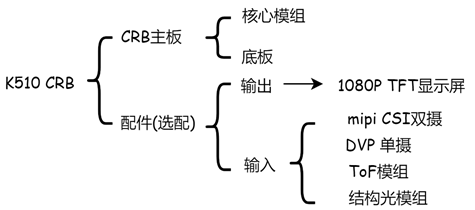

Рисунок 1-2 Состав К510 CRB

    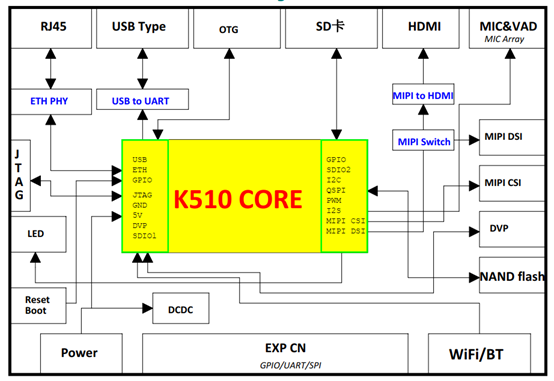

Рисунок 1-3 Блок-схема системы CRB K510 

&emsp; &emsp; Комплект разработчика K510 CRB состоит в основном из следующих компонентов:

| комплектующие | количество |
| :-: | :-: |
| Материнская плата K510 CRB | 1 |
| USB type C线缆 | 2 |
| Кабель Микро USB OTG | 1 |
| MIPI DSI дисплей с разрешением 1920x1080 | 1 |
| MIPI CSI камера подплата, встроенный датчик изображения Sony IMX219 два | 1 |
| Акриловый защитный корпус | 1 |

## 1.2 Обзор функций

&emsp; &emsp; K510 SDK основан на buildroot в качестве базового фреймворка, с ядром linux K510 (версия linux 4.17.0), u-boot (u-boot версии 2020.01), riscv-pk-k510

&emsp; &emsp; Основные особенности K510 CRB V1.2 (если нет специальных деклараций, версии CRB, описанные далее в этом документе, являются V1.2) следующие:

- PMIC: Управление питанием
- 32-разрядная версия LPDDR3EE, общая емкость 512 МБбайт
- 8-битный eMMC, общая емкость 4GByte
- QSPI NAND, общая емкость 128 МБбайт
- TF-карта: поддерживает внешнее расширение памяти TF-карты.
- USB OTG: обновление системы, поддержка коммутации хост/устройство
- SDIO WIFI: поддерживает функцию беспроводного Интернета и соединение Bluetooth
- Аудио: поддержка голосового ввода и вывода
- PDM MIC: функция пробуждения VAD
- Uart & JTAG Debug: платы разработки, используемые Debug
- Видеовход: Двойной вход КАМЕРЫ MIPI CSI 2lane
- Видеовыход: MIPI DSI 4lane, дисплей 1080P
- RGMII: гигабитное Ethernet-соединение
- HDMI: мультимедийный интерфейс высокой четкости
- Расширенные интерфейсы: блок питания, GPIO, I2C, SPI
- Ключи, индикаторы

# 2 Введение в аппаратные ресурсы

## 2.1 Общие визуализации

    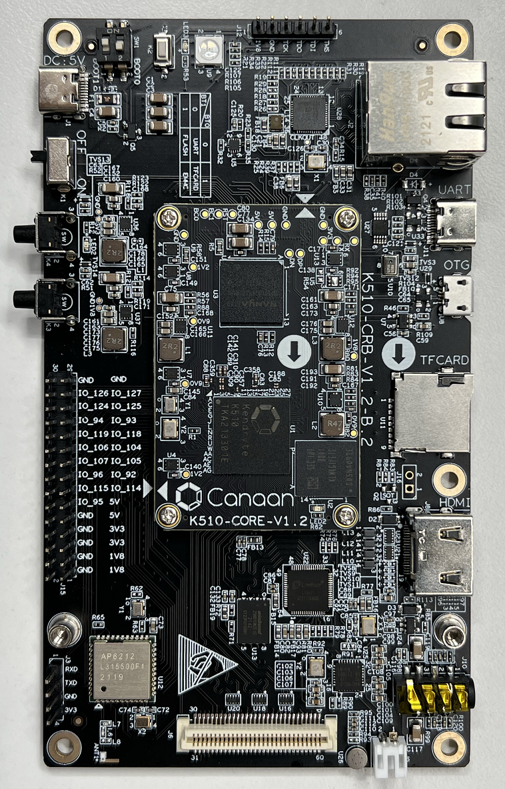

 Рисунок 2-1 Передняя панель системной платы 

    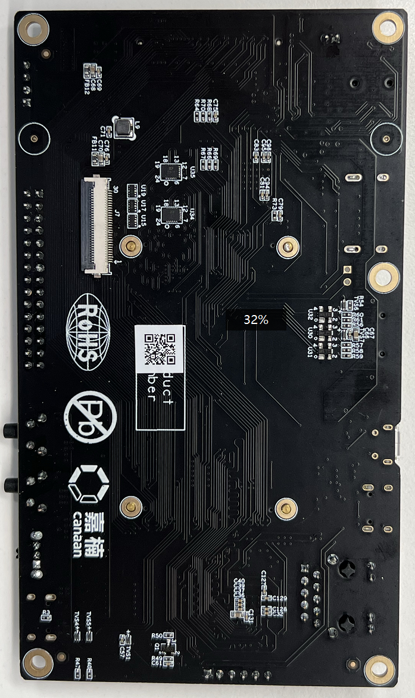

 Рисунок 2-1 На задней панели материнской платы 

## 2.2 Принципиальная схема структуры и интерфейса

    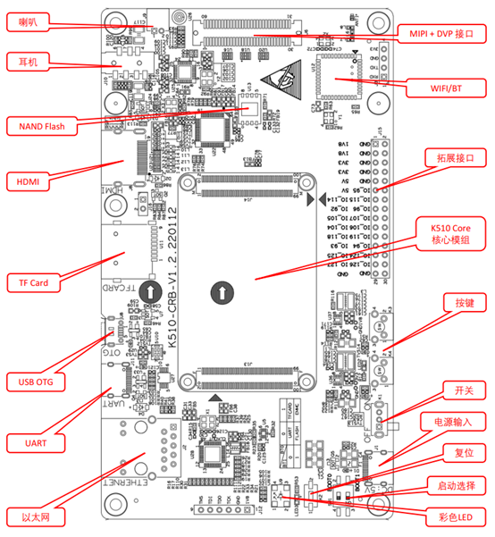

 Рисунок 2-3 Положение каждого устройства на передней панели материнской платы 

    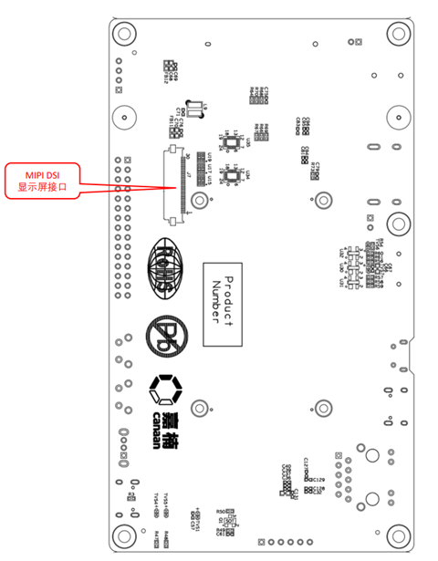

 Рисунок 2-4 Задняя часть материнской платы 

## 2.3 Блок-схема питания

&emsp; &emsp; K510 CRB использует DC-5V в качестве входной мощности всей платы, обеспечивая DC-5V для основного модуля K510 CORE и 1,8 В и 3,3 В для других периферийных устройств объединительной платы через два DC-DC.

## 2.4 Адрес устройства I2C

Таблица адресов устройств I2C 2-1

| имя | Контакты (SCL, SDA) | адрес | замечание |
| :-: | :-: | :-: | :-: |
| сенсорный экран | IO_103、IO_102 | 0x14 или 0x5D | |
| Разъем HDMI | IO_117、IO_116 | 0x3B | |
| Аудиокодек | IO_117、IO_116 | 0x1A | |
| Камера MIPI CSI0 | IO_120、IO_121 | 0x10 | |
| Камера MIPI CSI1 | IO_47、IO_48   | 0x10 | |

## 2.5 Схемы

&emsp; &emsp; Эталонную схему для платы разработки K510 CRB следует[ загрузить при выпуске](https://github.com/kendryte/k510_docs/releases). 

# 3 Введение в каждый раздел платы разработки

## 3.1 Основные модули

&emsp; &emsp; Перед использованием K510 CRB для обучения и разработки рекомендуется обратиться к подробной архитектуре чипа в руководстве K510, чтобы можно было глубже понять блок питания, хранилище, вычислительные ресурсы и периферийные устройства K510, что способствует знакомству и развитию чипового решения. Основная плата K510 показана на рисунке 3-1.

    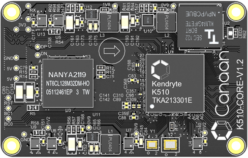

Рисунок 3-1 Основной модуль ядра K510

## 3.2 Входной источник питания

&emsp; &emsp; K510 CRB использует внешний источник питания 5 В, бортовые два интерфейса USB типа C, могут использоваться для питания платы разработки, из которых интерфейс UART используется для подключения к компьютеру, интерфейс USB КОМПЬЮТЕРА может обеспечить только ток 500 мА, в случае недостаточного питания, пожалуйста, используйте адаптер одновременно для питания на DC: 5V. Интерфейс показан на следующем рисунке.

    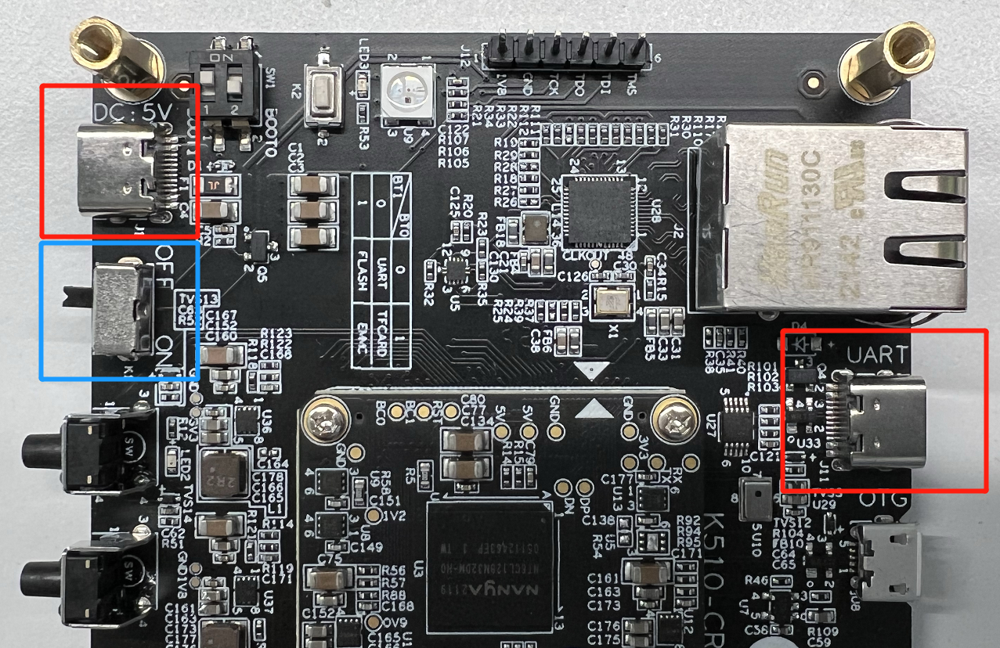

 Рисунок 3-2 Входной разъем питания 

**Примечание: Ограничьте использование блока питания 5 В, при использовании адаптера быстрой зарядки, старайтесь не подключать другие устройства, такие как мобильные телефоны одновременно, чтобы не привести к неправильному выводу адаптера быстрой зарядки блока питания выше 5 В, что приведет к повреждению части блока питания платы разработки. **
&emsp; &emsp; Используйте тумблер K2 для включения и выключения питания, как показано на следующем рисунке. 

    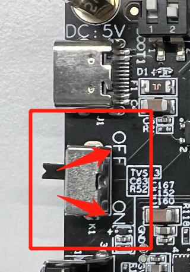

Рисунок 3-3 Описание выключателя питания

## 3.3 Запоминающие устройства

&emsp; &emsp; K510 CRB включает в себя различные устройства хранения на борту, включая DDR, eMMC, ФЛЭШ-память NAND и TF-карту.

### 3.3.1 eMMC

&emsp; &emsp; Встроенная память EMMC объемом 4 ГБ на K510 CRB, расположенная на основном модуле, может использоваться для хранения таких данных, как код запуска и пользовательские файлы.

    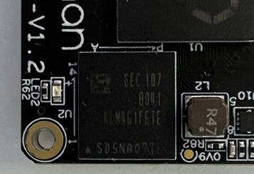

Рисунок 3-4 Память eMMC

### 3.3.2 НандФлэш

&emsp; &emsp; K510 CRB включает в себя 128 МБ флэш-памяти NAND, которая может использоваться для хранения данных, таких как код запуска и пользовательские файлы.

    

Рисунок 3-5 Флэш-память NAND

### 3.3.2 TF карта

&emsp; &emsp; K510 CRB имеет держатель карты TF на борту, который может быть подключен извне к карте TF для хранения данных, таких как код запуска и пользовательские файлы.

    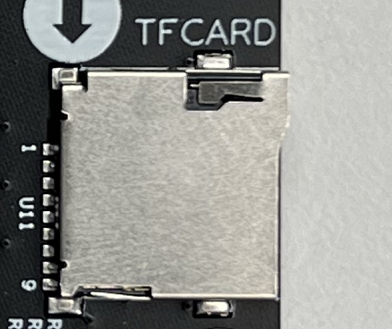

Рисунок 3-6 Держатель карты TF

## 3.4 Нажатия клавиш

&emsp; &emsp; K510 CRB содержит две пользовательские сенсорные кнопки, которые позволяют пользователям настраивать кнопки касания для запуска в качестве системных входов или других функций, связанных с программным обеспечением.

    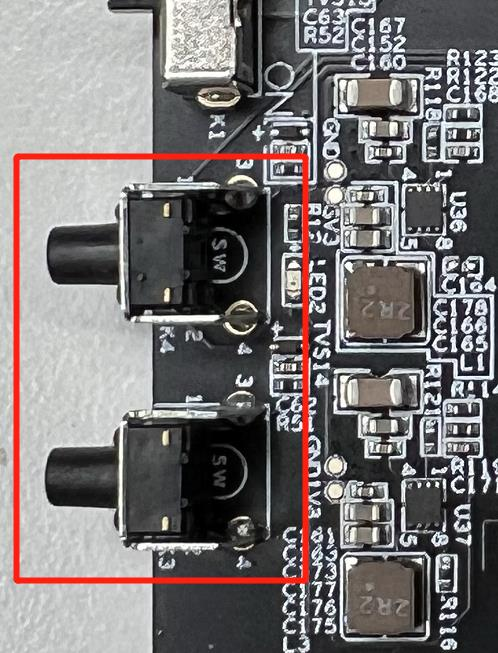

Рисунок 3-7 Клавиши

## 3,5 светодиода

&emsp; &emsp; K510 CRB имеет светодиод на борту, который подключается непосредственно к контакту GPIO чипа K510.

&emsp; &emsp; K510 CRB оснащен цветным светодиодом WS2812, который подключается непосредственно к контакту GPIO чипа K510.

&emsp; &emsp; Два светодиода специально запрограммированы на зажжение или тушение и могут использоваться в качестве системных выходов или программных индикаторов состояния.

    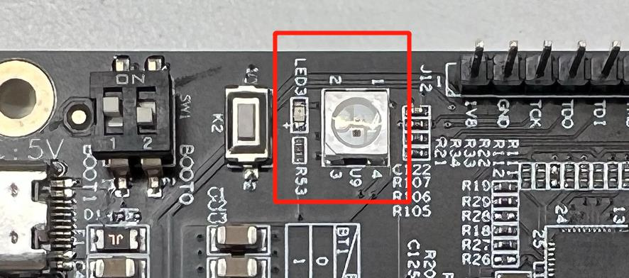

Рисунок 3-8 Светодиод

## 3.6 Режим загрузки и сброс настроек

&emsp; &emsp; K510 CRB имеет множество устройств хранения на борту, а режим загрузки выбирается путем настройки уровней загрузочных контактов, BOOT0 и BOOT1, причем 0 и 1 представляют низкий и высокий уровни.

&emsp; &emsp; На печатной плате режим запуска выбирается DIP-переключателем, показанным на следующем рисунке, и основной модуль был разработан для подтягивания BOOT0 и BOOT1, а сторона набираемого света маркировки ON представляет соответствующую битовую эффективность вытягивания вниз, а другая сторона ON соответствует OFF представляет эффективность подтягивания.

&emsp; &emsp; K510 определяет режим загрузки чипа по состоянию аппаратных контактов boot0 и BOOT1, а выбор режима загрузки показан в следующей таблице.

Таблица 2-1 Режимы загрузки

| ЗАГРУЗКА1   | ЗАГРУЗКА0   | Режим запуска      |
| ------- | ------- | ------------ |
| 0 (ВКЛ.)   | 0 (ВКЛ.)   | Загрузка с последовательного порта      |
| 0 (ВКЛ.)   | 1 (ВЫКЛ.)  | Загрузка SD-карты      |
| 1 (ВЫКЛ.)  | 0 (ВКЛ.)   | Сапоги NANDFLASH |
| 1 (ВЫКЛ.)  | 1 (ВЫКЛ.)  | Ботинки EMMC      |

    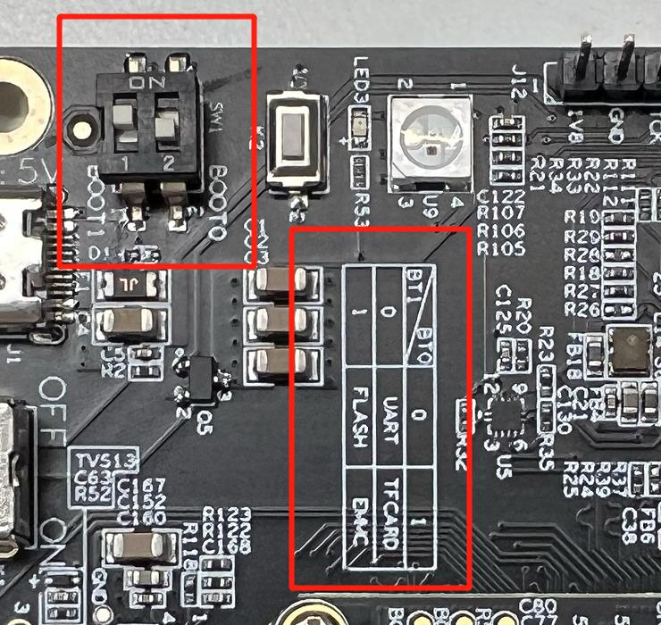

Рисунок 3-9 Переключатель сброса и DIP-переключатель режима запуска

&emsp; &emsp; Встроенная кнопка сброса K510 CRB - K2 на рисунке 3-9, которую можно нажать для выполнения аппаратной операции сброса системы.

## 3.7 Аудиовход и выход

&emsp; &emsp; K510 CRB использует микросхему аудиокодека Nuvoton, NAU88C22, для реализации функций ввода и вывода для речи. Включает в себя встроенный микрофон, стандартный разъем для наушников 3,5 мм и разъем динамика 2P.

    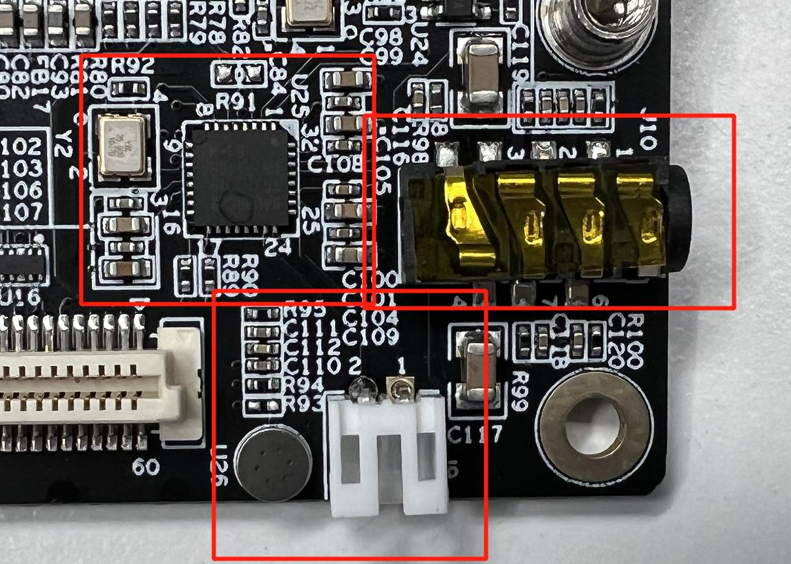

Рисунок 3-10 Аудио

## 3.8 РАЗЪЕМ USB OTG

&emsp; &emsp; Встроенный разъем USB OTG K510 CRB можно использовать для реализации функциональности USB-хоста/устройства.

    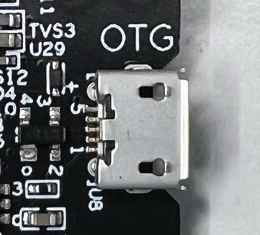

Рисунок 3-11 Сиденье USB-OTG

## 3.9 Интерфейс UART

&emsp; &emsp; K510 CRB Для облегчения пользовательской разработки и отладки K510 CRB имеет интерфейс USB-> UART на борту, который может управляться последовательным портом USART и отладкой K510 через кабель PC-USB. Для первоначального использования может потребоваться загрузка драйвера, как описано в разделе 4.2. Встроенный интерфейс UART показан на рисунке ниже.

    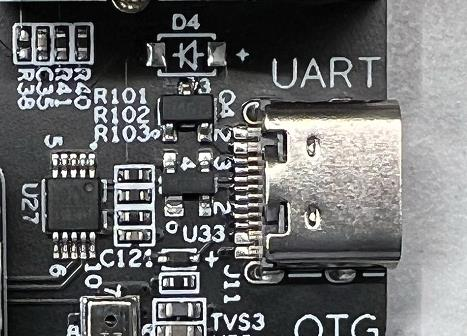

Рисунок 3-12 Интерфейс USB-UART

## Модуль 3.10 WIFI/BT

&emsp; &emsp; K510 CRB включает в себя модуль WIFI/BT 2-в-1 AP6212 для расширения платы разработки сетевых подключений и функций связи Bluetooth, как показано в бортовом интерфейсе ниже.

    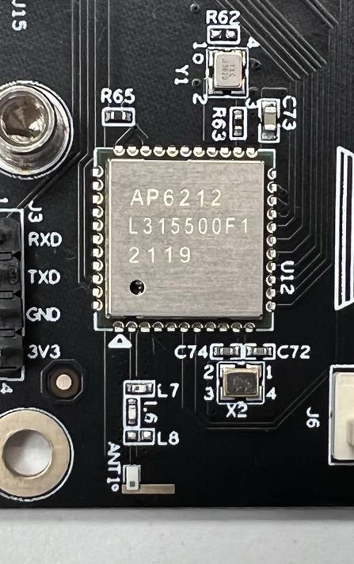

Рисунок 3-13 Модуль WIFI/BT

## 3.11 Ethernet

&emsp; &emsp; K510 CRB имеет встроенный держатель Gigabit Ethernet, а K510 реализован через внешний PHY-чип с интерфейсом RGMII. Встроенный интерфейс показан на следующем рисунке.

    

Рисунок 3-14 Интерфейс Ethernet

## Выход 3.12 hdmi

&emsp; &emsp; Встроенное гнездовое крепление HDMI-A K510 CRB можно подключить к внешнему дисплею с помощью стандартного кабеля HDMI с помощью вывода интерфейса mipi dsi K510. Встроенный интерфейс показан на следующем рисунке.

    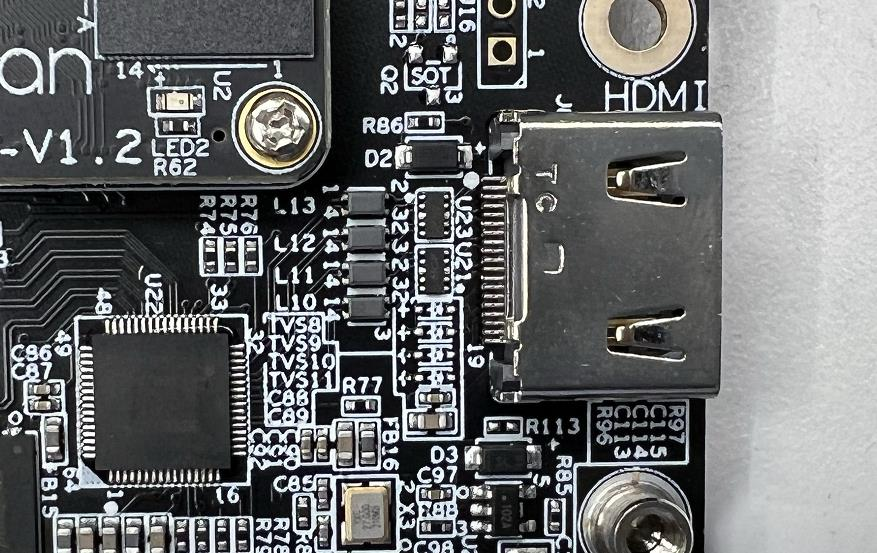

Рисунок 3-15 Интерфейс HDMI

 **Примечание**: Поскольку и HDMI, и 1080P TFT дисплеи используют драйверы mipi dsi, они могут выбрать только один из двух дисплеев, не могут использоваться одновременно, переключайтесь через контакт управления GPIO, чтобы выбрать один из выходов. 

## 3.13 Видео в

&emsp; &emsp; K510 CRB потребляет mipi CSI, DVP, блок питания и частичный GPIO через разъем 0,8 мм между платой и платой для обеспечения входа камеры в различных сценариях и различных ситуациях спроса. Встроенный интерфейс показан на следующем рисунке. Определения интерфейса приведены в следующей таблице.

    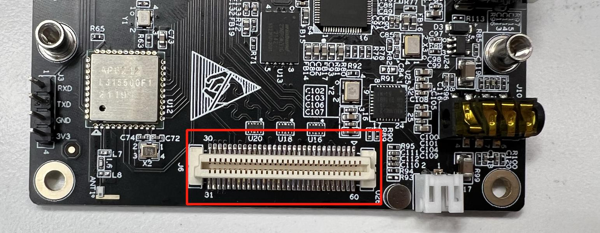

Рисунок 3-16 Интерфейс Video IN

Таблица 3-2 Определения интерфейса Video IN

| нумерация | определение             | нумерация | определение                       |
| ---- | ---------------- | ---- | --------------- |
| 1    | VDD_5V           | 60   | GPIO_1V8_59_DVP_D12      |
| 2    | VDD_5V           | 59   | GPIO_1V8_58_DVP_D11      |
| 3    | VDD_5V           | 58   | GPIO_1V8_50_DVP_D3       |
| 4    | VDD_5V           | 57   | GPIO_1V8_51_DVP_D4       |
| 5    | ВНД              | 56   | GPIO_1V8_60_DVP_D13      |
| 6    | ВНД              | 55   | GPIO_1V8_55_DVP_D8       |
| 7    | MIPI_CSI_D0_P    | 54   | GPIO_1V8_61_DVP_D14      |
| 8    | MIPI_CSI_D0_N    | 53   | GPIO_1V8_52_DVP_D5       |
| 9    | ВНД              | 52   | GPIO_1V8_47_DVP_D0       |
| 10   | MIPI_CSI_CLK0_P  | 51   | GPIO_1V8_56_DVP_D9       |
| 11   | MIPI_CSI_CLK0_N  | 50   | GPIO_1V8_53_DVP_D6       |
| 12   | ВНД              | 49   | GPIO_1V8_57_DVP_D10      |
| 13   | MIPI_CSI_D1_P    | 48   | GPIO_1V8_48_DVP_D1       |
| 14   | MIPI_CSI_D1_N    | 47   | GPIO_1V8_54_DVP_D7       |
| 15   | ВНД              | 46   | GPIO_1V8_64_DVP_HREF     |
| 16   | MIPI_CSI_D2_N    | 45   | GPIO_1V8_49_DVP_D2       |
| 17   | MIPI_CSI_D2_P    | 44   | GPIO_1V8_65_DVP_DEN      |
| 18   | ВНД              | 43   | GPIO_1V8_66_DVP_PCLK     |
| 19   | MIPI_CSI_CLK1_N  | 42   | GPIO_1V8_62_DVP_D15      |
| 20   | MIPI_CSI_CLK1_P  | 41   | GPIO_1V8_63_DVP_VSYNC    |
| 21   | ВНД              | 40   | GPIO_1V8_82 |
| 22   | MIPI_CSI_D3_N    | 39   | GPIO_1V8_67  |
| 23   | MIPI_CSI_D3_P    | 38   | GPIO_1V8_68  |
| 24   | ВНД              | 37   | GPIO_1V8_72  |
| 25   | MIPI_CSI_I2C_SCL | 36   | GPIO_1V8_73  |
| 26   | MIPI_CSI_I2C_SCA | 35   | GPIO_1V8_74  |
| 27   | ВНД              | 34   | ВНД          |
| 28   | ВНД              | 33   | ВНД          |
| 29   | 1В8              | 32   | 3В3          |
| 30   | 1В8              | 31   | 3В3          |

**Примечание**: Обратите внимание на диапазон уровней подключенных контактов при внешнем подключении, чтобы предотвратить непоправимый вход напряжения от необратимого повреждения микросхемы K510. 

## 3.14 Видеовыход

&emsp; &emsp; K510 CRB имеет заслонку 30P с шагом 0,5 мм под разъемом FPC для подключения к внешнему ЖК-дисплею, как показано на рисунке ниже. Определения интерфейса приведены в следующей таблице.

    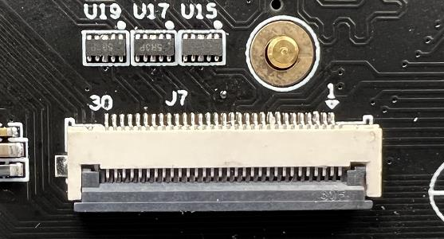

Рисунок 3-17 Интерфейс видеовыхода

Таблица 3-3 Определения интерфейса видеовыхода

| нумерация | определение              | нумерация | определение             |
| ---- | ----------------- | ---- | ---------------- |
| 1    | ВНД               | 16   | MIPI_DSI_D1_N    |
| 2    | ВНД               | 17   | MIPI_DSI_D1_P    |
| 3    | VDD_5V            | 18   | ВНД              |
| 4    | VDD_5V            | 19   | MIPI_DSI_CLK_N   |
| 5    | VDD_3V3           | 20   | MIPI_DSI_CLK_P   |
| 6    | VDD_3V3           | 21   | ВНД              |
| 7    | ВНД               | 22   | MIPI_DSI_D0_N    |
| 8    | TOUCH_1V8_I2C_SCL | 23   | MIPI_DSI_D0_P    |
| 9    | TOUCH_1V8_I2C_SDA | 24   | ВНД              |
| 10   | TOUCH_1V8_INT     | 25   | MIPI_DSI_D3_N    |
| 11   | TOUCH_1V8_RST     | 26   | MIPI_DSI_D3_P    |
| 12   | ВНД               | 27   | ВНД              |
| 13   | MIPI_DSI_D2_N     | 28   | MIPI_DSI_LCD_RST |
| 14   | MIPI_DSI_D2_P     | 29   | MIPI_DSI_LCD_EN  |
| 15   | ВНД               | 30   | ВНД              |

## 3.15 Расширение интерфейса

&emsp; &emsp; Чтобы облегчить реализацию пользовательских функций расширения для пользователей, на K510 CRB зарезервирован контакт расширения 30P 2,54 мм, который приводит к источнику питания и части GPIO, которым пользователь может управлять через программное обеспечение iomux для сопоставления аппаратных ресурсов, таких как I2C, UART, SPI с соответствующим GPIO для достижения внешнего соединения и расширения соответствующих функций. Встроенный интерфейс показан на следующем рисунке. Подробные определения приведены в следующей таблице.

    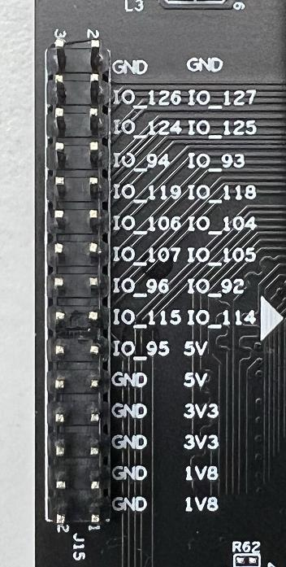

Рисунок 3-18 40P-контактный интерфейс расширения

Таблица 3-4 Расширенные определения интерфейсов

| нумерация | определение         | нумерация | определение         |
| ---- | ------------ | ---- | ------------ |
| 1    | VDD_1V8      | 2    | ВНД          |
| 3    | VDD_1V8      | 4    | ВНД          |
| 5    | VDD_3V3      | 6    | ВНД          |
| 7    | VDD_3V3      | 8    | ВНД          |
| 9    | VDD_5V       | 10   | ВНД          |
| 11   | VDD_5V       | 12   | GPIO_1V8_95  |
| 13   | GPIO_3V3_114 | 14   | GPIO_3V3_115 |
| 15   | GPIO_1V8_92  | 16   | GPIO_1V8_96  |
| 17   | GPIO_1V8_105 | 18   | GPIO_1V8_107 |
| 19   | GPIO_1V8_104 | 20   | GPIO_1V8_106 |
| 21   | GPIO_1V8_118 | 22   | GPIO_1V8_119 |
| 23   | GPIO_1V8_93  | 24   | GPIO_1V8_94  |
| 25   | GPIO_3V3_125 | 26   | GPIO_3V3_124 |
| 27   | GPIO_3V3_127 | 28   | GPIO_3V3_126 |
| 29   | ВНД          | 30   | ВНД          |

**Примечание**: Обратите внимание на диапазон уровней подключенных контактов при внешнем подключении, чтобы предотвратить непоправимый вход напряжения от необратимого повреждения микросхемы K510. 

# 4 Использование платы разработки

## 4.1 Установка драйвера

&emsp; &emsp; K510 CRB имеет ch340E на борту для реализации функции связи USB-UART, поэтому перед использованием необходимо установить соответствующий драйвер.

&emsp; &emsp; Используйте драйвер в пакете или загрузите и установите его по следующему адресу.

&emsp;&emsp;<http://www.wch.cn/product/CH340.html>

## 4.2 Запись прошивки

&emsp; &emsp; Пожалуйста, обратитесь к[ K510_SDK_Build_and_Burn_Guide ](./K510_SDK_Build_and_Burn_Guide.md)документации. 

## 4.3 Включение и выключение

&emsp; &emsp; 1) Установите кабель питания и кабель отладки USB.

&emsp; &emsp; 2) DIP-переключатель выбран для запуска с TF-карты.

&emsp; &emsp; 3) Включите переключатель, переключив переключатель, как показано в разделе 3.2.

## 4.4 Отладка последовательного порта

&emsp; &emsp; После установки драйвера включите K510 CRB, после чего порт появится в диспетчере устройств ПК - Порт.

&emsp; &emsp; С помощью средства отладки последовательного порта откройте номер порта устройства, скорость передачи данных 115200.

&emsp; &emsp; Как показано на следующем рисунке, устройством является «COM6», который показан в диспетчере устройств ПК.

    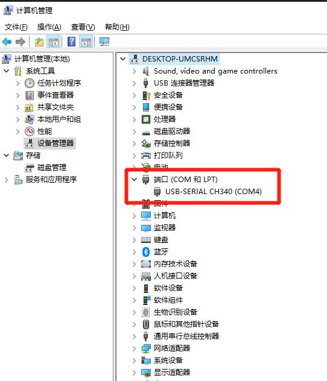

Figure 4-1 Диспетчер устройств после завершения установки драйвера

**Отказ от ответственности за **перевод  
Для удобства клиентов Canaan использует переводчик AI для перевода текста на несколько языков, которые могут содержать ошибки. Мы не гарантируем точность, надежность или своевременность предоставленных переводов. Компания Canaan не несет ответственности за любые убытки или ущерб, вызванные доверием к точности или надежности переведенной информации. При наличии разницы в содержании переводов на разные языки преимущественную силу имеет упрощенная версия на китайском языке. 

Если вы хотите сообщить об ошибке или неточности перевода, пожалуйста, не стесняйтесь обращаться к нам по почте.
