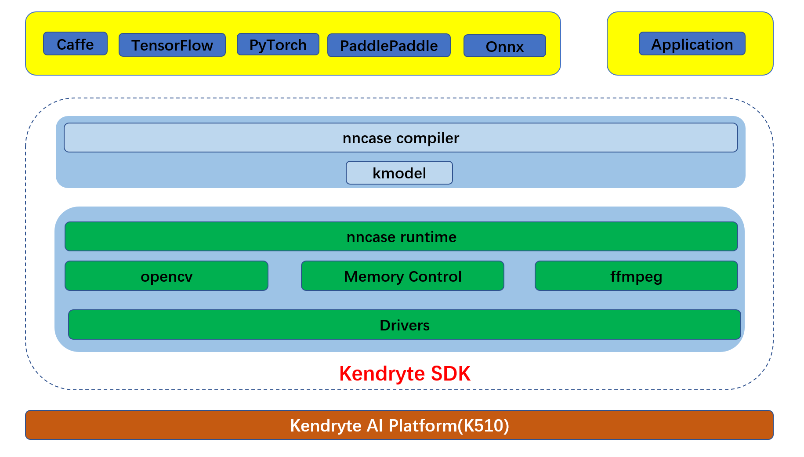

**<font face="黑体" size="6" style="float:right">K510 AI Application Guide</font>**

<font face="黑体"  size=3>文档版本：V1.0.0</font>

<font face="黑体"  size=3>发布日期：2022-03-07</font>

<div style="page-break-after:always"></div>

<font face="黑体" size=3>**免责声明**</font>
您购买的产品、服务或特性等应受北京嘉楠捷思信息技术有限公司（“本公司”，下同）商业合同和条款的约束，本文档中描述的全部或部分产品、服务或特性可能不在您的购买或使用范围之内。除非合同另有约定，本公司不对本文档的任何陈述、信息、内容的准确性、可靠性、完整性、营销型、特定目的性和非侵略性提供任何明示或默示的声明或保证。除非另有约定，本文档仅作为使用指导的推理。
由于产品版本升级或其他原因，本文档内容将可能在未经任何通知的情况下，不定期进行更新或修改。

**<font face="黑体"  size=3>商标声明</font>**

“”、“Canaan”图标、嘉楠和嘉楠其他商标均为北京嘉楠捷思信息技术有限公司的商标。本文档可能提及的其他所有商标或注册商标，由各自的所有人拥有。

**<font face="黑体"  size=3>版权所有©2022北京嘉楠捷思信息技术有限公司</font>**
本文档仅适用K510平台开发设计，非经本公司书面许可，任何单位和个人不得以任何形式对本文档的部分或全部内容传播。

**<font face="黑体"  size=3>北京嘉楠捷思信息技术有限公司</font>**
网址：canaan-creative.com
商务垂询：salesAI@canaan-creative.com

<div style="page-break-after:always"></div>
# 前言
**<font face="黑体"  size=5>文档目的</font>**
本文档为K510 AI 应用的配套文档，旨在帮助工程师了解 k510 AI 应用的编写与应用。

**<font face="黑体"  size=5>读者对象</font>**

本文档（本指南）主要适用的人员：

- 软件开发人员
- 技术支持人员

**<font face="黑体"  size=5>修订记录</font>**
<font face="宋体"  size=2>修订记录累积了每次文档更新的说明。最新版本的文档包含以前所有版本的更新内容。</font>

| 版本号   | 修改者     | 修订日期 | 修订说明 |
| :-----  |-------    |  ------ | ------  |
| V1.0.0  | AI 产品部  | 2022-03-07 |      |
|        |        |            |            |
|        |        |            |            |
|        |        |            |            |
|        |        |            |            |
|        |        |            |            |

<div style="page-break-after:always"></div>
**<font face="黑体"  size=6>目 录</font>**

[TOC]

<div style="page-break-after:always"></div>

# 1 简介

本文档介绍K510 AI应用的编写与应用。基于K510 AI芯片进行AI应用开发共有如下几个阶段：

模型准备：将训练好的模型在PC端进行验证（可使用静态图片推理），以确保模型的正确性

模型生成：将训练好的模型使用nncase compiler进行编译，生成kmodel

模型验证：将生成的kmodel使用nncase simulator进行精度验证

编写AI 应用程序：完成视频/图片的读取、输入的预处理、模型推理、模型后处理

编译AI 应用程序：使用交叉编译工具链，完成K510 AI应用程序的编译

部署和联调：将编译好的AI 应用署到K510硬件产品上，并在实际场景中进行功能的联调

在K510 AI芯片上进行AI应用开发的整体架构如下图所示：



本文档将以320x320分辨率的YOLOV5s的onnx模型为示例，介绍K510 AI应用整个流程的编写与应用。

# 2 模型准备

用于推理的YOLOV5s的onnx模型位于/docs/utils/AI_Application/aidemo_sdk/models/onnx子目录(如果没有文件请下载 [models](https://github.com/kendryte/k510_docs/releases/download/v1.5/models.tar.gz) 并解压)，静态图片位于/docs/utils/AI_Application/aidemo_sdk/examples/python_inference_on_PC/data子目录，脚本位于/docs/utils/AI_Application/aidemo_sdk/examples/python_inference_on_PC子目录。

按照脚本命令提示，运行yolov5_image.py脚本，得到静态图片的推理结果。通过验证输出图片的检测框正确与否来检测模型的正确性。

```shell
usage: yolov5_image.py [-h] [--image_path IMAGE_PATH]
                       [--image_out_path IMAGE_OUT_PATH]
                       [--onnx_path ONNX_PATH]
                       [--confidence_threshold CONFIDENCE_THRESHOLD]
                       [--nms_threshold NMS_THRESHOLD]

object detect

optional arguments:
  -h, --help            show this help message and exit
  --image_path IMAGE_PATH
                        input image path
  --image_out_path IMAGE_OUT_PATH
                        output image path
  --onnx_path ONNX_PATH
                        onnx model path
  --confidence_threshold CONFIDENCE_THRESHOLD
                        confidence_threshold
  --nms_threshold NMS_THRESHOLD
                        nms_threshold
```

# 3 模型生成

模型生成依赖于nncase compiler，关于nncase compiler的具体使用规则可参考[K510_nncase_Developer_Guides.md](./K510_nncase_Developer_Guides.md)。生成YOLOV5s的kmodel的脚本位于/docs/utils/AI_Application/aidemo_sdk/scripts子目录。

按照脚本命令提示，运行gen_yolov5s_320_with_sigmoid_bf16_with_preprocess_output_nhwc.py，可生成相应的kmodel。

```shell
usage: gen_yolov5s_320_with_sigmoid_bf16_with_preprocess_output_nhwc.py [-h] [--target TARGET] [--dump_dir DUMP_DIR] [--onnx ONNX] [--kmodel KMODEL]

optional arguments:
  -h, --help           show this help message and exit
  --target TARGET      target to run
  --dump_dir DUMP_DIR  temp folder to dump
  --onnx ONNX          onnx model path
  --kmodel KMODEL      kendryte model path
```

需要注意的是，为了尽可能减少在CPU上做预处理，脚本中的编译选项配置如下：

```python
compile_options.input_type = 'uint8'
compile_options.preprocess = True
compile_options.input_layout = 'NCHW'
compile_options.output_layout = 'NHWC'
compile_options.input_shape = [1, 3, 320, 320]
compile_options.mean = [0, 0, 0]
compile_options.std = [255, 255, 255]
compile_options.input_range = [0, 255]
```

# 4 模型验证

模型验证依赖于nncase simulator，关于nncase simulator的具体使用规则可参考[K510_nncase_Developer_Guides.md](./K510_nncase_Developer_Guides.md)。验证YOLOV5s的kmodel脚本位于/docs/utils/AI_Application/aidemo_sdk/scripts子目录。

按照脚本命令提示，运行simu_yolov5s_320_with_sigmoid_bf16_with_preprocess_output_nhwc.py，可验证相应的kmodel是否生成正确。

```shell
usage: sim_yolov5s_320_with_sigmoid_bf16_with_preprocess_output_nhwc.py [-h] [--onnx ONNX] [--kmodel KMODEL]

optional arguments:
  -h, --help       show this help message and exit
  --onnx ONNX      original model file
  --kmodel KMODEL  kmodel file
```

如有cosine similarity接近与1或者等于1，则可确保生成的kmodel的正确性。

```text
output 0 cosine similarity : 0.9999450445175171
output 1 cosine similarity : 0.9999403953552246
output 2 cosine similarity : 0.9999019503593445
```

# 5 编写AI 应用程序

模型验证依赖于nncase runtime，关于nncase runtime的具体使用规则可参考[K510_nncase_Developer_Guides.md](./K510_nncase_Developer_Guides.md)。AI应用程序参考 `k510_buildroot/package/ai/code/object_detect`。首先需要创建目标检测实例，并为kmodel输入输出分配空间。

```c++
objectDetect od(obj_thresh, nms_thresh, net_len, {valid_width, valid_height});
od.load_model(kmodel_path);  // load kmodel
od.prepare_memory();  // memory allocation
```

为实现zero memory copy，将ISP输出地址与kmodel输入地址关联

```c++
// define cv::Mat for ai input
// padding offset is (valid_width - valid_height) / 2 * valid_width
cv::Mat rgb24_img_for_ai(net_len, net_len, CV_8UC3, od.virtual_addr_input[0] + (valid_width - valid_height) / 2 * valid_width);
```

配置ISP输出的宽高

```c++
 /****fixed operation for video operation****/
 mtx.lock();
 cv::VideoCapture capture;
 capture.open(5);
 // video setting
 capture.set(cv::CAP_PROP_CONVERT_RGB, 0);
 capture.set(cv::CAP_PROP_FRAME_WIDTH, net_len);
 capture.set(cv::CAP_PROP_FRAME_HEIGHT, net_len);
 // RRRRRR....GGGGGGG....BBBBBB, CHW
 capture.set(cv::CAP_PROP_FOURCC, V4L2_PIX_FMT_RGB24);
 mtx.unlock();
```

配置相应的video配置文件，video_height_r为ISP真实输出高度，video_height为ISP不同通道间的高度偏移

```json
"/dev/video5":{
    "video5_used":1,
    "video5_width":320,
    "video5_height":320,
    "video5_height_r":240,
    "video5_out_format":0
}
```

将输入输出地址与kmodel的input_tensor和output_tensor关联

```c++
od.set_input(0);
od.set_output();
```

运行kmodel，得到输出结果，并进行后处理

```c++
{
    ScopedTiming st("od run", enable_profile);
    od.run();
}

{
    ScopedTiming st("od get output", enable_profile);
    od.get_output();
}
std::vector<BoxInfo> result;
{
    ScopedTiming st("post process", enable_profile);
    od.post_process(result);
}
```

最终，将检测框画到OSD上，显示输出

```c++
{
    ScopedTiming st("draw osd", enable_profile);
    obj_cnt = 0;
        for (auto r : result)
        {
        if (obj_cnt < 32)
        {
            struct vo_draw_frame frame;
            frame.crtc_id = drm_dev.crtc_id;
            frame.draw_en = 1;
            frame.frame_num = obj_cnt;
            frame.line_y_start = r.x2 * DRM_INPUT_WIDTH / valid_width;
            frame.line_x_start = r.x1 * DRM_INPUT_WIDTH / valid_width;
            frame.line_x_end = r.y1 * DRM_INPUT_HEIGHT / valid_height + DRM_OFFSET_HEIGHT;
            frame.line_y_end = r.y2 * DRM_INPUT_HEIGHT / valid_height + DRM_OFFSET_HEIGHT;
            draw_frame(&frame);

            cv::Point origin;
            origin.x = (int)(r.x1 * DRM_INPUT_WIDTH / valid_width);
            origin.y = (int)(r.y1 * DRM_INPUT_HEIGHT / valid_height + 10);
            std::string text = od.labels[r.label] + ":" + std::to_string(round(r.score * 100) / 100.0).substr(0,4);
            cv::putText(img_argb, text, origin, cv::FONT_HERSHEY_COMPLEX, 1.5, cv::Scalar(0, 0, 255, 255), 1, 8, 0);
        }
        obj_cnt += 1;
    }
}
```

# 6 编译AI应用程序

使用交叉编译工具链，关于AI应用程序的编译的具体使用规则可参考[K510_SDK_Build_and_Burn_Guide](./K510_SDK_Build_and_Burn_Guide.md)。

**翻译免责声明**  
为方便客户，Canaan 使用 AI 翻译程序将文本翻译为多种语言，它可能包含错误。我们不保证提供的译文的准确性、可靠性或时效性。对于因依赖已翻译信息的准确性或可靠性而造成的任何损失或损害，Canaan 概不负责。如果不同语言翻译之间存在内容差异，以简体中文版本为准。

如果您要报告翻译错误或不准确的问题，欢迎通过邮件与我们联系。