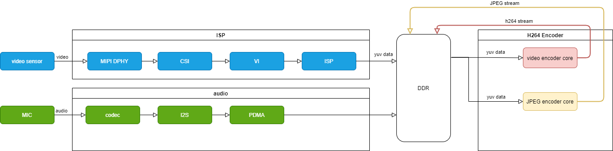
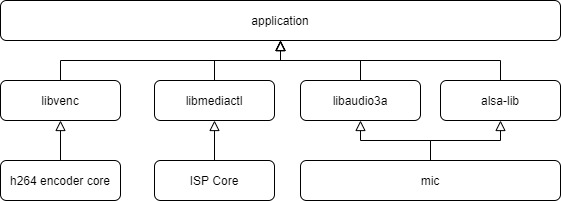
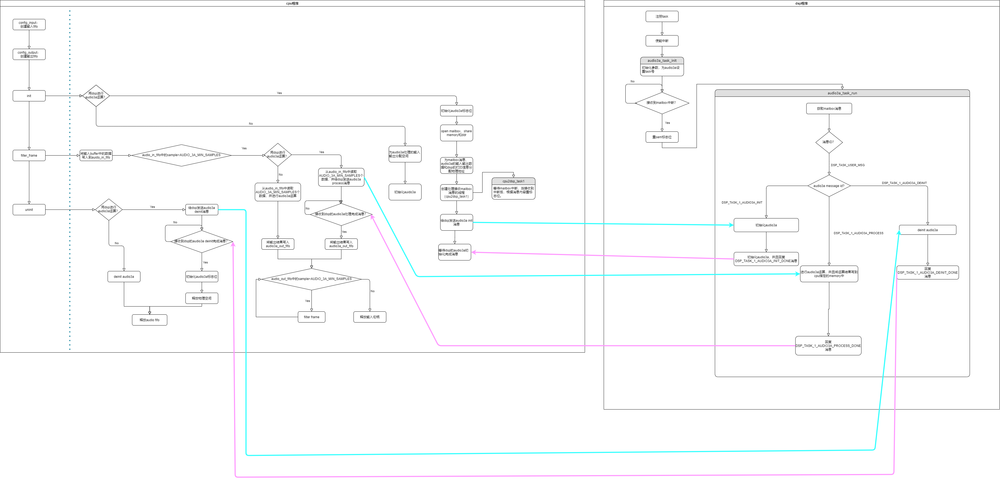
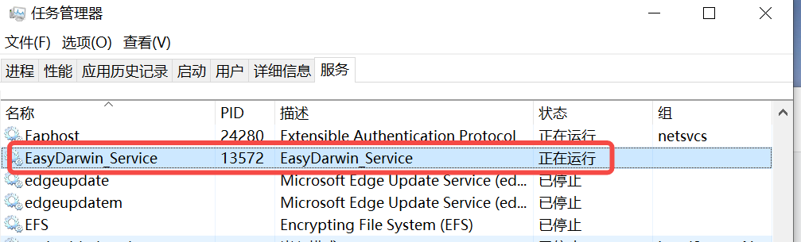

**<font face="黑体" size="6" style="float:right">K510 多媒体开发指南</font>**

<font face="黑体"  size=3>文档版本：V1.0.0</font>

<font face="黑体"  size=3>发布日期：2022-03-09</font>

<div style="page-break-after:always"></div>

<font face="黑体" size=3>**免责声明**</font>
您购买的产品、服务或特性等应受北京嘉楠捷思信息技术有限公司（“本公司”，下同）商业合同和条款的约束，本文档中描述的全部或部分产品、服务或特性可能不在您的购买或使用范围之内。除非合同另有约定，本公司不对本文档的任何陈述、信息、内容的准确性、可靠性、完整性、营销型、特定目的性和非侵略性提供任何明示或默示的声明或保证。除非另有约定，本文档仅作为使用指导的参考。
由于产品版本升级或其他原因，本文档内容将可能在未经任何通知的情况下，不定期进行更新或修改。

**<font face="黑体"  size=3>商标声明</font>**

“”、“Canaan”图标、嘉楠和嘉楠其他商标均为北京嘉楠捷思信息技术有限公司的商标。本文档可能提及的其他所有商标或注册商标，由各自的所有人拥有。

**<font face="黑体"  size=3>版权所有©2022北京嘉楠捷思信息技术有限公司</font>**
本文档仅适用K510平台开发设计，非经本公司书面许可，任何单位和个人不得以任何形式对本文档的部分或全部内容传播。

**<font face="黑体"  size=3>北京嘉楠捷思信息技术有限公司</font>**
网址：canaan-creative.com
商务垂询：salesAI@canaan-creative.com

<div style="page-break-after:always"></div>
# 前言
## 文档目的
本文档为K510 Multimedia 应用实例的说明文档。
## 目标读者
本文档面向的人员：
- 软件开发人员
- 技术支持人员

## 修订记录

| 版本号    | 修改者 | 修订日期| 修订说明  |  
|  ------  |-------| -------| ------ |
| v1.0.0    |系统软件组 | 2022-03-09 | SDK V1.5发布 |
|     |     |      |   |

<div style="page-break-after:always"></div>
**<font face="黑体"  size=6>目 录</font>**

[TOC]

# 1 Encoder API

## 1.1 头文件说明

k510_buildroot/package/encode_app/enc_interface.h

## 1.2 API 函数说明

### 1.2.1 VideoEncoder_Create

【描述】

创建视频编码器

【语法】

```c
EncoderHandle* VIdeoEncoder_Create(EncSettings *pCfg)
```

【参数】

pCfg：输入编码配置参数

|            参数名             | 参数解释                                                     |                           取值范围                           | 适用编码模块 |
| :---------------------------: | :----------------------------------------------------------- | :----------------------------------------------------------: | ------------ |
|            channel            | 通道号,最多支持8个编码通道                                   |                            [0，7]                            | jpeg、avc    |
|             width             | 编码图像宽度                                                 | avc: [128,2048], multiple of 8 <br/> jpeg: up to 8192, multiple of 16 | jpeg、avc    |
|            height             | 编码图像高度                                                 | avc: [64,2048], multiple of 8 <br/> jpeg: up to 8192, multiple of 2 | jpeg、avc    |
|           FrameRate           | 帧率,只能配置为固定几个值                                    |                       (25,30,50,60,75)                       | jpeg、avc    |
|            rcMode             | 码率控制模式 0:CONST_QP 1:CBR 2:VBR<br />jpeg固定为CONST_QP  |                       参见RateCtrlMode                       | jpeg，avc    |
|            BitRate            | CBR 模式下的目标码率或VBR模式下的最低码率                    |                        [10,20000000]                         | avc          |
|          MaxBitRate           | VBR模式下的最高码率                                          |                        [10,20000000]                         | avc          |
|            SliceQP            | 初始 QP 值,-1表示auto                                        |                avc:-1,[0,51]<br/>jpeg:[1,100]                | jpeg，avc    |
|             MinQP             | 最小qp值                                                     |                         [0,sliceqp]                          | avc          |
|             MaxQP             | 最大qp值                                                     |                         [sliceqp,54]                         | avc          |
|            profile            | SPS 中的 profile_idc 参数:0: base 1:main 2:high 3:jpeg       |                            [0,3]                             | jpeg，avc    |
|             level             | PS 中的 level_idc 参数                                       |                           [10,42]                            | avc          |
|          AspectRatio          | 显示比例                                                     |                     参见AVC_AspectRatio                      | jpeg，avc    |
|            FreqIDR            | 两个idr帧的间隔                                              |                           [1,1000]                           | avc          |
|            gopLen             | Group Of Picture，即两个 I 帧之间的间隔                      |                           [1,1000]                           | avc          |
|          bEnableGDR           | 是否启用帧内刷新                                             |                         [true,false]                         | avc          |
|            gdrMode            | gdr 刷新模式:0，垂直刷新  1，水平刷新                        |                       参见GDRCtrlMode                        | avc          |
|          bEnableLTR           | 是否启用长期参考帧                                           |                         [true,false]                         | avc          |
|          roiCtrlMode          | roi控制模式:0:不使用roi 1：相对qp  2：绝对qp                 |                       参见ROICtrlMode                        | avc          |
|       EncSliceSplitCfg        | slice 分割配置                                               |                                                              | avc          |
|         bSplitEnable          | Slice 分割是否使能                                           |                         [true,false]                         | avc          |
|         u32SplitMode          | Slice 分割模式:0：按 bit 数分割。<br />1:按宏块行分割        |                            [0,1]                             | avc          |
|         u32SliceSize          | u32SplitMode=0，表示每个 slice 的 byte 数<br />u32SplitMode=1，表示每个 slice 占的宏块行数<br /> | u32SplitMode=0，[100,65535]<br />u32SplitMode=1，[1,(图像高+15)/16] | avc          |
|          entropyMode          | 熵编码，0：CABAC     1：CAVLC                                |                      参见EncEntropyMode                      | avc          |
|          encDblkCfg           | 区块滤波配置                                                 |                                                              | avc          |
| disable_deblocking_filter_idc | 默认值0，具体含义请参见 H.264 协 议                          |                            [0，2]                            | avc          |
|  slice_alpha_c0_offset_div2   | 默认值0，具体含义请参见 H.264 协 议                          |                           [-6，6]                            | avc          |
|    slice_beta_offset_div2     | 默认值0，具体含义请参见 H.264 协 议                          |                          [-6,   6]                           | avc          |

```c
typedef struct
{
    int                       channel;  //encode channel number
    unsigned short            width;
    unsigned short            height;
    unsigned char             FrameRate;
    RateCtrlMode              rcMode;
    unsigned int              BitRate;
    unsigned int              MaxBitRate;
    int                       SliceQP;  //auto: -1, or from 0 to 51
    int                       MinQP;//from 0 to SliceQP
    int                       MaxQP;//from SliceQP to 51
    AVC_Profile               profile;
    unsigned int              level;  //1 .. 51, 51 is 5.1
    AVC_AspectRatio           AspectRatio;
    int                       FreqIDR; //default value  : -1,IDR:number of frames between two IDR pictures;GDR:refresh period
    unsigned int              gopLen;  
    bool                      bEnableGDR;//gdr
    GDRCtrlMode               gdrMode;
    bool                      bEnableLTR;//Long Term reference

    ROICtrlMode               roiCtrlMode;
    EncSliceSplitCfg          sliceSplitCfg;
    EncEntropyMode            entropyMode;//Profile is set to AVC_MAIN or AVC_HIGH is valid
    EncDblkCfg                encDblkCfg;
}EncSettings;
typedef enum
{
    CONST_QP,
    CBR,
    VBR
} RateCtrlMode;
typedef enum
{
    AVC_C_BASELINE,
    AVC_MAIN,
    AVC_HIGH,
    JPEG
} AVC_Profile;
typedef enum
{
    ASPECT_RATIO_AUTO,
    ASPECT_RATIO_4_3,
    ASPECT_RATIO_16_9,
    ASPECT_RATIO_NONE
} AVC_AspectRatio;
typedef struct
{
    unsigned int          s32X;
    unsigned int          s32Y;
    unsigned int          u32Width;
    unsigned int          u32Height;
} RECT_S;
typedef struct
{
    unsigned int          uIndex;//index[0-7]
    bool                  bEnable;
    int                   uQpValue;
    RECT_S                stRect;
} EncROICfg;
typedef enum
{
    ROI_QP_TABLE_NONE,
    ROI_QP_TABLE_RELATIVE,//[-32,31],6 LSBs effective
    ROI_QP_TABLE_ABSOLUTE,//[0,51],6 LSBs effective
} ROICtrlMode;
typedef enum
{
    GDR_VERTICAL = 0,
    GDR_HORIZONTAL,
    GDR_CTRLMAX,
} GDRCtrlMode;
typedef struct
{
    bool bSplitEnable;
    unsigned int u32SplitMode; // 0:splite by byte; 1:splite by slice count
    unsigned int u32SliceSize;
}EncSliceSplitCfg;

typedef enum
{
    ENTROPY_MODE_CABAC = 0,
    ENTROPY_MODE_CAVLC,
}EncEntropyMode;

typedef struct
{
    unsigned int  disable_deblocking_filter_idc;//[0,2]
    int  slice_alpha_c0_offset_div2;//[-6,6]
    int  slice_beta_offset_div2;//[-6,6]
}EncDblkCfg;
```

【返回值】

```c
typedef void* EncoderHandle
```

### 1.2.2 VideoEncoder_SetRoiCfg

【描述】

roi设置，最多支持8个矩形区域，系统内部按照 0～7 的索引号对 ROI 区域进行管理，uIndex 表示的用户设置 ROI 的索引号。ROI 区域之间可以互相叠加，且当发生叠加时，ROI 区域之间的优先级按照索引号0～7 依次提高。

在编码器创建后到销毁前均可使用。编码过程中可以动态调整roi区域。

【语法】

```c
EncStatus VideoEncoder_SetRoiCfg(EncoderHandle *hEnc,const EncROICfg*pEncRoiCfg);
```

【参数】

hEnc: 创建时返回的句柄

pEncRoiCfg:roi 区域配置信息

```c
typedef struct
{
    unsigned int          s32X;
    unsigned int          s32Y;
    unsigned int          u32Width;
    unsigned int          u32Height;
}RECT_S;

typedef struct 
{
    unsigned int          uIndex;//index[0-7]
    bool                  bEnable;
    int                   uQpValue;
    RECT_S                stRect;
}EncROICfg;
```

参数说明

```text
uIndex     - 指定该roi区域索引号，范围0-7最多支持8个区域
bEnable    - 指定该区域是否使能，只有使能的区域才有效
uQpValue   - qp值，可以是相对qp或绝对qp，qp模式由EncSettings中roiCtrlMode属性决定。绝对qp范围                  [0,51]，相对qp范围[-31,31]
stRect     - roi矩形区域，s32X矩形左上角x值，s32Y矩形左上角y值，u32Width矩形宽度，u32Height矩形高度
```

【返回值】

```c
typedef enum
{
    Enc_SUCCESS = 0, 
    Enc_ERR = 1,
}EncStatus;
```

### 1.2.3 VideoEncoder_SetLongTerm

【描述】

设置编码的下一帧为长期参考帧。在编码器创建后到销毁前均可使用。EncSettings中bEnableLTR属性决定该功能是否使能。

【语法】

```c
EncStatus VideoEncoder_SetLongTerm(EncoderHandle *hEnc);
```

【参数】

hEnc: 创建时返回的句柄

【返回值】

```c
typedef enum
{
    Enc_SUCCESS = 0, 
    Enc_ERR = 1,
}EncStatus;
```

### 1.2.4 VideoEncoder_UseLongTerm

【描述】

设置编码的下一帧使用长期参考帧。在编码器创建后到销毁前均可使用。EncSettings中bEnableLTR属性决定该功能是否使能。

【语法】

```c
EncStatus VideoEncoder_UseLongTerm(EncoderHandle *hEnc);
```

【参数】

hEnc: 创建时返回的句柄

【返回值】

```c
typedef enum
{
    Enc_SUCCESS = 0,
    Enc_ERR = 1,
}EncStatus;
```

### 1.2.5 VideoEncoder_InsertUserData

【描述】

插入用户数据。

在编码器创建后到销毁前均可使用，编码过程中可以实时修改用户数据内容。用户数据将被插入到IDR帧的SEI数据区域。

【语法】

```c
EncStatus      VideoEncoder_InsertUserData(EncoderHandle *hEnc,char*pUserData,unsigned int nlen);
```

【参数】

hEnc: 创建时返回的句柄

pUserData:用户数据指针

nlen:用户数据长度(0, 1024]

【返回值】

```c
typedef enum
{
    Enc_SUCCESS = 0,
    Enc_ERR = 1,
}EncStatus;
```

### 1.2.6 VideoEncoder_Destory

【描述】

销毁视频编码器

【语法】

```c
EncStatus VideoEncoder_Destroy(EncoderHandle *hEnc)
```

【参数】

hEnc: 创建时返回的句柄

【返回值】

```c
typedef enum
{
    Enc_SUCCESS = 0, 
    Enc_ERR = 1,
}EncStatus;
```

### 1.2.7 VideoEncoder_EncodeOneFrame

【描述】

编码一个视频帧

【语法】

```c
EncStatus VideoEncoder_EncodeOneFrame(EncoderHandle *hEnc, EncInputFrame *input)
```

【参数】

hEnc: 创建时返回的句柄

input：输入YUV视频数据

```c
typedef struct
{
    unsigned short width;
    unsigned short height;
    unsigned short stride;
    unsigned char *data;
}EncInputFrame;
```

【返回值】

```c
Enc_SUCCESS = 0,
Enc_ERR = 1
```

### 1.2.8 VideoEncoder_GetStream

【描述】

获取视频编码流的buffer，注：该buffer空间由编码器内部分配。

【语法】

```c
EncStatus VideoEncoder_GetStream(EncoderHandle *hEnc, EncOutputStream *output)
```

【参数】

hEnc: 创建时返回的句柄

output：输出编码后的流数据buffer，bufSize大于0才有输出

```c
typedef struct
{
    unsigned char *bufAddr;
    unsigned int bufSize; 
}EncOutputStream;
```

【返回值】

```c
Enc_SUCCESS = 0,
Enc_ERR = 1
```

### 1.2.9 VideoEncoder_GetStream_ByExtBuf

【描述】

获取视频编码流的buffer，注：该buffer空间需由使用者调用此函数前分配。

【语法】

```c
EncStatus VideoEncoder_GetStream(EncoderHandle *hEnc, EncOutputStream *output)
```

【参数】

hEnc: 创建时返回的句柄

output：输出编码后的流数据buffer，bufSize大于0才有输出

```c
typedef struct
{
    unsigned char *bufAddr;
    unsigned int bufSize; 
}EncOutputStream;
```

【返回值】

```c
Enc_SUCCESS = 0,
Enc_ERR = 1
```

### 1.3.0 VideoEncoder_ReleaseStream

【描述】

释放视频编码流的buffer

【语法】

```c
EncStatus VideoEncoder_ReleaseStream(EncoderHandle *hEnc, EncOutputStream *output)
```

【参数】

- hEnc: 创建时返回的句柄
- output：VideoEncoder_GetStream返回的buffer

【返回值】

```c
Enc_SUCCESS = 0,
Enc_ERR = 1
```

# 2 硬件结构图及软件架构

# 2.1 硬件结构图

K510的硬件框图如下：


从video sensor接收到的数据，经MIPI DPHY、CSI、VI、ISP处理得到yuv源数据，并存储到DDR中。h264 encoder模块从DDR读取数据，进行编码运算，运算结果存储到DDR中。

# 2.2 软件架构

多媒体开发平台的软件架构如下：



其中，

- `libvenc`: encoder库，用于调用h264 encoder core
- `libmediactl`: isp库，用于控制sensor
- `libaudio3a`: audio3a库，用于对音频进行3a运算
- `alsa-lib`: 音频库，用于控制音频接口

# 3 Demo应用

## 3.1 Encode Application

程序放在`/app/encode_app`目录下：

- `encode_app`：Encode application程序
- 用于测试的yuv文件尺寸较大，没有放入SDK包

运行`encode_app`

| 参数名 | 参数解释 | 默认值 | 取值范围 | 适用编码模块 |
|:-|:-|:-|:-|:-|
| help | 帮助信息| | ||
| split | 通道个数 | NULL | [1,4] | jpeg、avc |
| ch | 通道号（从0开始） | NULL | [0,3] | jpeg、avc |
| i | 输入yuv文件，只支持**nv12**格式 | NULL | v4l2 <br> xxx.yuv | jpeg、avc |
| dev | v4l2 device name | NULL | **sensor0:**<br> /dev/video3 <br> /dev/video4 <br> **sensor1:** <br> /dev/video7 <br> /dev/video8 | avc |
| o | 输出| NULL | rtsp <br> xxx.264 <br> xxx.MJPEG <br> xxx.JPEG | jpeg、avc |
| w | 输出图像宽度 | 1920 | avc: [128,2048], multiple of 8 <br> jpeg: up to 8192, multiple of 16 | jpeg、avc |
| h | 输出图像高度 | 1080 | avc: [64,2048], multiple of 8 <br> jpeg: up to 8192, multiple of 2 | jpeg、avc |
| fps | 摄像头采集帧率，目前只支持30pfs | 30 | 30 | avc |
| r | 编码输出帧率 | 30 | 能整除fps或者被fps整除的数 | avc |
| inframes | 输入yuv帧数 | 0 | [0,50] | jpeg、avc |
| outframes | 输出yuv帧数，如果比参数-inframes大，将会重复编码 | 0 | [0,32767] | jpeg、avc |
| gop | Group Of Picture，即两个 I 帧之间的间隔 | 25 | [1,1000] | avc |
| rcmode | 表示码率控制模式 0:CONST_QP 1:CBR 2:VBR | CBR | [0,2] | avc |
| bitrate | CBR 模式下的目标码率或VBR模式下的最低码率,单位Kb | 4000 | [1,20000] | avc |
| maxbitrate | VBR模式下的最高码率,单位Kb | 4000 | [1,20000] | avc |
| profile | SPS 中的 profile_idc 参数:0: base 1:main 2:high 3:jpeg | AVC_HIGH | [0,3] | jpeg、avc |
| level | SPS 中的 level_idc 参数 | 42 | [10,42] | avc |
| sliceqp | 初始 QP 值,-1表示auto | 25 | avc:-1,[0,51]<br/>jpeg:[1,100] | jpeg、avc |
| minqp | 最小QP 值 | 0 | [0,sliceqp] | avc |
| maxqp | 最大QP值 | 54 | [sliceqp,54] | avc |
| enableLTR | 使能长期参考帧，参数指定刷新周期。0：不启用刷新周期。正数：周期性设置参考帧并且下一帧设置为使用长期参考帧 | 0 | [0,65535] | avc |
| roi | roi配置文件，指定多个roi区域 | NULL | xxx.conf | avc |
| ae | 使能AE | 0 | 0-不使能AE<br>1-使能AE ||
| conf | vl42配置文件,会指定的配置文件的基础上，根据命令行输入参数修改v4l2配置参数 | NULL | xxx.conf | avc |

### 3.1.1 输入yuv文件，输出文件

```shell
./encode_app -split 1 -ch 0 -i your_file.yuv -o out.264 -w 1920 -h 1080 -inframes 10 -outframes 30
./encode_app -split 1 -ch 0 -i your_file.yuv -o out.mjpeg -w 1920 -h 1080 -inframes 10 -outframes 30
```

### 3.1.2 输入v4l2，输出rtsp推流

#### 3.1.2.1 单通道

```shell
./encode_app -split 1 -ch 0 -i v4l2 -dev /dev/video3 -o rtsp -w 1920 -h 1080 -conf video_sample.conf
```

ffplay拉流命令示例：

```shell
 ffplay -rtsp_transport tcp rtsp://192.168.137.11:8554/testStream
```

- `rtsp://192.168.137.11:8554/testStream`为rtsp流url地址 ,-rtsp_transport tcp表示使用tcp传输音视频数据(默认使用udp)，可增加-fflags nobuffer选项来避免因播放器缓存而增加的延迟。

#### 3.1.2.2 单摄像头双通道

```shell
./encode_app -split 2 -ch 0 -i v4l2 -dev /dev/video3 -o rtsp -w 1920 -h 1080 -ch 1 -i v4l2 -dev /dev/video4 -o rtsp -w 1280 -h 720 -conf video_sample.conf
```

ffplay拉流命令同上。

#### 3.1.2.3 双摄像头

```shell
./encode_app -split 2 -ch 0 -i v4l2 -dev /dev/video3 -o rtsp -w 1920 -h 1080 -ch 1 -i v4l2 -dev /dev/video7 -o rtsp -w 1920 -h 1080 -conf video_sample.conf
```

ffplay拉流命令同上。

#### 3.1.2.4 roi测试

```shell
./encode_app -split 1 -ch 0 -i v4l2 -dev /dev/video3 -o rtsp -w 1920 -h 1080 -sliceqp -1 -bitrate 2048 -roi roi_1920x1080.conf -conf video_sample.conf
```

roi文件格式

```json
{
  "roiCtrMode": 1,
  "roiRegion": [
    {
      "qpValue": -15,
      "qpRegion": {
        "left": 0,
        "top": 0,
        "width": 500,
        "heigth": 500
      }
    }
  ]
}
```

参数说明:

```text
roiCtrMode - 1:相对qp  2:绝对qp
roiRegion  - roi区域，为多个区域数组，最多支持8个区域。
qpValue    - 指定该区域使用的qp值，相对qp范围:[-31,31]     绝对qp范围:[0,51]
qpRegion   - roi矩形区域
left       - 矩形区域的左上角X坐标
top        - 矩形区域的左上角Y坐标
width      - 矩形区域的宽度
heigth     - 矩形区域的高度
```

ffplay拉流命令同上。

### 3.1.3 帧率变换

```shell
./encode_app -split 1 -ch 0 -i v4l2 -dev /dev/video3 -r 60 -o rtsp -w 1920 -h 1080 -conf video_sample.conf
```

ffplay拉流命令同上。

### 3.1.4 多种输入帧率

目前支持VGA@75fps和720p60

```shell
./encode_app -split 1 -ch 0 -i v4l2 -dev /dev/video3 -o rtsp -w 640 -h 480 -fps 75 -r 75 -conf video_sample_vga480p75.conf
./encode_app -split 1 -ch 0 -i v4l2 -dev /dev/video3 -o rtsp -w 1280 -h 720 -fps 60 -r 60 -conf video_sample_720p60.conf
```

ffplay拉流命令同上。

### 3.1.5 rtsp推送音视频流

```c
./encode_app -split 1 -ch 0 -i v4l2 -dev /dev/video3 -o rtsp -w 1920 -h 1080 -alsa 1 -ac 2 -ar 44100 -af 2 -ad hw:0 -conf video_sample.conf
```

ffplay拉流命令同上。

### 3.1.6 注意事项

- 运行环境：核心板sensor：IMX219_SENSOR

- 多路编码时的总数据量不能超过1080p60。

- rtsp流地址格式:rtsp://ip地址:端口号/testStream，其中ip地址和端口号可变，其余部分固定.

  如：rtsp://192.168.137.11:8554/testStream，其中ip地址为192.168.137.11，端口号为8554.

  ip地址：开发板的ip地址，在板子上输入ifconfig即可获取。

  端口号：8554 + <通道号>*2，通道号一般从0开始(-ch 0,-ch 1...)。

- 播放rtsp流方式:可通过vlc或ffplay来播放对应的rtsp流，数据流可以通过udp或tcp协议传输。

  1)rtp over udp播放：ffplay -rtsp_transport  udp rtsp://192.168.137.11:8554/testStream

  2)rtp over tcp 播放:   ffplay -rtsp_transport   tcp  rtsp://192.168.137.11:8554/testStream

  建议使用rtp over tcp方式播放，避免因udp丢包导致画面花屏。

## 3.2 ffmpeg

ffmpeg放在/usr/local/bin目录下。

- `ffmpeg`: ffmpeg应用程序。

运行`ffmpeg`

(1) encoder libk510_h264参数
| 参数名 | 参数解释 | 默认值 | 取值范围 |
|:-|:-|:-|:-|
| g | gop size | 25 | 1~1000 |
| b | bitrate | 4000000 | 0~20000000 |
| r | 帧率,由于isp目前只支持30fps，故解码器应设置为30 | 30 | 30 |
| idr_freq | IDR频率 | -1(没有IDR) | -1~256 |
| qp | 用cqp编码时，配置qp值 | -1(auto) | -1~100 |
| maxrate | bitrate的最大值 | 0 | 20000000 |
| profile | 支持的profile | 2(high) | 0 - baseline <br> 1 - main <br> 2 - high |
| level | 编码level | 42 | 10~42 |
| ar | 屏幕宽高比 | 0（auto） | 0 - auto <br> 1 - 4:3 <br> 2 - 16:9 <br> 3 - none |
| ch | channel number | 0 | 0-7 |
| framesToEncode | 编码帧数 | -1(所有帧) | -1~16383 |

(2) encoder libk510_jpeg参数
| 参数名 | 参数解释 | 默认值 | 取值范围 |
|:-|:-|:-|:-|
| qp | 用cqp编码时，配置qp值 | 25 | -1~100 |
| r | framerate | 30 | 25~60 |
| ch | encode channel | 0 | 0~7 |
| maxrate | Maximum bitrate. (0=ignore) | 4000000 | 0~20000000 |
| ar | aspect ratio | 0(auto) | 0 - auto <br> 1 - 4:3 <br> 2 - 16:9 <br> 3 - none |

(3) device libk510_video参数
| 参数名 | 参数解释 | 默认值 | 取值范围 |
|:-|:-|:-|:-|
| wh | frame size | NULL | **for encoder libk510_h264:**:<br>  up to 2048x2048 <br> width multiple of 8 <br> height multiple of 8 <br> min. width: 128 <br> min. height: 64 <br> **for encoder libk510_jpeg:** <br> up to 8192x8192 <br> width multiple of 16 <br> height multiple of 2 |
| exp | exposure parameter | 0 | 0~128 |
| agc | analog gain | 0 | 0~232 |

(4) audio3a参数
| 参数名 | 参数解释 | 默认值 | 取值范围 |
|:-|:-|:-|:-|
| sample_rate | 音频采样率 | 16000 | 1~65535 |
| agc | 音频增益模式 | 3(AgcModeFixedDigital) | 0 - AgcModeUnchanged <br> 1 - AgcModeAdaptiveAnalog <br> 2 - AgcModeAdaptiveDigital <br> 3 - AgcModeFixedDigital |
| ns | 噪声level | 3(VeryHigh) | 0 - Low <br> 1 - Moderate <br> 2 - High <br> 3 - VeryHigh |
| dsp_task | auido3a运行位置 | 1(dsp) | 0 - cpu <br>1 - dsp |

可以通过help命令查看可配置参数

```shell
ffmpeg -h encoder=libk510_h264 #查看k510编码器的参数
ffmpeg -h demuxer=v4l2 #查看demuxer的配置参数
ffmpeg -h filter=audio3a #查看audio3a的配置参数
```

ffmpeg的逻辑框如下：


audio3a用于将接收到的音频进行3a运算并输出，其逻辑框图如下：



### 3.2.1 程序运行说明

#### 3.2.1.1 rtp推流

##### 3.2.1.1.1. rtp推送视频流

ffmpeg运行命令示例：

```shell
ffmpeg -f v4l2 -s 1920x1080 -conf "video_sample.conf" -isp 1 -buf_type 2 -r 30 -i /dev/video3 -vcodec libk510_h264 -an -f rtp rtp://10.102.231.29:1234
```

其中10.102.231.29为接收端地址，根据实际更改。
程序运行中按"q"停止运行。

ffplay接收命令：

```shell
ffplay.exe -protocol_whitelist "file,udp,rtp" -i test.sdp -fflags nobuffer -analyzeduration 1000000 -flags low_delay
```

其中test.sdp按照如下示例配置。

```text
SDP:
v=0
o=- 0 0 IN IP4 127.0.0.1
s=No Name
c=IN IP4 10.102.231.29
t=0 0
a=tool:libavformat 58.76.100
m=video 1234 RTP/AVP 96
a=rtpmap:96 H264/90000
a=fmtp:96 packetization-mode=1
```

.sdp参数说明：

- c=：媒体链接信息；IN：网络类型；IP4：地址类型；后面是IP地址（注意是接收端所在的IP地址，不是发送方的IP）
- m=是媒体级会话的开始处，video：媒体类型；1234：端口号；RTP/AVP：传输协议；96：rtp头中的payload格式
按照实际情况修改接收端IP地址和端口号，注意rtp的端口号需为偶数。

##### 3.2.1.1.2. rtp推送音频流

ffmpeg运行命令示例：

```shell
ffmpeg -f alsa -ac 2 -ar 32000 -i hw:0 -acodec aac -f rtp rtp://10.100.232.11:1234
```

其中10.100.232.11为接收端地址，根据实际修改。

- ac：设置音频通道数
- ar：设置音频采样率

ffplay接收命令与接收视频流相同，sdp文件参考下面的示例。

```text
SDP:
v=0
o=- 0 0 IN IP4 127.0.0.1
s=No Name
c=IN IP4 10.100.232.11
t=0 0
a=tool:libavformat 58.76.100
m=audio 1234 RTP/AVP 97
b=AS:128
a=rtpmap:97 MPEG4-GENERIC/32000/2
a=fmtp:97 profile-level-id=1;mode=AAC-hbr;sizelength=13;indexlength=3;indexdeltalength=3; config=129056E500
```

##### 3.2.1.1.3 rtp推送音视频流

ffmpeg运行命令示例：

```shell
ffmpeg -f v4l2 -s 1920x1080 -conf "video_sample.conf" -isp 1 -buf_type 2 -r 30 -i /dev/video3 -vcodec libk510_h264 -an -f rtp rtp://10.100.232.11:1234 -f alsa -ac 2 -ar 32000 -i hw:0 -acodec aac -vn -f rtp rtp://10.100.232.11:1236
```

ffplay接收命令与接收音频流相同，sdp文件参考下面的示例。

```text
SDP:
v=0
o=- 0 0 IN IP4 127.0.0.1
s=No Name
t=0 0
a=tool:libavformat 58.76.100
m=video 1234 RTP/AVP 96
c=IN IP4 10.100.232.11
a=rtpmap:96 H264/90000
a=fmtp:96 packetization-mode=1
m=audio 1236 RTP/AVP 97
c=IN IP4 10.100.232.11
b=AS:128
a=rtpmap:97 MPEG4-GENERIC/32000/2
a=fmtp:97 profile-level-id=1;mode=AAC-hbr;sizelength=13;indexlength=3;indexdeltalength=3; config=129056E500
```

#### 3.2.1.2 rtsp推流

rtsp推流前需要部署rtsp服务器，将数据流推送到服务器上。rtsp服务器推荐使用EasyDarwin，下载地址:[Releases · EasyDarwin/EasyDarwin (github.com)](https://github.com/EasyDarwin/EasyDarwin/releases).

软件安装成功后，会以系统服务的形式开机自启，默认监听端口号:554.



##### 3.2.1.2.1 rtsp推视频流

ffmpeg运行命令示例：

```shell
ffmpeg -f v4l2 -s 1920x1080 -conf "video_sample.conf" -isp 1 -buf_type 2 -r 30 -i /dev/video3 -vcodec libk510_h264 -acodec copy -f rtsp rtsp://10.100.232.11:554/test110
```

- `idr_freq`为IDR帧间隔，需要为GOP的整数倍。rtsp推流必须生成IDR帧才能拉到流。
- `rtsp://10.100.232.11:554/test110`为rtsp服务器的推拉流url地址

ffplay拉流命令示例：

```shell
ffplay.exe -protocol_whitelist "file,udp,rtp,tcp" -i rtsp://10.100.232.11:554/test110
```

##### 3.2.1.2.2 rtsp推音频流

ffmpeg运行命令示例：

```shell
ffmpeg -f alsa -ac 2 -ar 32000 -i hw:0 -acodec aac -f rtsp rtsp://10.100.232.11:554/test110
```

ffplay拉流命令与rtsp拉视频流的命令相同。

##### 3.2.1.2.3 rtsp推音视频流

ffmpeg运行命令示例：

```shell
ffmpeg -f v4l2 -s 1920x1080 -conf "video_sample.conf" -isp 1 -buf_type 2 -r 30 -i /dev/video3 -f alsa -ac 2 -ar 32000 -i hw:0 -idr_freq 25 -vcodec libk510_h264 -acodec aac -f rtsp rtsp://10.100.232.11:554/test110
```

ffplay拉流命令与rtsp拉视频流的命令相同。

#### 3.2.1.3 rtmp推流

rtmp推流前需要部署rtmp服务器，将数据流推送到服务器上。支持rtmp协议的服务器包括fms，nginx，srs等。

##### 3.2.1.3.1 rtmp推视频流

ffmpeg运行命令示例:

```shell
ffmpeg -f v4l2 -s 1920x1080 -conf "video_sample.conf" -isp 1 -buf_type 2 -r 30 -i /dev/video3 -vcodec libk510_h264 -f flv rtmp://10.100.232.11/live/1
```

- `rtmp://10.100.232.11/live/1`为向rtmp服务器推流的url地址  

ffplay拉流命令示例：

```shell
ffplay -fflags nobuffer rtmp://10.100.232.11/live/1
```

- `rtmp://10.100.232.11/live/1`为从rtmp服务器拉流的url地址 （推流和拉流的地址一样）,-fflags nobuffer选项来避免因播放器缓存而增加的延迟。

##### 3.2.1.3.2 rtmp推音频流

ffmpeg运行命令示例:

```shell
ffmpeg -f alsa -ac 2 -ar 32000 -i hw:0 -acodec aac -f flv rtmp://10.100.232.11/live/1
```

- `rtmp://10.100.232.11/live/1`为向rtmp服务器推流的url地址

ffplay拉流命令与rtmp拉视频流的命令相同。

##### 3.2.1.3.3 rtmp推音视频流

ffmpeg运行命令示例:

```shell
ffmpeg -f v4l2 -s 1920x1080 -conf "video_sample.conf" -isp 1 -buf_type 2 -r 30 -i /dev/video3 -f alsa -ac 2 -ar 32000 -i hw:0 -idr_freq 25 -vcodec libk510_h264 -acodec aac -f flv rtmp://10.100.232.11/live/1
```

- `rtmp://10.100.232.11/live/1`为向rtmp服务器推流的url地址

ffplay拉流命令与rtmp拉视频流的命令相同。

#### 3.2.1.4 audio3a

##### 3.2.1.4.1 单独运行audio

(1)  在cpu上运行audio3a
ffmpeg运行命令示例：

```shell
ffmpeg -f alsa -ac 2 -ar 16000 -i hw:0 -af audio3a=sample_rate=16000:dsp_task=0 -f rtp rtp://10.100.232.11:1234
```

(2) 在dsp上运行audio3a
运行两个telnet窗口，在两个窗口中分别运行dsp task scheduler和ffmpeg（先运行dsp task scheduler）
dsp task scheduler运行命令实例：

```shell
cd /app/dsp_app_new/
./dsp_app /app/dsp_scheduler/scheduler.bin
```

ffmpeg运行命令实例：

```shell
ffmpeg -f alsa -ac 2 -ar 16000 -i hw:0 -af audio3a=sample_rate=16000 -f rtp rtp://10.100.232.11:1234
```

##### 3.2.1.4.2 同时运行audio3a和video

(1) 在cpu上运行audio3a
运行两个telnet窗口，在两个窗口中分别运行audio3a和video。
video命令示例：

```shell
ffmpeg -f v4l2 -s 1920x1080 -conf "video_sample.conf" -isp 1 -buf_type 2 -r 30 -i /dev/video3 -vcodec libk510_h264 -an -f rtp rtp://10.100.232.11:1234
```

audio3a命令示例：

```shell
ffmpeg -f alsa -ac 2 -ar 16000 -i hw:0 -af audio3a=sample_rate=16000:dsp_task=0 -acodec aac -vn -f rtp rtp://10.100.232.11:1236
```

在cpu上同时运行audio3a和video会出现overflow，建议在dsp上运行audio3a
(2) 在dsp上运行audio3a
运行三个telnet窗口，在三个窗口上分别运行audio3a调用、video和dsp scheduler（先运行dsp task scheduler）
dsp task scheduler运行命令与单独运行audio3a相同。

audio3a命令实例：

```shell
ffmpeg -f alsa -ac 2 -ar 16000 -i hw:0 -af audio3a=sample_rate=16000 -f rtp rtp://10.100.232.11:1236
```

video命令示例：

```shell
ffmpeg -f v4l2 -s 1920x1080 -conf "video_sample.conf" -isp 1 -buf_type 2 -r 30 -i /dev/video3 -vcodec libk510_h264 -an -f rtp rtp://10.100.232.11:1234
```

- 10.100.232.11为rtp接收端的ip地址。
- 接收端ffplay的SDP文件内容，可以在运行上述ffmpeg命令后，从打印出来的log得到。

#### 3.2.1.5 v4l2

可以通过help命令查看可配置参数

```shell
ffmpeg -h demuxer=v4l2 #查看v4l2的配置参数
```

| 参数名 | 参数解释 | 默认值 | 取值范围 |
| :-- | :-- | :-- | :-- |
| s | 图像分辨率，例如1920x1080 | NULL | |
| r | 帧率，目前只支持30fps | 30 | 30 |
| isp | 打开k510 isp硬件 | 0 | 0-1 |
| buf_type | v4l2 buffer`类型` <br>1: V4L2_MEMORY_MMAP ：适合于-vcodec copy<br>2: V4L2_MEMORY_USERPTR：适合于-vcodec libk510_h264 | 1 | 1~2 |
| conf | v4l2 config file | NULL | |

ffmpeg运行命令示例：其中10.100.232.11为接收端地址，根据实际修改。

```shell
ffmpeg -f v4l2 -s 1920x1080 -conf "video_sample.conf" -isp 1 -buf_type 2 -r 30 -i /dev/video3 -vcodec libk510_h264 -an -f rtp rtp://10.100.232.11:1234 -f alsa -ac 2 -ar 16000 -i hw:0 -acodec aac -vn -f rtp rtp://10.100.232.11:1236
```

```shell
ffmpeg -f v4l2 -s 1920x1080 -conf "video_sample.conf" -isp 1 -i /dev/video3 -vcodec copy -y out.yuv
```

说明：

1. 运行时需要在运行目录中查找`video_sampe.conf`、`imx219_0.conf`和`imx219_1.conf`文件进行配置，这三个文件在`/encode_app/`目录下。
2. 摄像头实时进来的视频写成yuv文件，由于yuv文件很大，本地ddr或者nfs的写速度跟不上，可能导致丢帧。

#### 3.2.1.6 JPEG编码

文件输出：

```shell
ffmpeg -f v4l2 -s 1920x1080 -conf "video_sample.conf" -isp 1 -buf_type 2 -r 30 -i /dev/video3 -vcodec libk510_jpeg -y test.mjpeg
```

说明：运行时需要在运行目录中查找`video_sampe.conf`、`imx219_0.conf`和`imx219_1.conf`文件进行配置，这三个文件在`/encode_app/`目录下。

输出的文件test.mjpeg可在PC端用ffplay播放

```shell
ffplay -i test.mjpeg
```

推流：

```shell
ffmpeg -f v4l2 -s 1920x1080 -conf "video_sample.conf" -isp 1 -buf_type 2 -r 30 -i /dev/video3 -vcodec libk510_jpeg -an -f rtp rtp://10.100.232.11:1234
```

可用ffplay拉流

#### 3.2.1.7 多路编码

最多支持8路同时编码，可用每路的帧大小乘以帧率再相加，不要超过1080p60的数据量，-vcodec可选h264或者jpeg.

```shell
ffmpeg -f v4l2 -s 1920x1080 -conf "video_sample.conf" -isp 1 -buf_type 2 -r 30 -i /dev/video3 -filter_complex 'split=2[out1][out2]' -map '[out1]' -vcodec libk510_h264 -ch 0 -an -f rtp rtp://10.20.1.101:1234 -map '[out2]' -vcodec libk510_h264 -ch 1 -an -f rtp rtp://10.20.1.101:2236
```

```shell
ffmpeg -f v4l2 -s 480x360 -conf "video_sample.conf" -isp 1 -buf_type 2 -r 30 -i /dev/video3 -filter_complex 'split=8[out1][out2][out3][out4][out5][out6][out7][out8]' -map '[out1]' -vcodec libk510_h264 -b:v 300000 -ch 0 -an -f rtp rtp://10.20.1.101:1234 -map '[out2]' -vcodec libk510_h264 -b:v 300000 -ch 1 -an -f rtp rtp://10.20.1.101:2322 -map '[out3]' -vcodec libk510_h264 -b:v 300000 -ch 2 -an -f rtp rtp://10.20.1.101:3086 -map '[out4]' -vcodec libk510_h264 -b:v 300000 -ch 3 -an -f rtp rtp://10.20.1.101:4234 -map '[out5]' -vcodec libk510_h264 -b:v 300000 -ch 4 -an -f rtp rtp://10.20.1.101:5216 -map '[out6]' -vcodec libk510_h264 -b:v 300000 -ch 5 -an -f rtp rtp://10.20.1.101:6788 -map '[out7]' -vcodec libk510_h264 -b:v 300000 -ch 6 -an -f rtp rtp://10.20.1.101:7230 -map '[out8]' -vcodec libk510_h264 -b:v 300000 -ch 7 -an -f rtp rtp://10.20.1.101:8976
```

用ffplay拉流时，注意只能拉一路视频，通过改变SDP文件里的端口号切换其他路的视频，或者启动多个ffplay拉流。

### 3.2.2 程序移植说明

`ffmpeg`在`ffmpeg`开源代码4.4的版本上进行移植，`xxx.patch`为补丁包，增加了

- `ff_libk510_h264_encoder`：控制h264硬件编码，引用了`libvenc.so`
- `ff_libk510_jpeg_encoder`：控制jpeg硬件编码，引用了`libvenc.so`
- v4l2：在v4l2.c里，加入了k510硬件相关代码，实现了v4l2 buffer类型V4L2_MEMORY_USERPTR，引用了`libmediactl.so`。

#### 3.2.2.1 patch生成命令

（1）

```shell
quilt new -p ab xxx.patch #在patches目录下生成xxx.patch文件
quilt add <filename> #添加修改前的文件
### 修改代码 ###
quilt refresh #修改内容被添加到xxx.patch
```

（2）
将xxx.patch复制到package/ffmpeg_canaan目录中，并按照当前路径修改patch文件中的文件路径。

```shell
mv ../../patches/xxx.patch ../../package/ffmpeg_canaan
rm ../../patches/series
sed -i "s/\/dl\/ffmpeg_canaan\/ffmpeg-4.4//g" ../../package/ffmpeg_canaan/xxx.patch
```

#### 3.2.2.2 ffmpeg配置

在`package/ffmpeg_canaan/ffmpeg.mk`文件中，可以通过configure选项修改CPU核、编译工具链，使能`ff_k510_video_demuxer` `ff_libk510_jpeg_encoder`和`ff_libk510_h264_encoder`。

```shell
./configure \
    --cross-prefix=riscv64-linux- \
    --enable-cross-compile \
    --target-os=linux \
    --cc=riscv64-linux-gcc \
    --arch=riscv64 \
    --extra-ldflags="-L./" \
    --extra-ldflags="-ldl" \
    --extra-ldflags="-Wl,-rpath ." \
    --enable-static \
    --enable-libk510_video \
    --enable-libk510_h264 \
    --enable-libk510_jpeg \
    --enable-alsa \
    --disable-autodetect \
    --disable-ffplay \
    --disable-ffprobe \
    --disable-doc \
    --enalbe-audio3a \
    --enable-indev=v4l2 \
```

**翻译免责声明**  
为方便客户，Canaan 使用 AI 翻译程序将文本翻译为多种语言，它可能包含错误。我们不保证提供的译文的准确性、可靠性或时效性。对于因依赖已翻译信息的准确性或可靠性而造成的任何损失或损害，Canaan 概不负责。如果不同语言翻译之间存在内容差异，以简体中文版本为准。

如果您要报告翻译错误或不准确的问题，欢迎通过邮件与我们联系。
