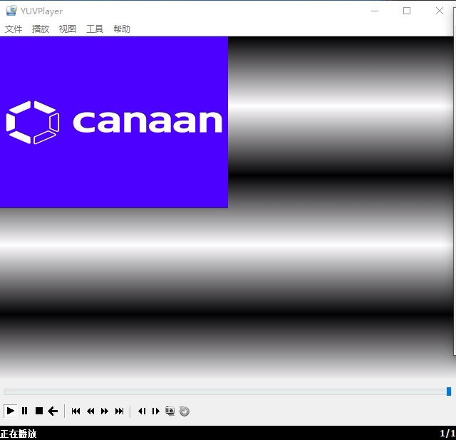

**<font face="黑体" size="6" style="float:right">K510 SDK Application Guide</font>**

<font face="黑体"  size=3>文档版本：V1.0.0</font>

<font face="黑体"  size=3>发布日期：2022-03-09</font>

<div style="page-break-after:always"></div>

<font face="黑体" size=3>**免责声明**</font>
您购买的产品、服务或特性等应受北京嘉楠捷思信息技术有限公司（“本公司”，下同）商业合同和条款的约束，本文档中描述的全部或部分产品、服务或特性可能不在您的购买或使用范围之内。除非合同另有约定，本公司不对本文档的任何陈述、信息、内容的准确性、可靠性、完整性、营销型、特定目的性和非侵略性提供任何明示或默示的声明或保证。除非另有约定，本文档仅作为使用指导的参考。
由于产品版本升级或其他原因，本文档内容将可能在未经任何通知的情况下，不定期进行更新或修改。

**<font face="黑体"  size=3>商标声明</font>**

“”、“Canaan”图标、嘉楠和嘉楠其他商标均为北京嘉楠捷思信息技术有限公司的商标。本文档可能提及的其他所有商标或注册商标，由各自的所有人拥有。

**<font face="黑体"  size=3>版权所有©2022北京嘉楠捷思信息技术有限公司</font>**
本文档仅适用K510平台开发设计，非经本公司书面许可，任何单位和个人不得以任何形式对本文档的部分或全部内容传播。

**<font face="黑体"  size=3>北京嘉楠捷思信息技术有限公司</font>**
网址：canaan-creative.com
商务垂询：salesAI@canaan-creative.com

<div style="page-break-after:always"></div>
# 前言
**<font face="黑体"  size=5>文档目的</font>**
本文档为K510 SDK 应用实例的说明文档。

**<font face="黑体"  size=5>读者对象</font>**

本文档（本指南）主要适用的人员：

- 软件开发人员
- 技术支持人员

**<font face="黑体"  size=5>修订记录</font>**
<font face="宋体"  size=2>修订记录累积了每次文档更新的说明。最新版本的文档包含以前所有版本的更新内容。</font>

| 版本号 | 修改者     | 修订日期   | 修订说明     |
| :----- | ---------- | ---------- | ------------ |
| V1.0.0 | 系统软件组 | 2022-03-09 | SDK V1.5发布 |
|        |            |            |              |
|        |            |            |              |
|        |            |            |              |
|        |            |            |              |
|        |            |            |              |
|        |            |            |              |
|        |            |            |              |
|        |            |            |              |

<div style="page-break-after:always"></div>
**<font face="黑体"  size=6>目 录</font>**

[TOC]

<div style="page-break-after:always"></div>

# 1  Demo应用

## 1.1 ai demo程序

### 1.1.1 说明

nncase 的demo程序源码位于SDK目录下的`package/ai`目录，目录结构如下：

```shell
$ tree -L 2 ai
ai
├── ai.hash
├── ai.mk
├── code
│   ├── build.sh
│   ├── cmake
│   ├── CMakeLists.txt
│   ├── common
│   ├── face_alignment
│   ├── face_detect
│   ├── face_expression
│   ├── face_landmarks
│   ├── face_recog
│   ├── hand_image_classify
│   ├── head_pose_estimation
│   ├── imx219_0.conf
│   ├── imx219_1.conf
│   ├── license_plate_recog
│   ├── object_detect
│   ├── object_detect_demo
│   ├── openpose
│   ├── person_detect
│   ├── retinaface_mb_320
│   ├── self_learning
│   ├── shell
│   ├── simple_pose
│   ├── video_192x320.conf
│   ├── video_object_detect_320.conf
│   ├── video_object_detect_320x320.conf
│   ├── video_object_detect_432x368.conf
│   ├── video_object_detect_512.conf
│   ├── video_object_detect_640.conf
│   └── video_object_detect_640x480.conf
└── Config.in
```

可以参考retinaface_mb_320的源码和`CMakeLists.txt`添加新的nncase 的demo程序。

模型的编译参见`nncase_demo.mk`里面定义的*POST_INSTALL_TARGET_HOOKS*：

```text
NNCASE_DEMO_DEPENDENCIES += mediactl_lib nncase_linux_runtime opencv4 libdrm
define NNCASE_DEMO_COMPILE_MODEL
    mkdir -p $(TARGET_DIR)/app/ai/kmodel/kmodel_compile/retinaface_mb_320
    cd $(@D) && /usr/bin/python3 retinaface_mb_320/rf_onnx.py --quant_type uint8 --model ai_kmodel_data/model_file/retinaface/retinaface_mobile0.25_320.onnx
    cp $(@D)/rf.kmodel $(TARGET_DIR)/app/ai/kmodel/kmodel_compile/retinaface_mb_320/rf_uint8.kmodel
    cd $(@D) && /usr/bin/python3 retinaface_mb_320/rf_onnx.py --quant_type bf16 --model ai_kmodel_data/model_file/retinaface/retinaface_mobile0.25_320.onnx
    cp $(@D)/rf.kmodel $(TARGET_DIR)/app/ai/kmodel/kmodel_compile/retinaface_mb_320/rf_bf16.kmodel

NNCASE_DEMO_POST_INSTALL_TARGET_HOOKS += NNCASE_DEMO_COMPILE_MODEL
```

模型的编译需要nncase环境，关于nncase环境的搭建，参考k510_nncase_Developer_Guides.md。以后nncase有更新，buildroot sdk会同步更新到nncase。

### 1.1.2 retinaface

功能：人脸检测，人脸特征点检测

程序路径：
`/app/ai/shell`
运行：
执行非量化模型，`./retinaface_mb_320_bf16.sh`
执行uint8量化模型，`./retinaface_mb_320_uint8.sh`

脚本里面有关于QOS的设置，下面的两个demo的设置一样。

```shell
#devmem phyaddr width value
devmem 0x970E00fc 32 0x0fffff00
devmem 0x970E0100 32 0x000000ff
devmem 0x970E00f4 32 0x00550000
```

跑demo时，需要优先保证屏幕显示正常，即调整显示相关的QoS为高优先级。
QOS_CTRL0.ax25mp write QoS = 5
QOS_CTRL0.ax25mp read QoS = 5
QOS_CTRL2.ispf2k write QoS = 0xf
QOS_CTRL2.ispf2k read QoS = 0xf
QOS_CTRL2.ispr2k write QoS = 0xf
QOS_CTRL2.ispr2k read QoS = 0xf
QOS_CTRL2.isp3dtof write QoS = 0xf
QOS_CTRL3.display read QoS = 0xf
QOS_CTRL3.display write QoS = 0xf

QOS 控制寄存器0(QOS_CTRL0) offset[0x00f4]


QOS 控制寄存器1(QOS_CTRL1) offset[0x00f8]


QOS 控制寄存器2(QOS_CTRL2) offset[0x00fc]


QOS 控制寄存器3(QOS_CTRL3) offset[0x0100]


模型的编译安装详见文件package/ai/ai.mk：

编译脚本路径：
package/ai/code/retinaface_mb_320/rf_onnx.py

### 1.1.3 object_detect

功能：物体分类检测，80分类

程序路径：
`/app/ai/shell`

运行：
执行非量化模型，`./object_detect_demo_bf16.sh`
执行uint8量化模型，`./object_detect_demo_uint8.sh`

模型的编译安装详见文件package/ai/ai.mk

编译脚本路径：
package/ai/code/object_detect_demo/od_onnx.py

## 1.2 ffmpeg

`ffmpeg`在`ffmpeg-4.4`开源代码上进行移植，`0001-buildroot-ffmpeg-0.1.patch`为补丁包，增加了

- `ff_k510_video_demuxer`：控制isp输入，引用了`libvideo.so`
- `ff_libk510_h264_encoder`：控制h264硬件编码，引用了`libvenc.so`

可以通过help指令查看可配置参数

```shell
ffmpeg -h encoder=libk510_h264 #查看k510编码器的参数
ffmpeg -h demuxer=libk510_video #查看demuxer的配置参数
```

详细运行说明参考[K510_Multimedia_Developer_Guides.md](./K510_Multimedia_Developer_Guides.md)

## 1.3 alsa_demo

alsa demo程序放在`/app/alsa_demo`目录下：

运行准备:

1. 插上耳机

运行alsa demo：

```shell
cd /app/alsa_demo/
./alsa_demo c #录音到文件capture.pcm，demo程序仅作参考，可以参考package/alsa_demo的源码。
./alsa_demo p #播放capture.pcm
```

## 1.4 TWOD demo

运行 rotation 使用方法：

```shell
cd /app/twod_app
./twod-rotation-app
```

将ouput.yuv 拷到yuv显示器上设置尺寸1080 x 1920，显示格式nv12，结果如下


scaler 使用方法

```shell
cd /app/twod_app
./twod-scaler-app
```

将ouput.yuv 拷到yuv显示器上设置尺寸640x480，显示格式nv12，结果如下


运行 rgb2yuv 使用方法：

```shell
cd /app/twod_app
./twod-osd2yuv-app
```

将ouput.yuv 拷到yuv 显示器上设置尺寸320x240,显示格式nv12，结果如下


运行 yuv2rgb 使用方法：

```shell
cd /app/twod_app
./twod-scaler-output-rgb888-app
```

将ouput.yuv 拷到rgb888显示器上设置尺寸640x480，显示格式rgb24，结果如下


运行 输出yuv上叠加osd 使用方法：

```shell
cd /app/twod_app
./twod-scaler-overlay-osd-app
```

将ouput.yuv 拷到显示器上设置尺寸640x480，显示格式nv12，结果如下


API:

```c
/* 创建内存 */
twod_create_fb()
/* 配置原图片参数 */   
twod_set_src_picture()
/* 配置输出图片参数 */ 
twod_set_des_picture()
/* 设置 scaler */     
twod_set_scaler()
/* 等待操作完成 */     
twod_wait_vsync()
/* Invali cache */   
twod_InvalidateCache()
/* flash cache */     
twod_flashdateCache()
/* 释放内存*/     
twod_free_mem()
/* 设置旋转 */  
twod_set_rot()
```

## 1.5 RTC demo

RTC驱动会注册生成/dev/rtc0设备节点。

应用层遵循Linux系统中的标准RTC编程方法调用驱动，在运行参考例程之前，建议通过shell 控制台关闭内核信息打印。

```shell
echo 0 > /proc/sys/kernel/printk
```

进入/app/rtc目录，输入如下命令启动rtc应用程序。

```shell
cd /app/rtc
./rtc 2021-11-3 21:10:59
```

程序的执行结果为：


RTC demo程序的主要代码片段如下，详细请参考package/rtc 文件夹下的代码。

```c
/*解析参数，获取当前年月日、时分秒*/
if(argc !=3) {
    fprintf(stdout, "useage:\t ./rtc year-month-day hour:minute:second\n");
    fprintf(stdout, "example: ./rtc 2021-10-11 19:54:30\n");
    return -1;
}

sscanf(argv[1], "%d-%d-%d",  &year, &month, &day);
sscanf(argv[2], "%d:%d:%d",  &hour, &minute, &second);

/*打开RTC设备，设备节点是：/dev/rtc0 */
fd = open("/dev/rtc0", O_RDONLY);
if (fd == -1) {
    perror("/dev/rtc0");
    exit(errno);
}

/* 设置RTC时间。*/
retval = ioctl(fd, RTC_SET_TIME, &rtc_tm);
if (retval == -1) {
    perror("ioctl");
    exit(errno);
}

/* 休眠 2秒。 */
sleep(2);

/* 读取RTC当前时间。*/
retval = ioctl(fd, RTC_RD_TIME, &rtc_tm);
if (retval == -1) {
    perror("ioctl");
    exit(errno);
}

/* 打印 RTC当前时间。*/
fprintf(stdout, "\nRTC date/time: %d/%d/%d %02d:%02d:%02d\n",
        rtc_tm.tm_mday, rtc_tm.tm_mon + 1, rtc_tm.tm_year + 1900,
        rtc_tm.tm_hour, rtc_tm.tm_min, rtc_tm.tm_sec);
```

## 1.6 WDT demo

K510一共有三个看门狗，WDT驱动会注册生成/dev/watchdog0、/dev/watchdog1、/dev/watchdog2 设备节点。

应用层遵循 Linux系统中的标准WDT编程方法调用驱动，wathdog应用程序第一个参数可为0、1，分别代表watchdog0、watchdog1，第二个参数表示可设置的超时时间（单位秒），例如如下命令表示启动watchdog0，watchdog0溢出时间40秒。

```shell
cd /app/watchdog
./watchdog 0 40
```

程序启动后将每间隔1秒喂一次看门狗，当shell终端中输入stop字符后，应用程序停止喂狗，看门狗将在设置超时时间溢出后复位设备重启，详细请参考package/watchdog文件夹下的代码。

程序的执行结果为：


**注意**：当前k510看门狗模块的工作时钟频率为757575Hz，以秒为单位的超时时间需要转换成看门狗实际的工作时钟频率的超时时间，计算公式是2^n/757575，因此实际的超时时间会大于等于输入的超时时间。

实际超时时间的计算过程是：

1. 输入40，2^25/757575=44 > 40，2^24/757575=22 < 40，因此设置为44秒；

2. 输入155，2^27/757575=177 > 155，因此设置为177秒；

3. 输入2000，2^31/757575=2834 > 2000，因此设置为2834秒；

## 1.7 UART demo

K510一共有4个串口，当前驱动中串口2、3没有使能，串口0驱动会注册生成/dev/ttyS0设备节点。

应用层遵循Linux系统中的标准UART编程方法调用驱动。uart应用程序第一个参数可为0、1，分别代表uart0、uart1。

将开发板使用有线网连接到路由器，使得开发板和调试PC在一个网络中，当开发板上电后将自动获取IP，在开发板的shell串口终端中输入ifconfig命令获取IP地址，调试PC利用此IP通过telent连接开发板打开一个telent窗口。例如调试PC通过MobaXterm使用telent连接开发板的操作如下图。


telent终端窗口中输入如下命令启动串口0工作。

```shell
cd /app/uart
./uart 0
```

在telent窗口中输入要发送的内容，可以在shell串口终端窗口看到接收到的数据，详细请参考package/crb_demo/uart文件夹下的代码。
例如，telent窗口的输入：


对应的Shell串口终端窗口显示：


## 1.8 ETH demo

应用层遵循Linux系统中的标准ETH编程方法调用驱动。

### 1.8.1 Client

设备作为client端，进入/app/client目录，输入如下命令启动client应用程序，ETH应用程序第一个参数表示要建立TCP链接的服务器ip地址，例如输入如下命令表示启动ETH程序与10.20.1.13的server建立通信。

```shell
cd /app/client
./client 10.20.1.13
```

通过tcp协议连接server进行通信，在另一台ubuntu机器上运行server程序，详细代码请参考package/app/client文件夹下内容。

设备端显示日志：


### 1.8.2 Server

设备作为server端，进入/app/server目录，例如输入如下命令表示启动server程序。

```shell
cd /app/server
./server
```

在另一台ubuntu机器上运行client程序，通过tcp协议连接server进行通信，详细代码请参考package/crb_demo/server文件夹下内容。

设备端显示日志：

 

## 1.9 SDMMC demo

K510一共有3个SDMMC主控制器，开发板上SDMMC0用于接eMMC，SDMMC1用于WIFI模块，SDMMC2控制器用于接sdcard。

SDMMC驱动会注册生成/dev/mmcblk0，EMMC驱动会注册成/dev/mmcblk1设备节点。

SD卡在系统启动后会自动挂载到/root/data ，进入/app/write_read_file目录，SDMMC应用程序第一个参数表示要进行读写操作的文件，如SD卡挂载到/root/data，可对/root/data/目录下的文件进行读写操作，先写后读，输入如下命令启动SDMMC应用程序对SD卡进行读和写的操作并计算读写速度（单位m/s）。

```shell
cd /app/write_read_file
./write_read_file /root/data/test.txt
```

开启对SD卡进行1G数据的读写，代码请参考package/app/write_read_file文件夹下的内容。


## 1.10 SHA/AES demo

SHA/AES demo 使用Linux 内核导出 AF_ALG 类型的 Netlink 接口，在用户空间使用内核加密 API。详细信息请参考<https://www.kernel.org/doc/html/latest/crypto/userspace-if.html>。

参数：
-h 打印帮助信息
-t 算法类型：hash、skcipher
-n 算法名称：sha256、ecb(aes)、cbc(aes)
-x 解密操作
-k AES KEY(16进制字符串)
-v AES IV(16进制字符串)


sha256 test：

```shell
cd /app/crypto
echo -n "This is a test file, hello world" > plain.txt
./crypto -t hash -n "sha256" plain.txt sha256.txt
xxd -p -c 32 sha256.txt
sha256sum plain.txt
```


ecb(aes) 128 test：

```shell
cd /app/crypto
echo -n "This is a test file, hello world" > plain.txt
./crypto -t skcipher -n "ecb(aes)" -k 00112233445566778899aabbccddeeff plain.txt ecb_aes_en.bin
./crypto -t skcipher -n "ecb(aes)" -k 00112233445566778899aabbccddeeff  -x ecb_aes_en.bin ecb_aes_de.bin
cmp ecb_aes_de.bin plain.txt
cat ecb_aes_de.bin
```


cbc(aes) 128 test

```shell
cd /app/crypto
echo -n "This is a test file, hello world" > plain.txt
./crypto -t skcipher -n "cbc(aes)" -k 00112233445566778899aabbccddeeff -v 00112233445566778899aabbccddeeff plain.txt cbc_aes_en.bin
./crypto -t skcipher -n "cbc(aes)" -k 00112233445566778899aabbccddeeff -v 00112233445566778899aabbccddeeff -x cbc_aes_en.bin cbc_aes_de.bin
cmp cbc_aes_de.bin plain.txt
cat cbc_aes_de.bin
```


aes-ecb-128和aes-cbc-128加密时要求明文要16字节对齐，不足会自动补0。

## 1.11 TRNG demo

TRNG demo通过读取/dev/hwrng字符设备产生指定长度的随机数，按16进制字符串输出。

./trng的输入参数含义：

-h 打印帮助信息

-b 指定输出随机数长度，单位byte


## 1.12 DRM demo

drm demo展示了VO硬件多图层功能。

VO共有8个layer：

1. 背景层，可配置背景色。

2. layer0是video层，支持YUV422和YUV420，支持NV12和NV21格式，大小端可配，支持硬件scaling up和scaling down。

3. layer1-layer3是video层，支持YUV422和YUV420，支持NV12和NV21格式，大小端可配。

4. layer4-layer6是OSD层，支持多种ARGB格式。

开发板启动后进入/app/drm_demo目录，输入命令：

```shell
cd /app/drm_demo
./drm_demo
```

启动drm_demo应用程序， drm_demo显示效果：


## 1.13 V4L2_DRM demo

v4l2_drm demo展示了摄像头输入和显示的功能。

开发板启动后进入/app/mediactl_lib目录，输入命令：

```shell
cd /app/mediactl_lib
./v4l2_drm.out -f video_drm_1080x1920.conf
```

启动v4l2_drm.out应用程序，v4l2_drm.out显示效果：


## 1.14 LVGL demo

进入/app/lvgl,运行以下命令：

```shell
cd /app/lvgl
./lvgl
```

显示效果如下：


## 1.15 PWM demo

PWM驱动会注册生成/sys/class/pwm/pwmchip0和/sys/class/pwm/pwmchip3设备节点。

本例程可分别对pwm0和pwm1进行配置和使能，进入/app/pwm目录，pwm应用程序第一个参数表示设置pwm的周期，单位为ns，第二个参数设置pwm一个周期中“ON”的时间，单位为ns，第三个参数可以为0、1，分别代表pwm0和pwm1，例如输入如下命令表示使能pwm0，周期为1s，占空比为1000000000/500000000*100% = 50%，详细代码请参考package/app/pwm文件夹下的内容。

```shell
cd /app/pwm
./pwm 1000000000 500000000 0
```

程序的执行结果为：


通过示波器连接K510 CRB1.2开发板J15的28号引脚，可以示波器上观察到一个周期为1秒，占空比为50%的波形图。

## 1.16 WIFI demo

WiFi模块驱动加载后会生成无线网卡wlan0，遵循标准网口驱动，正常参考TCP/IP socket编程。

1. 在笔记本打开“移动热点”，然后设置热点的名称和密码
2. 在笔记本上启动NetAssist，配置协议类型、本地主机IP、本地主机端口、接收设置、发送设置及需要发送的数据，如下图：

    

3. wifi测试程序的参数格式为：

```shell
./wifi <AP name> <password> <local ip> <server ip>
```

例如进入/app/wifi目录，输入启动wifi测试程序命令，程序的执行结果如下图：


## 1.17 GPIO_KEYS demo

按键驱动使用linux kernel自身集成的基于input子系统的通用gpio-keys驱动，驱动加载后在/dev/input目录下生成事件监控节点eventX，X为事件节点序号，可以通过cat /proc/bus/input/devices查看

gpio-keys例程阻塞式读取按键上报事件并打印事件信息，其信息包括按键编码和按键动作，按键编码标识按键身份，按键动作分为pressed和released，在按键release时例程会计算按键按下的持续时间

程序执行结果如下图所示:


**翻译免责声明**  
为方便客户，Canaan 使用 AI 翻译程序将文本翻译为多种语言，它可能包含错误。我们不保证提供的译文的准确性、可靠性或时效性。对于因依赖已翻译信息的准确性或可靠性而造成的任何损失或损害，Canaan 概不负责。如果不同语言翻译之间存在内容差异，以简体中文版本为准。

如果您要报告翻译错误或不准确的问题，欢迎通过邮件与我们联系。
