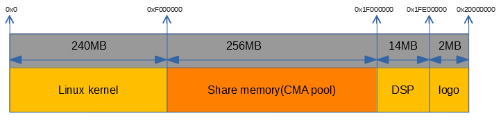

**<font face="黑体" size="6" style="float:right">K510 System memory map</font>**

<font face="黑体"  size=3>文档版本：V1.0.0</font>

<font face="黑体"  size=3>发布日期：2022-03-09</font>

<div style="page-break-after:always"></div>

<font face="黑体" size=3>**免责声明**</font>
您购买的产品、服务或特性等应受北京嘉楠捷思信息技术有限公司（“本公司”，下同）商业合同和条款的约束，本文档中描述的全部或部分产品、服务或特性可能不在您的购买或使用范围之内。除非合同另有约定，本公司不对本文档的任何陈述、信息、内容的准确性、可靠性、完整性、营销型、特定目的性和非侵略性提供任何明示或默示的声明或保证。除非另有约定，本文档仅作为使用指导的参考。
由于产品版本升级或其他原因，本文档内容将可能在未经任何通知的情况下，不定期进行更新或修改。

**<font face="黑体"  size=3>商标声明</font>**

“”、“Canaan”图标、嘉楠和嘉楠其他商标均为北京嘉楠捷思信息技术有限公司的商标。本文档可能提及的其他所有商标或注册商标，由各自的所有人拥有。

**<font face="黑体"  size=3>版权所有©2022北京嘉楠捷思信息技术有限公司</font>**
本文档仅适用K510平台开发设计，非经本公司书面许可，任何单位和个人不得以任何形式对本文档的部分或全部内容传播。

**<font face="黑体"  size=3>北京嘉楠捷思信息技术有限公司</font>**
网址：canaan-creative.com
商务垂询：salesAI@canaan-creative.com

<div style="page-break-after:always"></div>
# 前言
**<font face="黑体"  size=5>文档目的</font>**
本文档为K510 SDK 应用实例的说明文档。

**<font face="黑体"  size=5>读者对象</font>**

本文档（本指南）主要适用的人员：

- 软件开发人员
- 技术支持人员

**<font face="黑体"  size=5>修订记录</font>**
<font face="宋体"  size=2>修订记录累积了每次文档更新的说明。最新版本的文档包含以前所有版本的更新内容。</font>

| 版本号   | 修改者     | 修订日期 | 修订说明 |
|  :-----  |-------   |  ------  |  ------  |
| V1.0.0 | 系统软件组 | 2022-03-09 |   |
|        |        |            |                    |
|        |        |            |                    |
|        |        |            |                    |
|        |        |            |                    |
|        |        |            |                    |

<div style="page-break-after:always"></div>
**<font face="黑体"  size=6>目 录</font>**

[TOC]

<div style="page-break-after:always"></div>

# 1  K510 系统内存规划

K510的内存规划如下图所示：



K510 crb参考板上有512MB DDR，总共规划了四个区域：

- 0~240M规划给Linux kernel
- 240M~496MB规划给share memory，采用预留CMA内存池的方式，这样在Share memory没有使用的情况下，Linux kernel内存管理子系统也可以从CMA池中分配内存
- 496M~510M规划给DSP使用
- 510M~512M规划给logo使用

# 2 设备树描述

K510的内存规划采用reserved-meory的方式，通过设备树的reserved-memory节点进行描述。相关设备树节点信息如下：

```text
ddr_memory: memory@0 {
    status              = "okay";
    device_type         = "memory";
    reg                 = <0x0 0x00000000 0x0 0x20000000>;
};

sharem_cma:sharem_cma@8000000 {
    compatible          = "k510-share-memory-cma";
    reg                 = <0x0 0xf000000 0x0 0x10000000>;  /*240M~496M*/
};

reserved-memory {
    #address-cells = <2>;
    #size-cells = <2>;
    ranges;

    cma_buffer: buffer@f000000 {
        compatible = "shared-dma-pool";
        reusable;
        linux,cma-default;
        reg = <0x0 0xf000000 0x0 0x10000000>;
    };

    dsp_buffer: buffer@1f000000 {
        no-map;
        reg = <0x0 0x1f000000 0x0 0xe00000>;
    };

    logo_buffer: buffer@1fe00000 {
        no-map;
        reg = <0x0 0x1fe00000 0x0 0x200000>;
    };
};
```

# 3 Buildroot相关配置

系统内存规划全部在linux kernel的dts中描述，但是dsp firmware的加载地址需要在buildroot中配置：

configs/k510_crb_lp3_v0_1_defconfig：

configs/k510_crb_lp3_v1_2_defconfig：

BR2_TARGET_EVB_FIRMWARE_LOAD_ADD=0x1f000000
