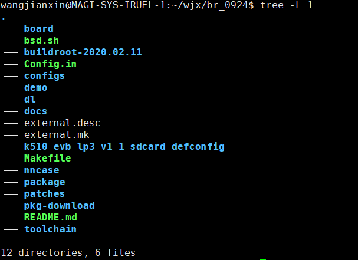

**<font face="黑体" size="6" style="float:right">K510 U-boot Developer's Guide</font>**

<font face="黑体"  size=3>文档版本：V1.0.0</font>

<font face="黑体"  size=3>发布日期：2022-03-09</font>

<div style="page-break-after:always"></div>

<font face="黑体" size=3>**免责声明**</font>
您购买的产品、服务或特性等应受北京嘉楠捷思信息技术有限公司（“本公司”，下同）商业合同和条款的约束，本文档中描述的全部或部分产品、服务或特性可能不在您的购买或使用范围之内。除非合同另有约定，本公司不对本文档的任何陈述、信息、内容的准确性、可靠性、完整性、营销型、特定目的性和非侵略性提供任何明示或默示的声明或保证。除非另有约定，本文档仅作为使用指导的参考。
由于产品版本升级或其他原因，本文档内容将可能在未经任何通知的情况下，不定期进行更新或修改。

**<font face="黑体"  size=3>商标声明</font>**

“”、“Canaan”图标、嘉楠和嘉楠其他商标均为北京嘉楠捷思信息技术有限公司的商标。本文档可能提及的其他所有商标或注册商标，由各自的所有人拥有。

**<font face="黑体"  size=3>版权所有©2022北京嘉楠捷思信息技术有限公司</font>**
本文档仅适用K510平台开发设计，非经本公司书面许可，任何单位和个人不得以任何形式对本文档的部分或全部内容传播。

**<font face="黑体"  size=3>北京嘉楠捷思信息技术有限公司</font>**
网址：canaan-creative.com
商务垂询：salesAI@canaan-creative.com

<div style="page-break-after:always"></div>
# 前言
**<font face="黑体"  size=5>文档目的</font>**
本文档为K510 demo板sdk配套文档，主要介绍uboot相关内容，比如uboot下k510 demo板配置文件、设备树、驱动位置等信息。

**<font face="黑体"  size=5>读者对象</font>**

本文档（本指南）主要适用的人员：

- 软件开发人员
- 技术支持人员

**<font face="黑体"  size=5>修订记录</font>**
<font face="宋体"  size=2>修订记录累积了每次文档更新的说明。最新版本的文档包含以前所有版本的更新内容。</font>

| 版本号   | 修改者     | 修订日期 | 修订说明 |
|  :-----  |-------   |  ------  |  ------  |
| V1.0.0 | 系统软件组 | 2022-03-09 |          |
|        |        |            |                    |
|        |        |            |                    |
|        |        |            |                    |
|        |        |            |                    |
|        |        |            |                    |

<div style="page-break-after:always"></div>
**<font face="黑体"  size=6>目 录</font>**

[TOC]

<div style="page-break-after:always"></div>

# 1 U-Boot 简介

u-boot是sdk的一部分，sdk目前使用的u-boot版本是2020.01。Uboot是德国DENX小组的开发用于多种嵌入式CPU的bootloader程序, UBoot不仅仅支持嵌入式Linux系统的引导，当前，它还支持NetBSD, VxWorks, QNX, RTEMS, ARTOS, LynxOS嵌入式操作系统。UBoot除了支持PowerPC系列的处理器外，还能支持MIPS、 x86、ARM、NIOS、RISICV等，主要功能有初始化内存，引导linux系统，更多u-boot介绍请参考<https://www.denx.de/wiki/U-Boot>

# 2 开发环境简介

- 操作系统

| 编号 | 软件资源 | 说明        |
| ---- | -------- | ----------- |
| 1    | Ubuntu   | 18.04/20.04 |

- 软件环境

软件环境要求如下表所示：

| 编号 | 软件资源 | 说明 |
| ---- | -------- | ---- |
| 1    | K510 SDK |      |

# 3 获取方式

下载并编译sdk，sdk编译的时候会下载uboot代码，并编译uboot代码。sdk的下载编译方法请参考[K510_SDK_Build_and_Burn_Guide.md](./K510_SDK_Build_and_Burn_Guide.md)

# 4 重要目录和文件说明

本章以编译k510_evb_lp3_v1_1_defconfig为例。对应的sdk编译方法是make CONF=k510_evb_lp3_v1_1_defconfig，其编译完后目录如下：



k510_evb_lp3_v1_1_defconfig/build/uboot-custom  ---uboot的代码和编译目录；

board/canaan/k510/uboot-sdcard.env---uboot默认环境变量配置文件

k510_evb_lp3_v1_1_defconfig/build/uboot-custom/configs/k510_evb_lp3_v1_1_defconfig --uboot配置文件；

k510_evb_lp3_v1_1_defconfig/build/uboot-custom/arch/riscv/dts/k510_evb_lp3_v1_1.dts----设备树文件；

k510_evb_lp3_v1_1_defconfig/build/uboot-custom/include/configs/k510_evb_lp3_v1_1.h---头文件；

k510_evb_lp3_v1_1_defconfig/images/u-boot_burn.bin ---uboot烧写固件

buildroot-2020.02.11/boot/uboot ----buildroot里面关于uboot的编译脚本，一般不需修改；

configs/k510_evb_lp3_v1_1_defconfig---sdk的配置文件，BR2_TARGET_UBOOT_BOARD_DEFCONFIG指定uboot的配置文件；

# 5 uboot启动流程

_start(arch/riscv/cpu/start.S, line 43)

board_init_f(common/board_f.c, line 1013)

board_init_r(common/board_r.c, line 845)

run_main_loop(common/board_r.c, line 637)

# 6 uboot下驱动说明

## 6.1 ddr驱动

board/Canaan/k510_evb_lp3/ddr_init.c

## 6.2 eth驱动

drivers/net/macb.c

设备树：

```text
ethernet@93030000 {
    compatible = "cdns,macb";
    reg = <0x0 0x93030000 0x0 0x10000>;
    phy-mode = "rmii";
    interrupts = <0x36 0x4>;
    interrupt-parent = <0x4>;
    clocks = <0x5 0x5>;
    clock-names = "hclk", "pclk";
};
```

## 6.3 串口驱动

drivers/serial/ns16550.c

设备树：

```text
serial@96000000 {
    compatible = "andestech,uart16550", "ns16550a";
    reg = <0x0 0x96000000 0x0 0x1000>;
    interrupts = <0x19 0x4>;
    clock-frequency = <0x17d7840>;
    reg-shift = <0x2>;
    reg-io-width = <0x4>;
    no-loopback-test = <0x1>;
    interrupt-parent = <0x4>;
};
```

## 6.4 iomux

drivers/pinctrl/pinctrl-single.c

设备树：

```text
iomux@97040000 {
    compatible = "pinctrl-single";
    reg = <0x0 0x97040000 0x0 0x10000>;
    #address-cells = <0x1>;
    #size-cells = <0x0>;
    #pinctrl-cells = <0x1>;
    pinctrl-single,register-width = <0x20>;
    pinctrl-single,function-mask = <0xffffffff>;
    pinctrl-names = "default";
    pinctrl-0 = <0x6 0x7 0x8 0x9 0xa>;

    iomux_uart0_pins {
        pinctrl-single,pins = <0x1c0 0x540ca8 0x1c4 0x5a0c69>;
        phandle = <0x6>;
    };

    iomux_emac_pins {
        pinctrl-single,pins = <0x8c 0x4e 0x90 0xce 0x88 0x8e 0x98 0x4e 0x80 0x8e 0xb8 0x4e 0xb4 0x4e 0xa8 0x8e 0xa4 0x8e 0x74 0x8e>;
        phandle = <0x7>;
    };

    iomux_spi0_pins {
        pinctrl-single,pins = <0x158 0x4e 0x15c 0x4e 0x160 0xce 0x164 0xce 0x168 0xce 0x16c 0xce 0x170 0xce 0x174 0xce 0x178 0xce 0x17c 0xce 0x180 0x8e>;
        phandle = <0x8>;
    };

    iomux_mmc0_pins {
        pinctrl-single,pins = <0x1c 0x4e 0x20 0xce 0x24 0xce 0x28 0xce 0x2c 0xce 0x30 0xce 0x34 0xce 0x38 0xce 0x3c 0xce 0x40 0xce>;
        phandle = <0x9>;
    };

    iomux_mmc2_pins {
        pinctrl-single,pins = <0x5c 0x4e 0x60 0xce 0x64 0xce 0x68 0xce 0x6c 0xce 0x70 0xce>;
        phandle = <0xa>;
    };
};
```

## 6.5 mmc和sd卡驱动

drivers/mmc/sdhci-cadence.c

设备树

```text
mmc0@93000000 {
    compatible = "socionext,uniphier-sd4hc", "cdns,sd4hc";
    reg = <0x0 0x93000000 0x0 0x400>;
    interrupts = <0x30 0x4>;
    interrupt-parent = <0x4>;
    clocks = <0xb 0x4>;
    max-frequency = <0xbebc200>;
    cap-mmc-highspeed;
    bus-width = <0x8>;
};

mmc2@93020000 {
    compatible = "socionext,uniphier-sd4hc", "cdns,sd4hc";
    reg = <0x0 0x93020000 0x0 0x400>;
    interrupts = <0x32 0x4>;
    interrupt-parent = <0x4>;
    clocks = <0xb 0x4>;
    max-frequency = <0xbebc200>;
    cap-sd-highspeed;
    bus-width = <0x1>;
};
```

# 7 Uboot默认环境变量

uboot的默认环境变量在SDK的board/canaan/k510目录下，用文本文件预定义：

uboot-emmc.env

uboot-nfs.env

uboot-sdcard.env

SDK的post脚本会在编译的时候调用mkenvimage将文本的环境变量定义编译为uboot可以加载的二进制镜像，放在启动分区中。

举例如下：

uboot-sdcard.env

```text
bootm_size=0x2000000
bootdelay=3

stderr=serial@96000000
stdin=serial@96000000
stdout=serial@96000000
arch=riscv
baudrate=115200

ipaddr=10.100.226.221
netmask=255.255.255.0
gatewayip=10.100.226.254
serverip=10.100.226.63
bootargs=root=/dev/mmcblk1p2 rw console=ttyS0,115200n8 debug loglevel=7

bootcmd=fatload mmc 1:1 0x600000 bootm-bbl.img;fatload mmc 1:1 0x2000000 k510.dtb;bootm 0x600000 - 0x2000000
bootcmd_nfs=tftp 0x600000 bootm-bbl.img;tftp 0x2000000 k510_nfsroot.dtb;bootm 0x600000 - 0x2000000
```

注：内核启动参数bootargs由uboot的默认环境变量设置，dts中的bootargs将会被覆盖。详见 常见问题-bootargs 哪里获取并传给内核的？

# 8 Uboot程序更新

## 8.1 烧写sdk镜像方法

sdk镜像里面已经包含uboot程序，直接烧写sdk镜像，比如：k510_evb_lp3_v1_1_defconfig/images/sysimage-sdcard.img文件

## 8.2 linux下更新sd卡里面的uboot程序

把u-boot_burn.bin文件放到tftp目录，配置设备网口ip地址，进入/root/sd/p1目录；执行tftp -gr u-boot_burn.bin xxx.xxx.xxx.xx 命令；

## 8.3 linux更新emmc里面的uboot程序

把u-boot_burn.bin文件放到tftp目录，配置设备网口ip地址；通过tftp -gr u-boot_burn.bin xxx.xxx.xxx.xx下载文件到设备；

执行dd if=u-boot_burn.bin of=/dev/mmcblk0p1 命令把文件写到mmc卡。

# 9 常见问题

## 9.1 DDR 频率如何配置？

答：目前evb只能跑800，CRB可以设置800或1600。CRB板子ddr频率设置方法见uboot的board\Canaan\k510_crb_lp3\ddr_param.h文件，800M对应#define DDR_800 1，1600M对应#define DDR_1600 1。

## 9.2 bootargs 哪里获取并传给内核的？

答：从uboot环境变量bootargs 获取，uboot引导内核时会根据bootargs 环境变量值，修改内存设备树里面的bootargs参数。相关代码如下：

```c
int fdt_chosen(void *fdt)
{
    int   nodeoffset;
    int   err;
    char  *str; /* used to set string properties */

    err = fdt_check_header(fdt);
    if (err < 0) {
        printf("fdt_chosen: %s\n", fdt_strerror(err));
        return err;
    }

    /* find or create "/chosen" node. */
    nodeoffset = fdt_find_or_add_subnode(fdt, 0, "chosen");
    if (nodeoffset < 0)
        return nodeoffset;

    str = env_get("bootargs");
    if (str) {
        err = fdt_setprop(fdt, nodeoffset, "bootargs", str,
                    strlen(str) + 1);
        if (err < 0) {
            printf("WARNING: could not set bootargs %s.\n",
                    fdt_strerror(err));
            return err;
        }
    }

    return fdt_fixup_stdout(fdt, nodeoffset);
}
```

## 9.3 启动参数和编译的设备树文件不一致？

答：uboot根据启动方式动态获取环境变量，引导内核时根据bootargs环境变量，更新内存里面的设备树。修改完后的启动参数见/sys/firmware/devicetree/base/chosen节点。

## 9.4 uboot环境变量保存在那里？

答：

| 启动方式 | uboot读取和保存位置 | 编译时对应文件 |
| :-: | :-: | :-: |
| emmc启动 | emmc第二个分区的uboot-emmc.env文件 | board\canaan\k510\uboot-emmc.env |
| sd卡启动 | sd卡第一个分区的uboot-sd.env文件 | board\canaan\k510\uboot-sd.env |

## 9.5 qos如何设置？

答：qos相关寄存器是QOS_CTRL0 QOS_CTRL1 QOS_CTRL2 QOS_CTRL3 QOS_CTRL4 。例子：
设置qos后，nncase demo性能有所提高

```c
*(uint32_t *)0x970E00FC = (0x2 << 8) | (0x2 << 12) | (0x2 << 16) | (0x2 << 20) | (0x2 << 24);
*(uint32_t *)0x970E0100 = (0x3 << 4) | 0x3;
*(uint32_t *)0x970E00F4 = (0x5 << 16) | (0x5 << 20);
```
